# Command System Container Architecture

This document provides a comprehensive explanation of the container system within the PySignalDecipher command framework, with a particular focus on the `BaseCommandContainer` and `CommandTabWidget` classes.

## Table of Contents

1. [Overview](#overview)
2. [Architecture](#architecture)
3. [BaseCommandContainer](#basecommandcontainer)
4. [CommandTabWidget](#commandtabwidget)
5. [Integration with ID System](#integration-with-id-system)
6. [Integration with Command System](#integration-with-command-system)
7. [Widget Registration and Factory Pattern](#widget-registration-and-factory-pattern)
8. [Practical Examples](#practical-examples)

## Overview

The command system container architecture provides a framework for creating UI containers that have built-in support for:

1. **Command Pattern Integration**: All container operations support undo/redo through the command system
2. **Dynamic Content Creation**: Widgets can be registered and instantiated dynamically using factory functions
3. **Observable Pattern Integration**: Containers can manage observable objects and their lifecycles
4. **Container Navigation**: Automatic navigation between containers during undo/redo operations
5. **ID System Integration**: Memory-efficient tracking of relationships between widgets, containers, and observables

This architecture enables sophisticated UI layouts with nested containers, all backed by a robust undo/redo system.

## Architecture

The container system is built on top of the core command system and ID system. Here's the high-level architecture:


The diagram shows that:
- `BaseCommandWidget` extends the core Qt widgets with command system functionality
- `BaseCommandContainer` builds on the base widget to provide container-specific features
- `CommandTabWidget` combines PySide6's `QTabWidget` with the container functionality
- All components leverage the ID, Command, and Observable systems

## BaseCommandContainer

The `BaseCommandContainer` class is the foundation for all command-enabled containers. It provides core container functionality independent of the specific UI container type (tab, dock, window, etc.).

### Key Properties and Fields

- `self.widget_id`: ID of this container in the ID system
- `self._widget_types`: Dictionary of registered widget types (factory functions, observables, and options)

### Core Methods

#### `initiate_container(self, type_code, container_id, location)`

This method initializes the container with a specific type code and parent information.

- **Parameters:**
  - `type_code`: ID system type code (e.g., `TypeCodes.TAB_CONTAINER`)
  - `container_id`: Optional ID of the parent container
  - `location`: Optional location within the parent container

```python
def initiate_container(self, type_code: str, container_id: Optional[str] = None, 
                       location: Optional[str] = None):
    # Initialize the base widget
    super().initiate_widget(type_code, container_id, location)
    
    # Widget type registry
    self._widget_types = {}  # type_id -> {factory, observables, options}
```

#### `register_widget_type(self, factory_func, observables, type_id, **options)`

This method registers a widget factory function that can create content for the container.

- **Parameters:**
  - `factory_func`: Function that creates a widget
  - `observables`: List of Observable IDs or Observable classes
  - `type_id`: Optional unique ID for this widget type
  - `**options`: Additional options (e.g., closable, dynamic)
- **Returns:**
  - Unique ID for the registered widget type

```python
def register_widget_type(self, factory_func: Callable, 
                       observables: List[Union[str, Type[Observable]]] = None,
                       type_id: str = None,
                       **options) -> str:
    # Generate type_id if not provided
    if type_id is None:
        # Use function name as part of the ID for better debugging
        func_name = factory_func.__name__
        type_id = f"{func_name}_{str(uuid.uuid4())[:8]}"
    
    # Store widget type info
    self._widget_types[type_id] = {
        "factory": factory_func,
        "observables": observables or [],
        "options": options
    }
    
    return type_id
```

#### `add_widget(self, type_id, location)`

This method creates and adds a widget of the registered type to the container.

- **Parameters:**
  - `type_id`: ID of the registered widget type
  - `location`: Location within the container
- **Returns:**
  - Widget ID of the created widget, or None if failed


#### `register_child(self, widget, location)`

This method registers a child widget with this container.

- **Parameters:**
  - `widget`: Child widget to register
  - `location`: Location identifier
- **Returns:**
  - ID of the registered child widget

#### `unregister_child(self, widget)`

This method unregisters a child widget from this container.

- **Parameters:**
  - `widget`: Child widget to unregister or its ID
- **Returns:**
  - True if widget was unregistered successfully

#### `get_child_widgets(self)`

This method gets all child widgets of this container.

- **Returns:**
  - List of child widgets

#### `get_widgets_at_location(self, location)`

This method gets all widgets at a specific location.

- **Parameters:**
  - `location`: Location identifier
- **Returns:**
  - List of widgets at the specified location

#### `_add_widget_to_container(self, widget, location, options)`

This abstract method adds a widget to the container at the specified location. It must be implemented by subclasses.

- **Parameters:**
  - `widget`: Widget to add
  - `location`: Location identifier
  - `options`: Widget type options

#### `navigate_to_container(self, trigger_widget, container_info)`

This method navigates to this container's context, used during undo/redo operations.

- **Parameters:**
  - `trigger_widget`: Widget that triggered the navigation
  - `container_info`: Additional context information for navigation
- **Returns:**
  - True if navigation was successful

## CommandTabWidget

The `CommandTabWidget` class extends both `QTabWidget` and `BaseCommandContainer` to provide a tab-based container with command system integration.

### Key Properties and Fields

- `self.widget_id`: ID of this container in the ID system
- `self._widget_types`: Inherited from `BaseCommandContainer`
- Signals: `tabAdded` and `tabClosed` for tab lifecycle events

### Core Methods

#### `__init__(self, parent, container_id, location)`

Initializes the command tab widget.

- **Parameters:**
  - `parent`: Qt parent widget
  - `container_id`: Optional ID of the parent container
  - `location`: Optional location within the parent container

```python
def __init__(self, parent=None, container_id=None, location=None):
    # Initialize QTabWidget
    QTabWidget.__init__(self, parent)
    
    # Initialize container with TAB_CONTAINER type
    self.initiate_container(TypeCodes.TAB_CONTAINER, container_id, location)
    
    # Connect signals
    self.setTabsClosable(True)
    self.tabCloseRequested.connect(self._on_tab_close_requested)
    self.currentChanged.connect(self._on_current_changed)
```

#### `addTab(self, widget, label)`

Overrides QTabWidget's addTab to register the widget with this container.

- **Parameters:**
  - `widget`: Tab content widget
  - `label`: Tab label
- **Returns:**
  - Tab index

#### `insertTab(self, index, widget, label)`

Overrides QTabWidget's insertTab to register the widget and update locations.

- **Parameters:**
  - `index`: Tab insertion index
  - `widget`: Tab content widget
  - `label`: Tab label
- **Returns:**
  - Tab index

#### `removeTab(self, index)`

Overrides QTabWidget's removeTab to unregister the widget and update locations.

- **Parameters:**
  - `index`: Tab index to remove

#### `_update_tab_locations(self)`

Updates location IDs for all tabs after adding, removing, or reordering.

#### `register_tab(self, factory_func, tab_name, observables, closable)`

A convenience method to register a tab type with a factory function.

- **Parameters:**
  - `factory_func`: Function that creates the tab content
  - `tab_name`: Display name for tabs of this type
  - `observables`: List of Observable IDs or Observable classes
  - `closable`: Whether tabs of this type can be closed
- **Returns:**
  - ID of the registered tab type

```python
def register_tab(self, factory_func: Callable, tab_name: str = None,
                observables: List[Union[str, Type[Observable]]] = None, 
                closable: bool = True) -> str:
    options = {"tab_name": tab_name, "closable": closable}
    return self.register_widget_type(factory_func, observables, **options)
```

#### `add_tab(self, type_id)`

Adds a new tab of the registered type, creating a command to support undo/redo.

- **Parameters:**
  - `type_id`: ID of the registered tab type
- **Returns:**
  - ID of the created tab


#### `_add_widget_to_container(self, widget, location, options)`

Implements the abstract method from BaseCommandContainer to add a widget as a tab.

- **Parameters:**
  - `widget`: Widget to add as tab content
  - `location`: Tab index as string (ignored, tabs are appended)
  - `options`: Widget type options

#### `set_tab_closable(self, index, closable)`

Sets whether a specific tab should be closable.

- **Parameters:**
  - `index`: Tab index
  - `closable`: Whether the tab should be closable

#### `_on_tab_close_requested(self, index)`

Handles tab close request from UI, creating a command to support undo/redo.

- **Parameters:**
  - `index`: Tab index to close

#### `_on_current_changed(self, index)`

Handles tab selection change, creating a command to support undo/redo.

- **Parameters:**
  - `index`: New tab index

#### `navigate_to_container(self, trigger_widget, container_info)`

Implements navigation to the appropriate tab for undo/redo operations.

- **Parameters:**
  - `trigger_widget`: Widget that triggered the navigation
  - `container_info`: Additional context information
- **Returns:**
  - True if navigation was successful

## Integration with ID System

The container system deeply integrates with the ID system for tracking relationships between containers, widgets, and observables.

### Widget and Container IDs

Each widget and container is assigned an ID with the format:
```
[type_code]:[unique_id]:[container_unique_id]:[location]
```

For example:
- `t:2J:0:0` - A tab container with no parent
- `pb:3a:2J:2` - A push button in container `2J` at location `2`

This ID encoding allows the system to efficiently track hierarchical relationships.

```mermaid
graph TD
    subgraph "ID System Integration"
        Container["Container (t:2J:0:0)"]
        Widget1["Widget 1 (pb:3a:2J:0)"]
        Widget2["Widget 2 (pb:4b:2J:1)"]
        Widget3["Widget 3 (pb:5c:2J:2)"]
        
        Container --> Widget1
        Container --> Widget2
        Container --> Widget3
        
        IDRegistry["ID Registry"]
        
        Container -.->|registers| IDRegistry
        Widget1 -.->|registers| IDRegistry
        Widget2 -.->|registers| IDRegistry
        Widget3 -.->|registers| IDRegistry
        
        IDRegistry -.->|lookup| Container
        IDRegistry -.->|lookup| Widget1
        IDRegistry -.->|lookup| Widget2
        IDRegistry -.->|lookup| Widget3
    end
    
    style Container stroke:#9370db,stroke-width:2px
    style IDRegistry stroke:#228b22,stroke-width:2px
```



### ID System Queries

The container system uses the ID registry to perform queries such as:
- `get_container_id_from_widget_id(widget_id)`: Get the container for a widget
- `get_widget_ids_by_container_id(container_id)`: Get all widgets in a container
- `get_widget_ids_by_container_id_and_location(container_id, location)`: Get widgets at a specific location

These queries allow the system to maintain relationships even without direct object references, enabling serialization and navigation during undo/redo.

## Integration with Command System

Every container operation is integrated with the command system for undo/redo support.

### Tab Operations as Commands

Operations like adding and removing tabs are encapsulated as commands:


### Command Execution Flow

When a tab is added:


### Navigation during Undo/Redo

The command system uses container navigation to ensure the right container is visible during undo/redo:


## Widget Registration and Factory Pattern

The container system uses the factory pattern for dynamic widget creation.

### Factory Functions

Factory functions create content on demand:

```python
def create_personal_info_tab(person_model):
    """Factory function to create a person info tab."""
    form = QWidget()
    layout = QFormLayout(form)
    
    name_edit = CommandLineEdit()
    name_edit.bind_to_text_property(person_model.get_id(), "name")
    
    layout.addRow("Name:", name_edit)
    
    return form
```

### Registration Flow


### Observable Management

Observables can be specified in two ways:
1. As IDs (use existing observables): `observables=["o:1A"]`
2. As classes (create new instances): `observables=[Person]`


## Practical Examples

Here are practical examples of using the container system:

### Basic Tab Container Setup

```python
# Create the tab container
main_tabs = CommandTabWidget(parent)
layout.addWidget(main_tabs)

# Register a tab type
def create_welcome_tab():
    tab = QWidget()
    layout = QVBoxLayout(tab)
    label = QLabel("Welcome to the application!")
    layout.addWidget(label)
    return tab

welcome_tab_type = main_tabs.register_tab(
    create_welcome_tab,
    tab_name="Welcome",
    observables=[],
    closable=False
)

# Add a welcome tab
main_tabs.add_tab(welcome_tab_type)
```

### Tab with Observable Data

```python
# Create a person model
person = Person(name="John Doe", age=30)
person_id = person.get_id()

# Register a tab type that uses the existing model
def create_person_details_tab(person_model):
    tab = QWidget()
    layout = QFormLayout(tab)
    
    name_edit = CommandLineEdit()
    name_edit.bind_to_text_property(person_model.get_id(), "name")
    
    age_spin = CommandSpinBox()
    age_spin.bind_to_value_property(person_model.get_id(), "age")
    
    layout.addRow("Name:", name_edit)
    layout.addRow("Age:", age_spin)
    
    return tab

details_tab_type = main_tabs.register_tab(
    create_person_details_tab,
    tab_name="Person Details",
    observables=[person_id],  # Use existing observable
    closable=True
)

# Add a tab that will show the person details
main_tabs.add_tab(details_tab_type)
```

### Tab with New Observable Instances

```python
# Register a tab type that creates a new model each time
new_person_tab_type = main_tabs.register_tab(
    create_person_details_tab,
    tab_name="New Person",
    observables=[Person],  # Create new Person instance each time
    closable=True
)

# Add two tabs with separate Person instances
main_tabs.add_tab(new_person_tab_type)  # Creates first person instance
main_tabs.add_tab(new_person_tab_type)  # Creates second person instance
```

### Nested Containers

```python
# Create a nested tab container
nested_tabs = CommandTabWidget(parent=None)

# Register content for the nested container
def create_nested_content():
    widget = QWidget()
    layout = QVBoxLayout(widget)
    button = QPushButton("Nested Button")
    layout.addWidget(button)
    return widget

nested_tab_type = nested_tabs.register_tab(create_nested_content, "Nested Tab")

# Add the nested container to a parent tab
def create_parent_tab():
    main_tab_content = QWidget()
    layout = QVBoxLayout(main_tab_content)
    layout.addWidget(nested_tabs)
    nested_tabs.add_tab(nested_tab_type)  # Add initial nested tab
    return main_tab_content

parent_tab_type = main_tabs.register_tab(create_parent_tab, "Parent Tab")
main_tabs.add_tab(parent_tab_type)
```

## Conclusion

The command system container architecture provides a powerful framework for building complex UIs with undo/redo support. The `BaseCommandContainer` provides the foundation for all containers, while specialized implementations like `CommandTabWidget` provide concrete UI elements.

The key strengths of this architecture are:

1. **Clean Separation of Concerns**: Factory functions, observables, and containers are cleanly separated
2. **Full Undo/Redo Support**: All operations are undoable and redoable
3. **Memory Efficiency**: The ID system enables tracking without direct references
4. **Dynamic Content Creation**: Widgets are created on demand from registered factory functions
5. **Flexible Observable Management**: Both shared and per-instance observables are supported

This provides a solid foundation for building complex UI applications with sophisticated state management.