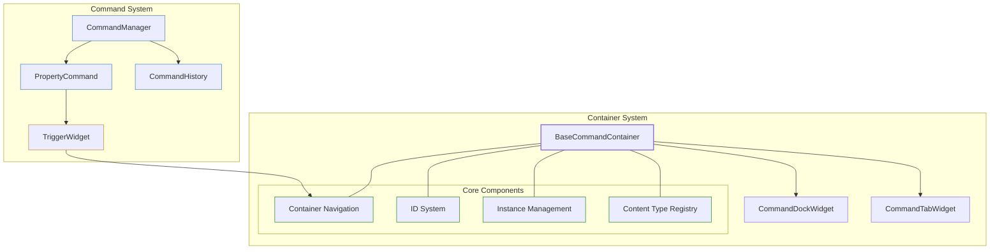
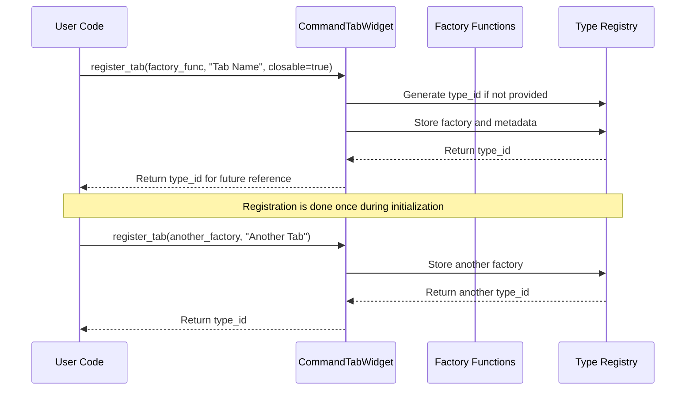
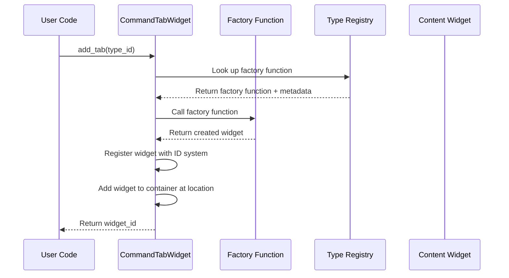
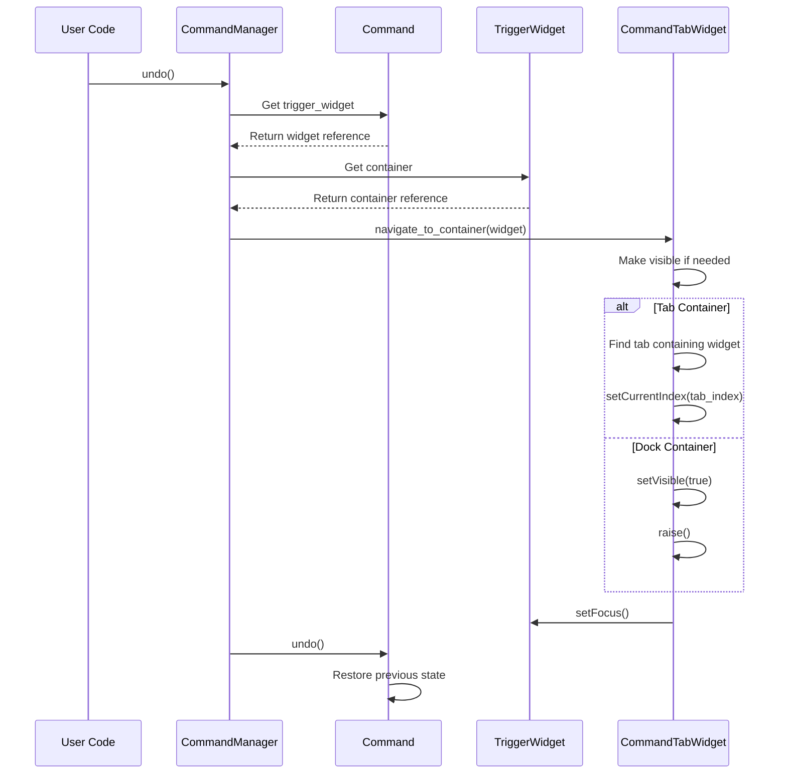
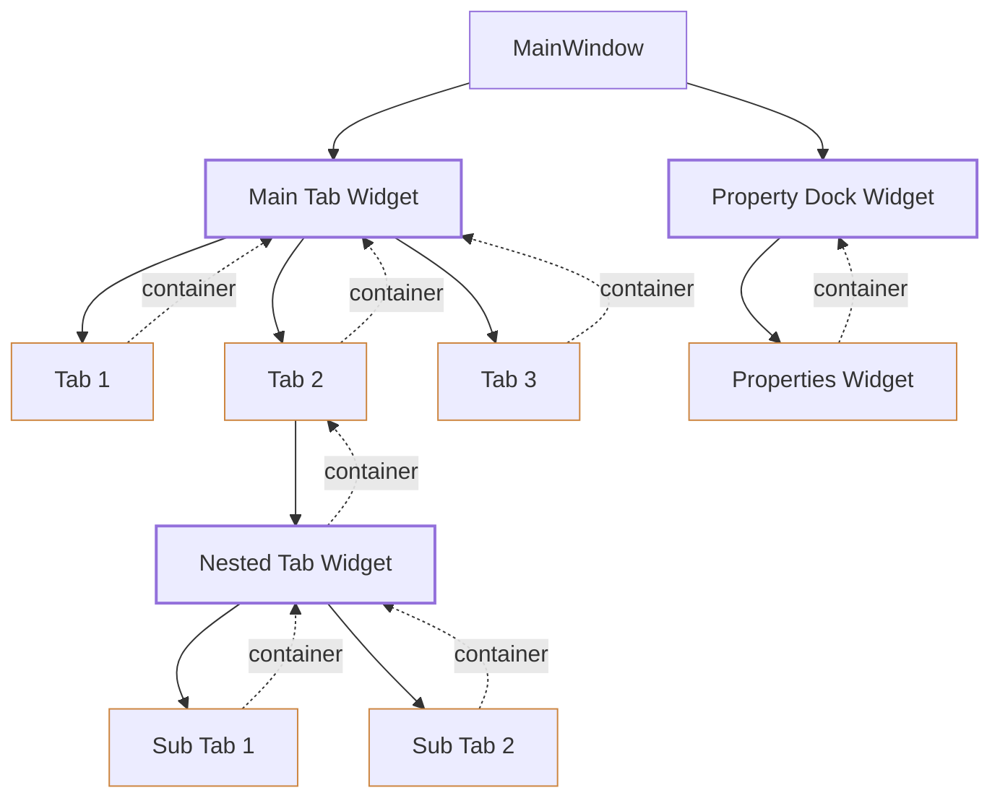
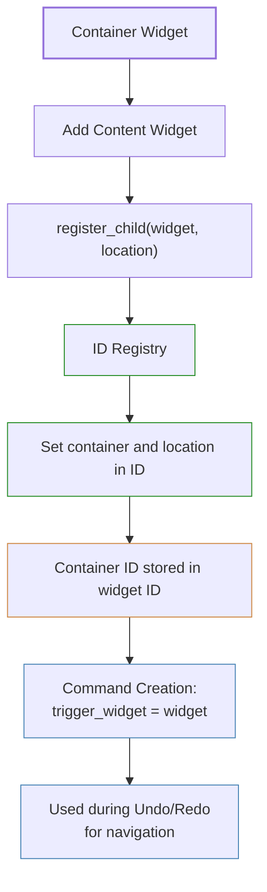
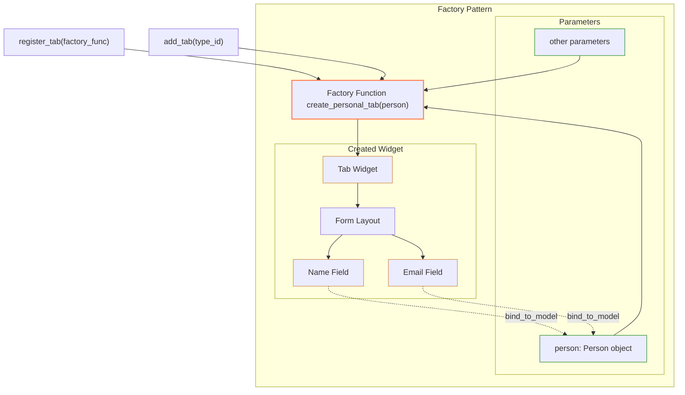
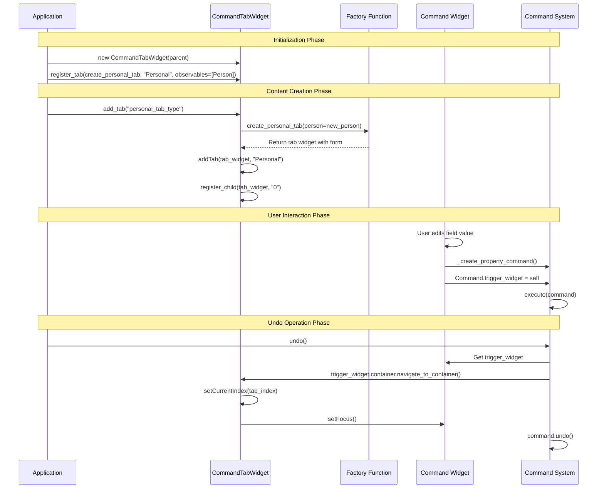

# Dynamic Container System Documentation

This document provides a comprehensive guide to the Dynamic Container Management System, explaining its architecture, usage patterns, and integration with the underlying command system.

## Overview

The Dynamic Container System provides a flexible framework for creating UI containers with built-in support for:

- Content type registration and dynamic instance creation
- Command pattern integration for undo/redo operations
- Container navigation and hierarchy management
- Widget lifecycle management

The system is designed to be memory-efficient and support complex UI layouts with nested containers.

## Core Architecture



## Key Components

### BaseCommandContainer

The `BaseCommandContainer` class serves as the foundation for all container implementations. It provides:

- Widget type registration
- Factory-based content creation
- Child widget management
- Container navigation

#### Key Methods

| Method | Description |
|--------|-------------|
| `initiate_container(type_code, container_id, location)` | Initialize the container with type code and optional parent |
| `register_widget_type(factory_func, observables, type_id, **options)` | Register a widget factory function with optional observables |
| `add_widget(type_id, location)` | Create and add a widget of the registered type |
| `register_child(widget, location)` | Register a child widget with this container |
| `unregister_child(widget)` | Unregister a child widget from this container |
| `get_child_widgets()` | Get all child widgets of this container |
| `get_widgets_at_location(location)` | Get all widgets at a specific location |
| `navigate_to_container(trigger_widget, container_info)` | Navigate to this container's context |

### CommandTabWidget

The `CommandTabWidget` class extends `BaseCommandContainer` to provide a tab-based container implementation with undo/redo support. It seamlessly integrates with the command system.

#### Key Methods

| Method | Description |
|--------|-------------|
| `register_tab(factory_func, tab_name, observables, closable)` | Register a tab type with factory function |
| `add_tab(type_id)` | Add a new tab of the registered type |
| `set_tab_closable(index, closable)` | Set whether a specific tab should be closable |
| `addTab(widget, label)` | Override to register the widget with this container |
| `insertTab(index, widget, label)` | Override to register the widget and update locations |
| `removeTab(index)` | Override to unregister the widget and update locations |

## Container Registration Flow



## Content Instance Creation Flow



## Navigation During Undo/Redo



## Nested Container Hierarchy



## User Guide

### Basic Container Setup

To create a tab container:

```python
from command_system.pyside6_widgets.containers import CommandTabWidget

# Create the tab container
main_tabs = CommandTabWidget(parent)

# Add it to your main layout
layout.addWidget(main_tabs)
```

### Registering Content Types

Register content factories once during initialization:

```python
def create_personal_info_tab(person_model):
    """Factory function to create a person info tab."""
    form = QWidget()
    layout = QFormLayout(form)
    
    name_edit = CommandLineEdit()
    name_edit.bind_to_text_property(person_model.get_id(), "name")
    
    age_spin = CommandSpinBox()
    age_spin.bind_to_value_property(person_model.get_id(), "age")
    
    layout.addRow("Name:", name_edit)
    layout.addRow("Age:", age_spin)
    
    return form

# Register the tab type
person_tab_type = main_tabs.register_tab(
    create_personal_info_tab,
    tab_name="Personal Info",
    observables=[Person],  # Will create a new Person instance
    closable=True
)
```

### Creating Content Instances

Create instances dynamically at runtime:

```python
# Add a new tab instance
tab_id = main_tabs.add_tab(person_tab_type)
```

This will:
1. Look up the factory function
2. Create a new Person instance
3. Call the factory with the instance
4. Add the resulting widget as a tab
5. Return the widget ID for reference

### Working with Observables

You can also use existing observable instances:

```python
# Create a person model
person = Person(name="John Doe", age=30)
person_id = person.get_id()

# Register a tab type that uses the existing model
details_tab_type = main_tabs.register_tab(
    create_personal_details_tab,
    tab_name="Details",
    observables=[person_id],  # Use existing observable
    closable=True
)

# Add a tab that will show the person details
main_tabs.add_tab(details_tab_type)
```

### Undo/Redo Support

All container operations automatically integrate with the command system:

```python
# Get command manager
manager = get_command_manager()

# Undo the last operation (e.g., tab addition)
if manager.can_undo():
    manager.undo()

# Redo the operation
if manager.can_redo():
    manager.redo()
```

### Nested Containers

Containers can be nested for complex layouts:

```python
# Create a nested tab container
nested_tabs = CommandTabWidget(parent=None)

# Register content for the nested container
nested_tab_type = nested_tabs.register_tab(create_nested_content)

# Add the nested container to a parent tab
main_tab_content = QWidget()
layout = QVBoxLayout(main_tab_content)
layout.addWidget(nested_tabs)

# Add the parent tab
main_tabs.addTab(main_tab_content, "Parent Tab")
```

## Widget Registration and Container References



## Factory Pattern Implementation



## Best Practices

1. **Register Types Once**: Register all content types during initialization, not during runtime
2. **Use Factory Functions**: Create dedicated factory functions for content creation
3. **Bind to Observable Models**: Use the observable pattern for data binding
4. **Leverage Automatic Undo/Redo**: Let the system handle command creation
5. **Use Type IDs**: Store type IDs for reuse, not factory functions
6. **Nest Containers**: Create complex layouts by nesting containers
7. **Close with Commands**: Use commands for closing tabs to enable undo

## Complete Flow Example



## Advanced Features

### Tab Closability Control

Control whether specific tabs can be closed:

```python
# Make a tab unclosable
main_tabs.set_tab_closable(1, False)
```

### Container Navigation

Navigate programmatically to containers:

```python
# Navigate to a specific container
container.navigate_to_container()
```

### Content Recreation

The system stores creation information to enable undo/redo of tab closures:

```python
# Container tracking allows proper recreation
recreation_info = {
    "type_id": type_id,
    "created_observables": [...],
    "observable_ids": [...]
}
```

## Conclusion

The Dynamic Container System provides a powerful framework for building complex UIs with built-in undo/redo support. By leveraging the factory pattern, observable pattern, and command pattern, it enables clean separation of concerns and excellent user experience.

For more details on the underlying command system and ID system, refer to their respective documentation.