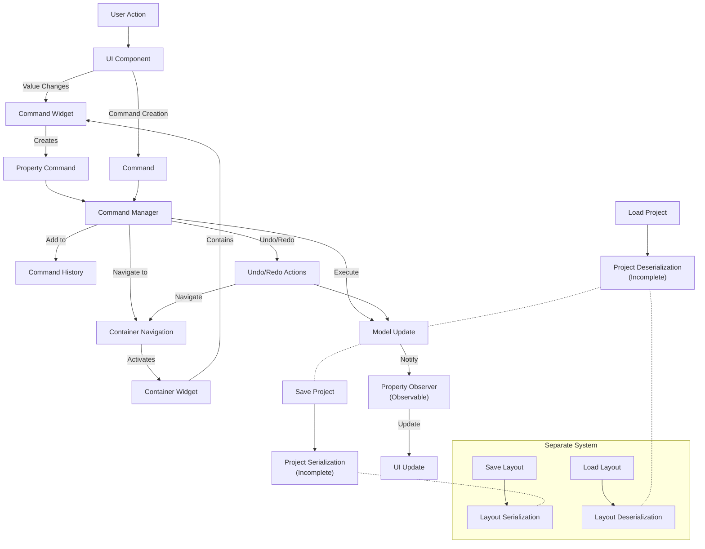

```mermaid
flowchart TD
    User[User Action] --> UI[UI Component]
    UI -- "Value Changes" --> CmdWidget[Command Widget]
    UI -- "Command Creation" --> CMD[Command]
    
    CmdWidget -- "Creates" --> PropCmd[Property Command]
    PropCmd --> CmdMgr[Command Manager]
    CMD --> CmdMgr
    
    CmdMgr -- "Execute" --> ModelUpdate[Model Update]
    CmdMgr -- "Add to" --> History[Command History]
    CmdMgr -- "Navigate to" --> Navigation[Container Navigation]
    
    Navigation -- "Activates" --> Container[Container Widget]
    Container -- "Contains" --> CmdWidget
    
    ModelUpdate -- "Notify" --> PropObserver["Property Observer\n(Observable)"]
    PropObserver -- "Update" --> UIUpdate[UI Update]
    
    CmdMgr -- "Undo/Redo" --> UndoRedo[Undo/Redo Actions]
    UndoRedo --> ModelUpdate
    UndoRedo -- "Navigate" --> Navigation
    
    SaveProject[Save Project] --> ProjectSerialize["Project Serialization\n(Incomplete)"]
    LoadProject[Load Project] --> ProjectDeserialize["Project Deserialization\n(Incomplete)"]
    
    subgraph "Separate System"
        SaveLayout[Save Layout] --> LayoutSerialize[Layout Serialization]
        LoadLayout[Load Layout] --> LayoutDeserialize[Layout Deserialization]
    end
    
    ProjectSerialize -.- LayoutSerialize
    ProjectDeserialize -.- LayoutDeserialize
    
    ModelUpdate -.- SaveProject
    ProjectDeserialize -.- ModelUpdate
```