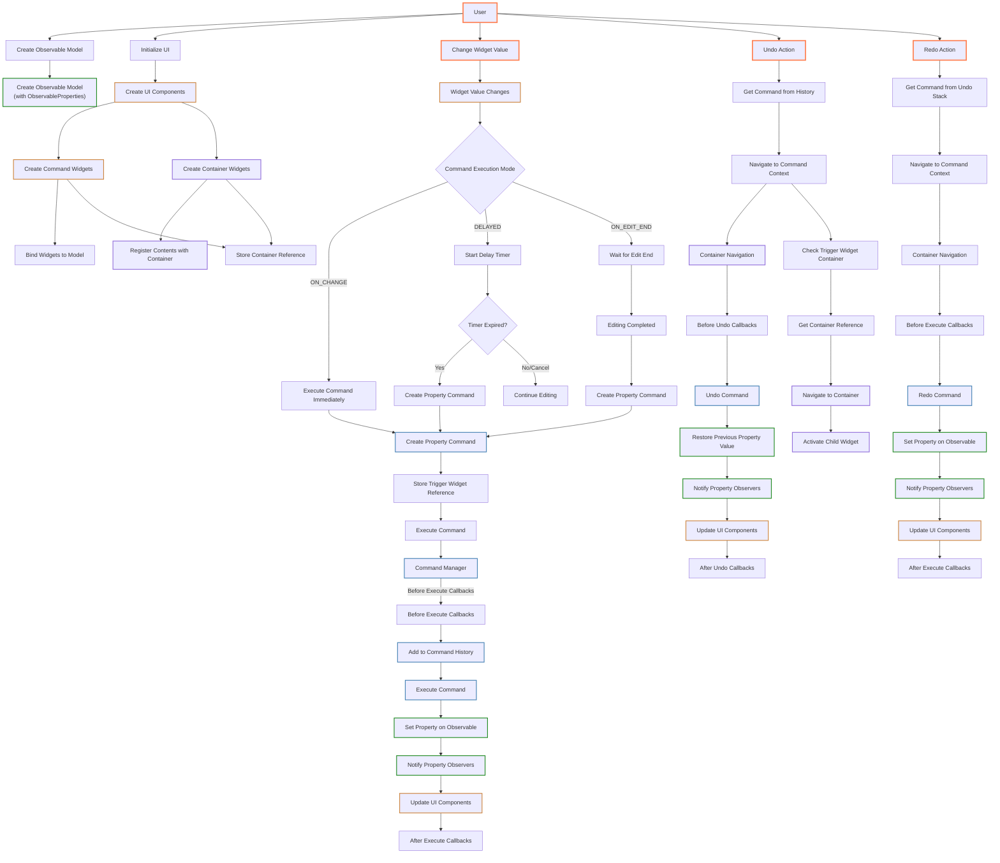

```mermaid
flowchart TD
    %% User actions
    User[User] --> ModelCreate[Create Observable Model]
    User --> UIInit[Initialize UI]
    User --> ValueChange[Change Widget Value]
    User --> UndoAction[Undo Action]
    User --> RedoAction[Redo Action]
    
    %% Model initialization
    ModelCreate --> ObservableModel["Create Observable Model\n(with ObservableProperties)"]
    
    %% UI initialization
    UIInit --> UIComponents[Create UI Components]
    UIComponents --> CmdWidgets[Create Command Widgets]
    UIComponents --> Containers[Create Container Widgets]
    CmdWidgets --> Binding[Bind Widgets to Model]
    Containers --> RegisterContents[Register Contents with Container]
    
    %% Widget to container relationship
    CmdWidgets --> SetContainer[Store Container Reference]
    Containers --> SetContainer
    
    %% Value change flow
    ValueChange --> WidgetValue[Widget Value Changes]
    WidgetValue --> ExecMode{Command Execution Mode}
    ExecMode -- "ON_CHANGE" --> ImmediateCmd[Execute Command Immediately]
    ExecMode -- "DELAYED" --> DelayTimer[Start Delay Timer]
    ExecMode -- "ON_EDIT_END" --> WaitEdit[Wait for Edit End]
    
    DelayTimer --> TimerExpired{Timer Expired?}
    TimerExpired -- Yes --> CreateDelayedCmd[Create Property Command]
    TimerExpired -- No/Cancel --> ContinueEditing[Continue Editing]
    
    WaitEdit --> EditCompleted[Editing Completed]
    EditCompleted --> CreateEditEndCmd[Create Property Command]
    
    %% Command creation
    CreateEditEndCmd --> CreateCommand[Create Property Command]
    CreateDelayedCmd --> CreateCommand
    ImmediateCmd --> CreateCommand
    
    CreateCommand --> StoreWidget[Store Trigger Widget Reference]
    StoreWidget --> ExecuteCommand[Execute Command]
    
    %% Command execution
    ExecuteCommand --> CommandManager[Command Manager]
    CommandManager -- "Before Execute Callbacks" --> BeforeExec[Before Execute Callbacks]
    BeforeExec --> AddHistory[Add to Command History]
    AddHistory --> DoExecute[Execute Command]
    DoExecute --> PropChange[Set Property on Observable]
    PropChange --> NotifyObs[Notify Property Observers]
    NotifyObs --> UpdateUI[Update UI Components]
    UpdateUI --> AfterExec[After Execute Callbacks]
    
    %% Undo flow
    UndoAction --> GetUndoCmd[Get Command from History]
    GetUndoCmd --> NavigateContext[Navigate to Command Context]
    NavigateContext --> ContainerNav[Container Navigation]
    ContainerNav --> BeforeUndo[Before Undo Callbacks]
    BeforeUndo --> UndoCommand[Undo Command]
    UndoCommand --> RestoreProp[Restore Previous Property Value]
    RestoreProp --> NotifyUndo[Notify Property Observers]
    NotifyUndo --> UpdateUIUndo[Update UI Components]
    UpdateUIUndo --> AfterUndo[After Undo Callbacks]
    
    %% Redo flow
    RedoAction --> GetRedoCmd[Get Command from Undo Stack]
    GetRedoCmd --> NavigateRedoContext[Navigate to Command Context]
    NavigateRedoContext --> ContainerNavRedo[Container Navigation]
    ContainerNavRedo --> BeforeRedo[Before Execute Callbacks]
    BeforeRedo --> RedoCommand[Redo Command]
    RedoCommand --> SetProp[Set Property on Observable]
    SetProp --> NotifyRedo[Notify Property Observers]
    NotifyRedo --> UpdateUIRedo[Update UI Components]
    UpdateUIRedo --> AfterRedo[After Execute Callbacks]
    
    %% Container navigation
    NavigateContext --> CheckContainer[Check Trigger Widget Container]
    CheckContainer --> GetContainerRef[Get Container Reference]
    GetContainerRef --> NavigateContainer[Navigate to Container]
    NavigateContainer --> ActivateWidget[Activate Child Widget]
    
    %% Styling with only colored borders, using default fills for dark mode compatibility
    classDef userAction stroke:#ff7f50,stroke-width:3px;
    classDef commandOp stroke:#4682b4,stroke-width:2px;
    classDef observable stroke:#228b22,stroke-width:2px;
    classDef uiComponent stroke:#cd853f,stroke-width:2px;
    classDef container stroke:#9370db,stroke-width:2px;
    
    class User,ValueChange,UndoAction,RedoAction userAction;
    class CommandManager,CreateCommand,AddHistory,DoExecute,UndoCommand,RedoCommand commandOp;
    class ObservableModel,PropChange,RestoreProp,SetProp,NotifyObs,NotifyUndo,NotifyRedo observable;
    class UIComponents,CmdWidgets,WidgetValue,UpdateUI,UpdateUIUndo,UpdateUIRedo uiComponent;
    class Containers,RegisterContents,ContainerNav,NavigateContainer,ActivateWidget container;
```