# Dynamic Container System Visualization

This document provides visual explanations of the Dynamic Container Management System using Mermaid diagrams.

## Core Architecture

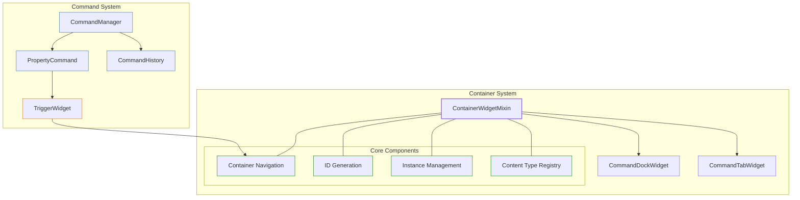

## Object Structure and Relationships

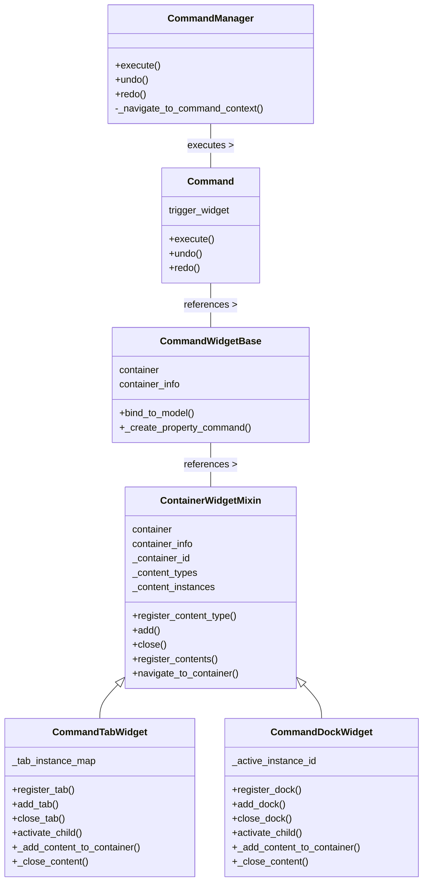

## Content Type Registration Flow

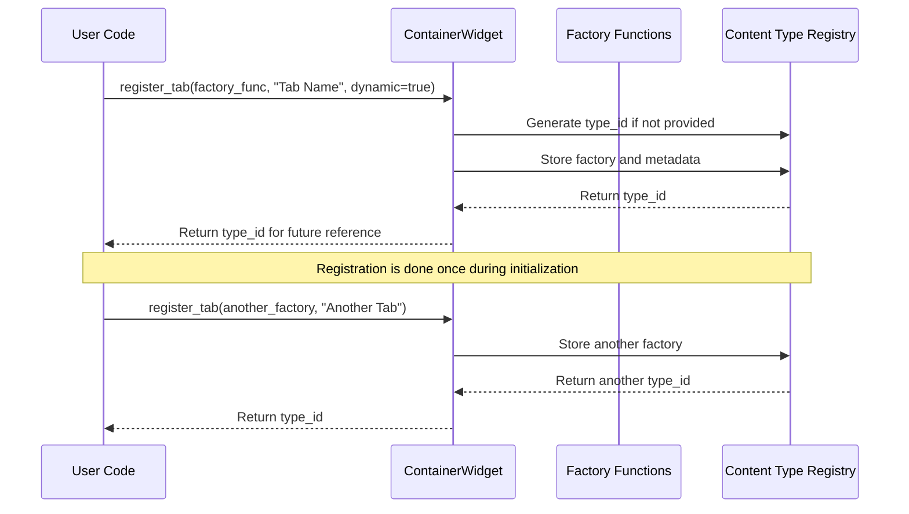

## Content Instance Creation Flow

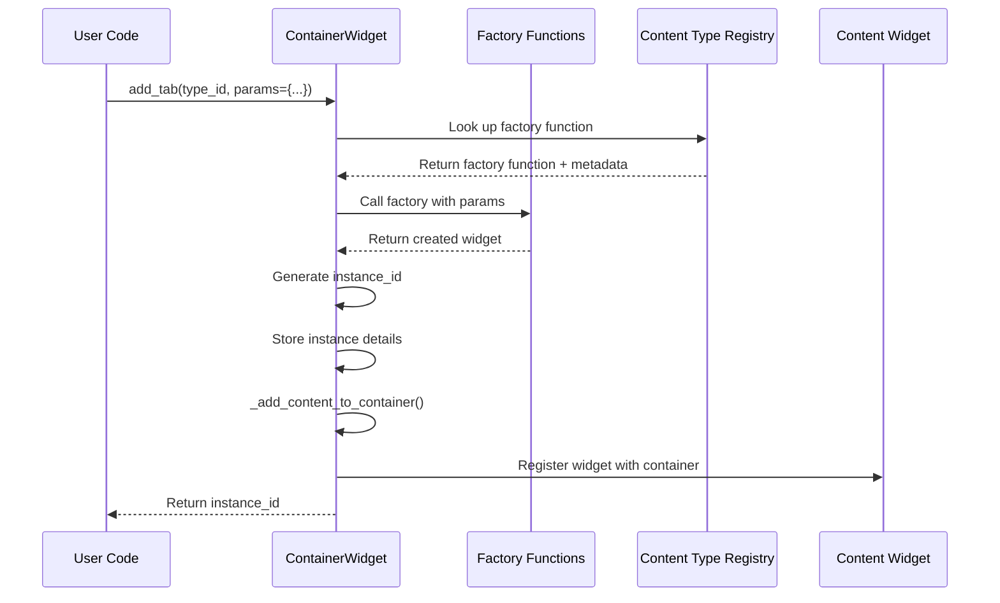

## Navigation During Undo/Redo

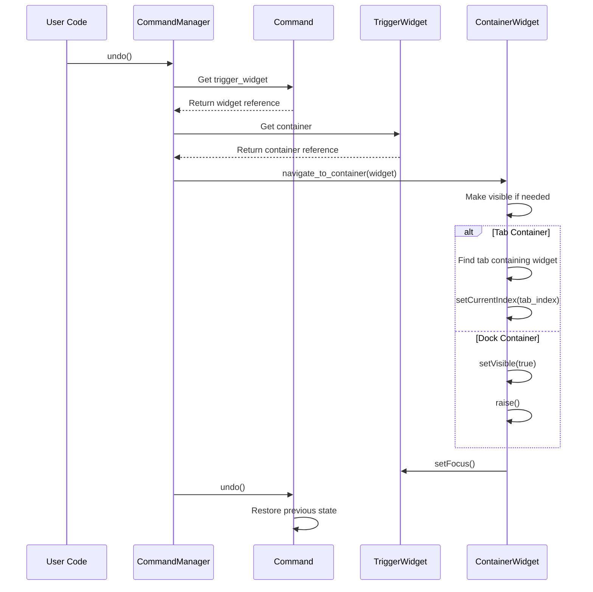

## Nested Container Hierarchy

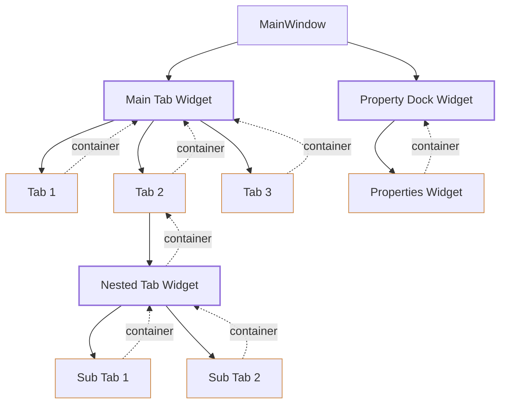

## Dynamic Content Creation and Management

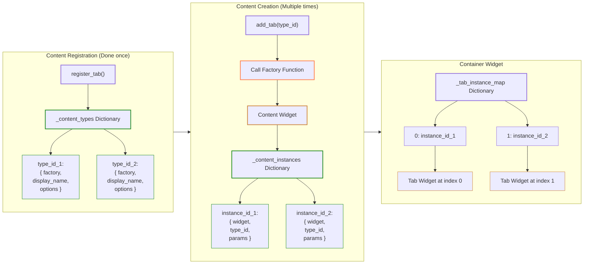

## Complete System Flow Example

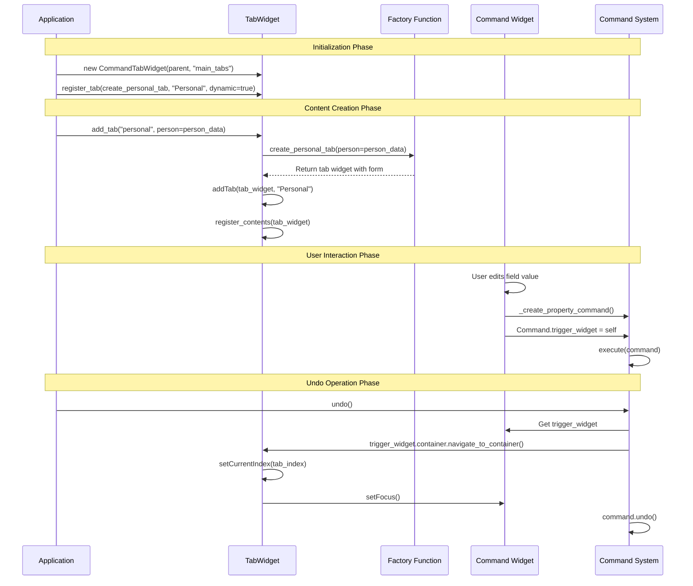

## Content Closure Flow

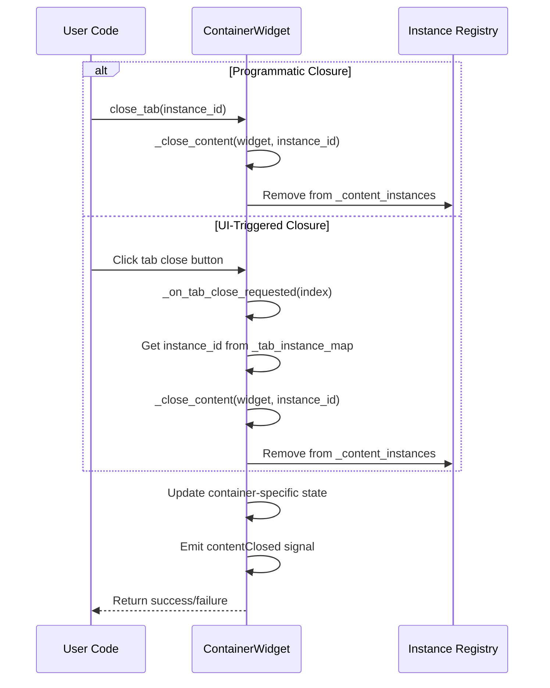

## Factory Pattern Implementation

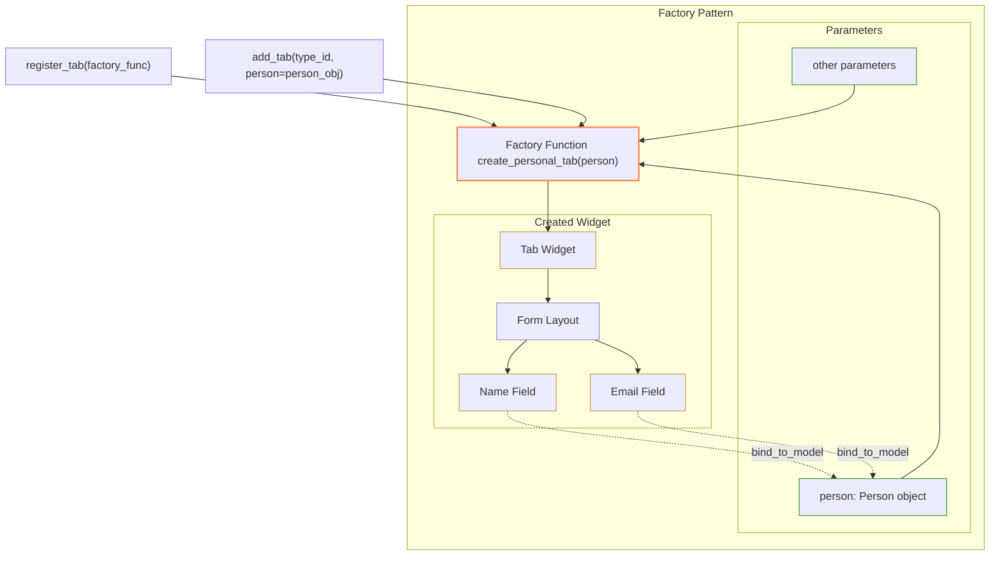

## Widget Registration and Container References

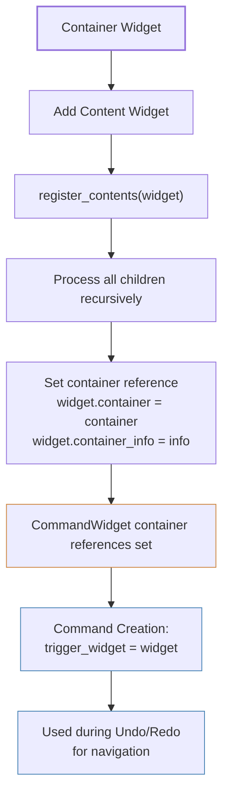