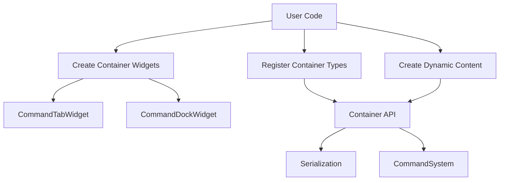
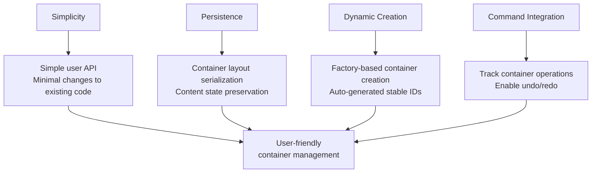
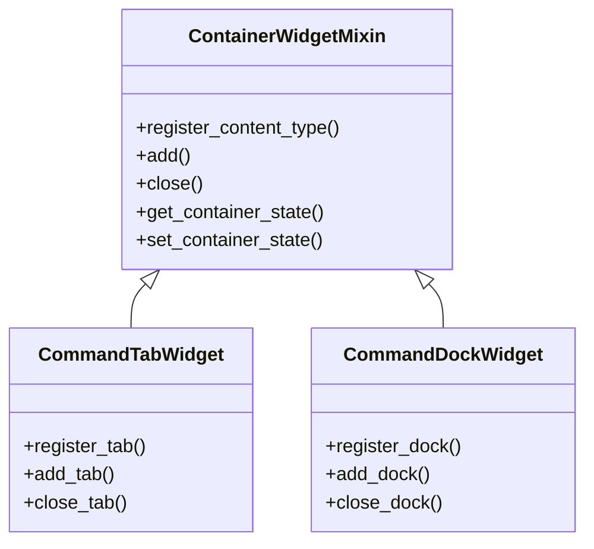
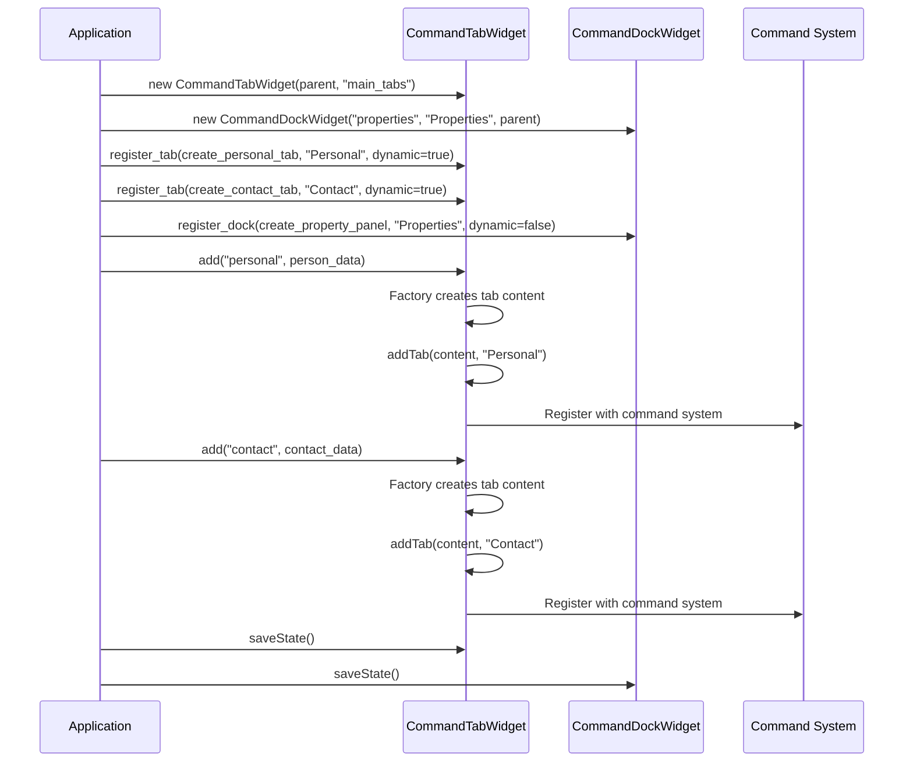
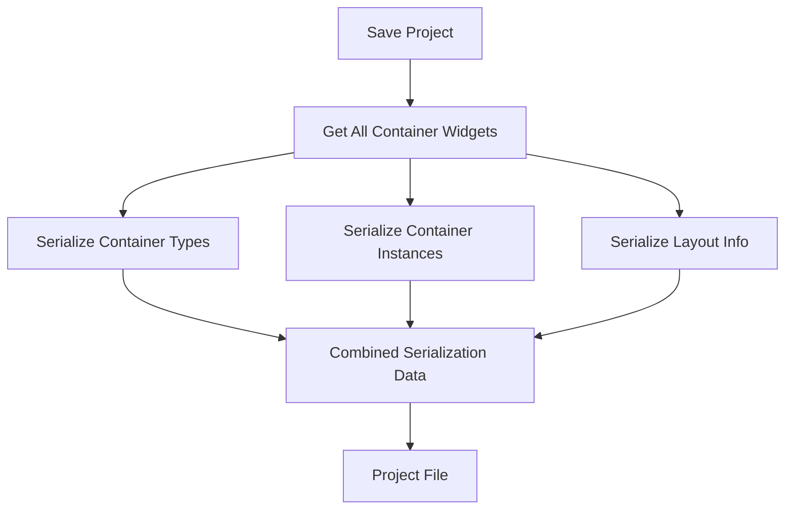

# Dynamic Container Management System

## Core Concept

The Dynamic Container Management System provides a simple way to manage, persist, and restore UI containers (tabs, docks, etc.) with minimal changes to existing code. The system handles both permanent and dynamic containers seamlessly while integrating with the command system.



## Goals and Approach



Our approach integrates directly into the container widgets (CommandTabWidget, CommandDockWidget), so the management system is abstracted away from users. Each container widget handles its own registration and creation of content.

## Key Components

### 1. Container Registration

Each container widget provides a registration method:

```python
# Register a tab type with factory function
personal_tab_id = tab_widget.register_tab(
    create_personal_tab,     # Factory function
    tab_name="Personal",     # Display name
    dynamic=True,            # Can have multiple instances
    closable=True            # Can be closed by user
)
```

### 2. Dynamic Container Creation

Once registered, containers can be created:

```python
# Create an instance of a registered tab
tab_instance = tab_widget.add(personal_tab_id)
```

### 3. Container Layout and State

The system automatically handles layout persistence:

```python
# Save entire application container layout
layout_data = save_container_layout()

# Restore layout from saved data
load_container_layout(layout_data)
```

## Container Types



## Workflow Example



## Implementation Philosophy

1. **Minimal Code Changes**: The system extends existing widgets without requiring major refactoring
2. **Factory Pattern**: Container content is created by factory functions
3. **Consistent IDs**: Container instances use stable IDs for persistence
4. **Command Integration**: Container operations can be part of the command history

## Simplified User Experience

From the user's perspective, the workflow is straightforward:

1. **Create container widgets normally**
   ```python
   self.tab_widget = CommandTabWidget(self, "main_tabs")
   ```

2. **Register content types once**
   ```python
   personal_tab_id = self.tab_widget.register_tab(
       self.create_personal_tab,
       tab_name="Personal",
       dynamic=True, 
       closable=True
   )
   ```

3. **Create content as needed**
   ```python
   self.tab_widget.add(personal_tab_id, person=self.person)
   ```

4. **Define factory functions**
   ```python
   def create_personal_tab(self, params=None):
       tab = QWidget()
       layout = QFormLayout(tab)
       
       first_name_edit = CommandLineEdit()
       if params and 'person' in params:
           first_name_edit.bind_to_model(params['person'], "first_name")
       
       layout.addRow("First Name:", first_name_edit)
       return tab
   ```

## Serialization Strategy



The serialization system captures:
1. Container type definitions
2. Instance state for dynamic containers
3. Layout information (position, size, visibility)
4. Parent-child relationships