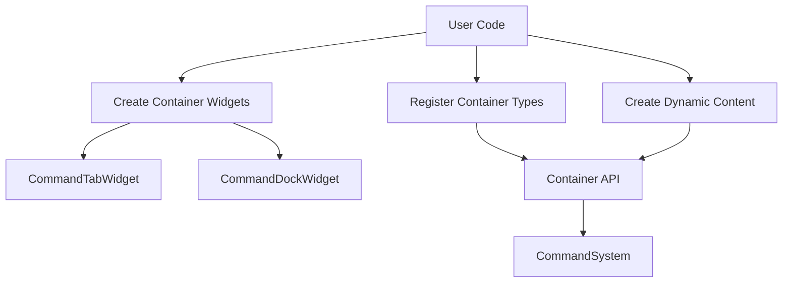
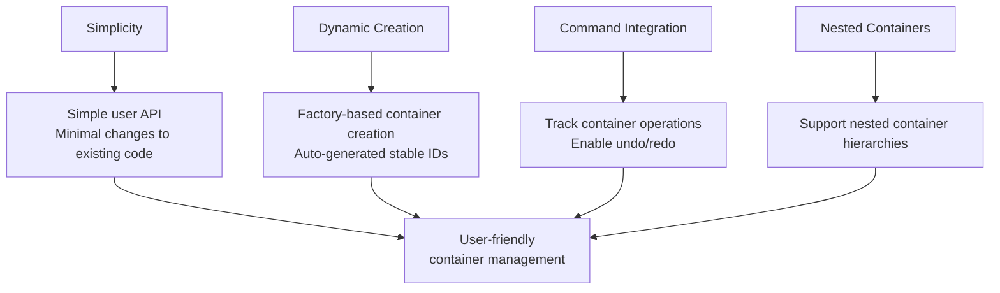
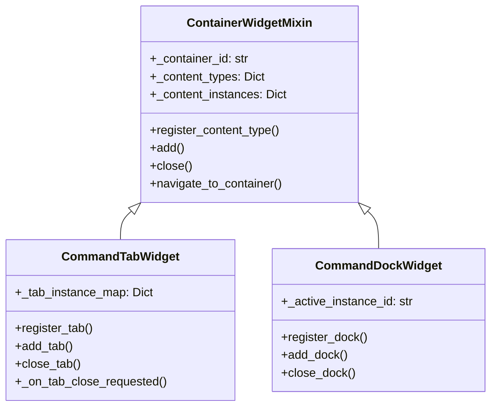
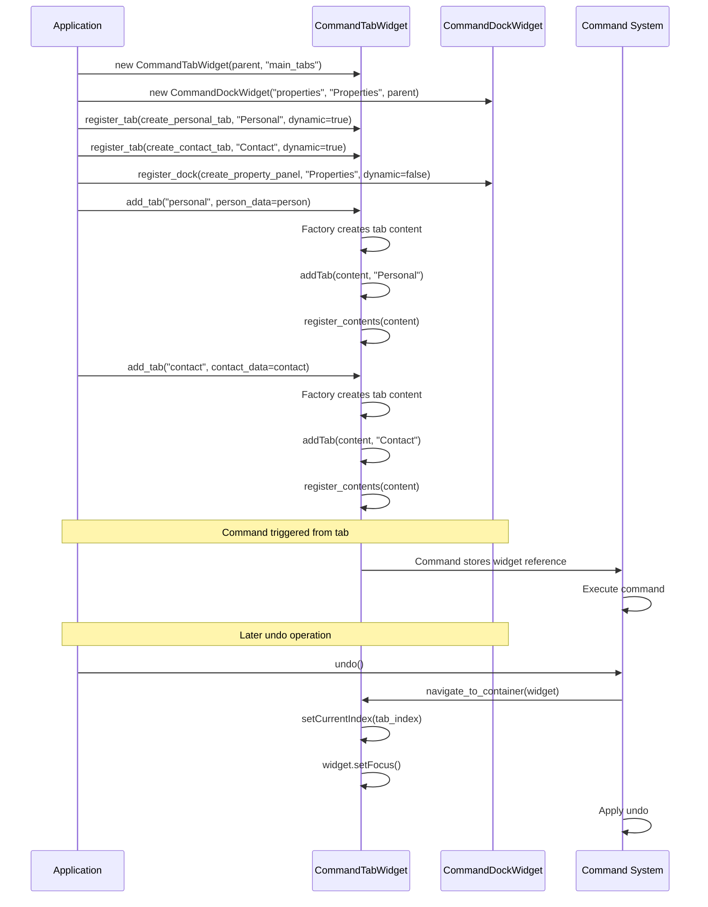

# Dynamic Container Management System

## Core Concept

The Dynamic Container Management System provides a simple way to manage, persist, and restore UI containers (tabs, docks, etc.) with minimal changes to existing code. The system handles both permanent and dynamic containers seamlessly while integrating with the command system.



## Goals and Approach



Our approach integrates directly into the container widgets (CommandTabWidget, CommandDockWidget), so the management system is abstracted away from users. Each container widget handles its own registration and creation of content.

## Key Components

### 1. Container Registration

Each container widget provides a registration method:

```python
# Register a tab type with factory function
personal_tab_id = tab_widget.register_tab(
    create_personal_tab,     # Factory function
    tab_name="Personal",     # Display name
    dynamic=True,            # Can have multiple instances
    closable=True            # Can be closed by user
)
```

### 2. Dynamic Container Creation

Once registered, containers can be created:

```python
# Create an instance of a registered tab
tab_instance = tab_widget.add_tab(personal_tab_id, person_data=person)
```

## How It Works Internally

### ContainerWidgetMixin

The `ContainerWidgetMixin` serves as the foundation for all dynamic containers:

1. **Registration System**:
   - Each container maintains a dictionary `_content_types` mapping type IDs to factory functions and options
   - Registration methods store factory functions and metadata about each content type
   - Types can be marked as dynamic (multiple instances) or static (single instance)

2. **Instance Management**:
   - Created instances are tracked in `_content_instances` dictionary
   - Each instance has a unique ID, either provided or auto-generated
   - Instance IDs enable direct reference to specific content instances

3. **Container Hierarchy**:
   - Containers store references to their parent container (if any)
   - The `register_contents` method sets container references in all child widgets
   - This enables precise navigation during command operations

4. **Command Integration**:
   - Widgets within containers store their container reference
   - Commands store the widget that triggered them
   - During undo/redo, the system navigates to the appropriate container

### Tab Widget Implementation

The `CommandTabWidget` builds on the base mixin with tab-specific functionality:

1. **Tab Management**:
   - Maintains a map between tab indices and instance IDs (`_tab_instance_map`)
   - Handles tab navigation and focus
   - Manages tab closure and index updates

2. **Tab Factory Pattern**:
   - `register_tab` registers a factory function for creating tab content
   - `add_tab` uses the factory to create tab content with parameters
   - Tab creation parameters are stored for future recreation

### Dock Widget Implementation

The `CommandDockWidget` implements dock-specific container behavior:

1. **Dock Content Management**:
   - Tracks active content instance with `_active_instance_id`
   - Handles content replacement when a new instance is added
   - Manages visibility and features based on content options

2. **Dock Navigation**:
   - Makes dock visible and raises it during navigation
   - Focus specific child widgets when needed
   - Ensures parent containers are visible (for nested docks)

## Container Types



## Workflow Example



## Implementation Philosophy

1. **Minimal Code Changes**: The system extends existing widgets without requiring major refactoring
2. **Factory Pattern**: Container content is created by factory functions
3. **Consistent IDs**: Container instances use stable IDs for persistence
4. **Command Integration**: Container operations can be part of the command history
5. **Nested Support**: Containers can be nested within other containers

## Simplified User Experience

From the user's perspective, the workflow is straightforward:

1. **Create container widgets normally**
   ```python
   self.tab_widget = CommandTabWidget(self, "main_tabs")
   ```

2. **Register content types once**
   ```python
   personal_tab_id = self.tab_widget.register_tab(
       self.create_personal_tab,
       tab_name="Personal",
       dynamic=True, 
       closable=True
   )
   ```

3. **Create content as needed**
   ```python
   self.tab_widget.add_tab(personal_tab_id, person=self.person)
   ```

4. **Define factory functions**
   ```python
   def create_personal_tab(self, person=None):
       tab = QWidget()
       layout = QFormLayout(tab)
       
       first_name_edit = CommandLineEdit()
       if person and 'person' in params:
           first_name_edit.bind_to_model(person, "first_name")
       
       layout.addRow("First Name:", first_name_edit)
       return tab
   ```

## Future Enhancements

1. **Serialization Integration**
   - Container layout persistence
   - Content state preservation
   - Content recreation from saved state

2. **Layout Management**
   - Container layout presets
   - Layout state serialization
   - Multi-window support

3. **Command History Integration**
   - Container creation/closure commands
   - Layout change commands
   - State change tracking