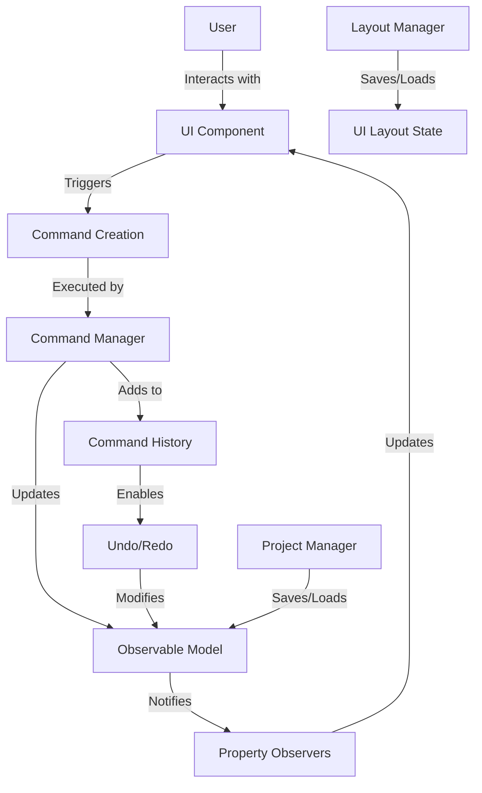
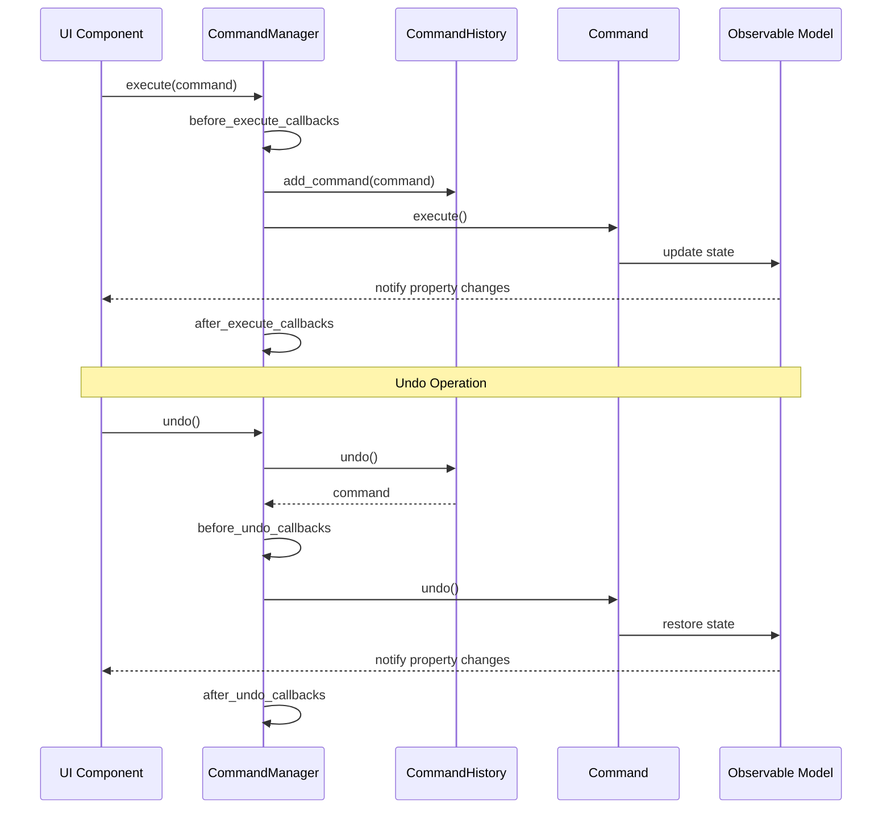
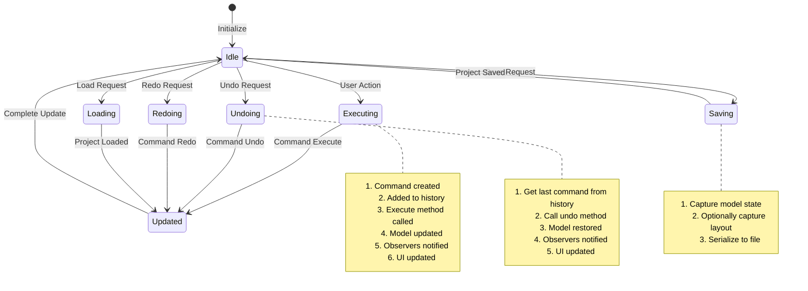

# PySignalDecipher Command System Architecture

The PySignalDecipher command system is a comprehensive framework that implements the Command pattern and Observable pattern to provide a robust undo/redo system with property change tracking. This document explains the role of each component and how they interact.

## Core Architecture Overview



## Core Components

### Observable Pattern (`core/observable.py`)

#### `Observable` Class
- **Role**: Base class for any object that needs to track property changes
- **Usage**: 
  - **Internal**: Framework foundation
  - **User**: Used directly when creating custom model classes
- **How it works**: Provides property change notifications, unique identity management, and parent-child relationship tracking
- **Key Methods**:
  - `add_property_observer()`: Register a callback for property changes
  - `remove_property_observer()`: Unregister a callback
  - `_notify_property_changed()`: Internal method called when a property changes
  - `get_id()/set_id()`: Manage unique object identity

```python
# User code example
class MyModel(Observable):
    def __init__(self):
        super().__init__()
        self._name = "Default"
        
    @property
    def name(self):
        return self._name
        
    @name.setter
    def name(self, value):
        old_value = self._name
        self._name = value
        self._notify_property_changed("name", old_value, value)
```

#### `ObservableProperty` Class
- **Role**: Descriptor that creates properties with automatic change notification
- **Usage**: 
  - **Internal**: Framework feature
  - **User**: Used directly in model class definitions
- **How it works**: Implements `__get__` and `__set__` to handle property access and automatically notify observers
- **Example**:

```python
# User code example - much cleaner with ObservableProperty
class MyModel(Observable):
    name = ObservableProperty[str]("Default")
    count = ObservableProperty[int](0)
```

### Command Pattern (`core/command.py`)

#### `Command` Abstract Class
- **Role**: Base class for all commands
- **Usage**: 
  - **Internal**: Framework foundation
  - **User**: Extended when creating custom commands
- **How it works**: Defines the command interface with execute/undo/redo methods
- **Key Methods**:
  - `execute()`: Perform the command action
  - `undo()`: Reverse the command action
  - `redo()`: Re-perform the command (default is to call execute)

```python
# User code example for custom command
class MyCustomCommand(Command):
    def __init__(self, target, parameter):
        self.target = target
        self.parameter = parameter
        self.old_state = target.save_state()  # Store state for undo
        
    def execute(self):
        self.target.perform_action(self.parameter)
        
    def undo(self):
        self.target.restore_state(self.old_state)
```

#### `PropertyCommand` Class
- **Role**: Command for changing a single property value
- **Usage**: 
  - **Internal**: Used automatically by property bindings
  - **User**: Typically not created directly
- **How it works**: Stores old and new property values to enable undo/redo

#### `CompoundCommand` Class
- **Role**: Groups multiple commands into a single unit
- **Usage**: 
  - **Internal**: Used for multi-step operations
  - **User**: Used when multiple related changes need to be treated as one
- **How it works**: Maintains a list of commands that are executed, undone, and redone together

#### `MacroCommand` Class
- **Role**: User-level named commands for UI operations
- **Usage**: 
  - **Internal**: Framework feature
  - **User**: Used for high-level user operations
- **How it works**: Extends CompoundCommand with descriptive names and metadata

### Command Management (`core/command_manager.py`)

#### `CommandHistory` Class
- **Role**: Tracks command execution for undo/redo
- **Usage**: 
  - **Internal**: Used by CommandManager
  - **User**: Not typically used directly
- **How it works**: Maintains stacks of executed and undone commands
- **Key Methods**:
  - `add_command()`: Add a command to history
  - `undo()`: Move command from executed to undone stack
  - `redo()`: Move command from undone to executed stack
  - `can_undo()/can_redo()`: Check if undo/redo is available

#### `CommandManager` Class
- **Role**: Central hub for command execution and history
- **Usage**: 
  - **Internal**: Core system component
  - **User**: Used directly to execute commands
- **How it works**: Manages command execution/undo/redo and notifies listeners
- **Key Methods**:
  - `execute()`: Execute a command and add to history
  - `undo()`: Undo the most recent command
  - `redo()`: Redo most recently undone command
  - `Callback hooks`: Before/after execute, before/after undo



## UI Integration

### Property Binding (`ui/property_binding.py`)

#### `Binding` Abstract Class
- **Role**: Base class for connecting model properties to UI widgets
- **Usage**: 
  - **Internal**: Extended for specific widget types
  - **User**: Not typically used directly
- **How it works**: Observes model property changes and widget value changes, keeping them in sync

#### `PropertyBinder` Class
- **Role**: Creates and manages property bindings
- **Usage**: 
  - **Internal**: Framework feature
  - **User**: Used directly to bind model properties to widgets
- **How it works**: Creates appropriate bindings based on widget types
- **Key Methods**:
  - `bind()`: Create binding between model property and widget
  - `unbind()`: Remove a binding
  - `unbind_all()`: Remove all bindings

```python
# User code example
property_binder = PropertyBinder()
property_binder.bind(my_model, "name", name_line_edit, "text")
property_binder.bind(my_model, "count", count_spin_box, "value")
```

### Qt Bindings (`ui/qt_bindings.py`)

Contains specific binding implementations for Qt widgets:
- `LineEditBinding`: For QLineEdit text
- `SpinBoxBinding`: For QSpinBox values
- `CheckBoxBinding`: For QCheckBox checked state
- etc.

These are used internally by PropertyBinder and not typically used directly by users.

### Command-Aware Widgets (`ui/widgets/base.py`)

#### `CommandWidgetBase` Class
- **Role**: Base mixin for widgets that create commands automatically
- **Usage**: 
  - **Internal**: Mixed into widget implementations
  - **User**: Not typically used directly
- **How it works**: Converts widget value changes into commands

## Layout and Dock Management

### Layout Manager (`layout/layout_manager.py`)

#### `LayoutManager` Class
- **Role**: Saves and restores UI layouts
- **Usage**: 
  - **Internal**: Framework feature
  - **User**: Used directly to save/load layouts
- **How it works**: Captures and restores widget states, geometry, and relationships
- **Key Methods**:
  - `capture_current_layout()`: Capture current UI state
  - `apply_layout()`: Restore a saved layout
  - `save_layout_preset()`: Save layout with a name
  - `load_layout_preset()`: Load a named layout

### Dock Manager (`ui/dock/dock_manager.py`)

#### `DockManager` Class
- **Role**: Manages dock widgets and their states
- **Usage**: 
  - **Internal**: Used by layout system
  - **User**: Used directly for dock management
- **How it works**: Tracks dock widgets, their relationships, and serialization
- **Key Methods**:
  - `register_dock()`: Register a dock widget
  - `save_dock_state()`: Save a dock's state
  - `restore_dock_state()`: Restore a dock's state

### Dock Widgets (`ui/dock/dock_widgets.py`)

#### `CommandDockWidget` Class
- **Role**: Command-aware dock widget
- **Usage**: 
  - **Internal**: Framework feature
  - **User**: Used directly as base for dock widgets
- **How it works**: Creates commands for dock state changes

#### `ObservableDockWidget` Class
- **Role**: Dock widget that is also Observable
- **Usage**: 
  - **Internal**: Framework feature
  - **User**: Used directly for bindable docks
- **How it works**: Exposes dock properties as observable properties

## Project Management

### Project Manager (`project/project_manager.py`)

#### `ProjectManager` Class
- **Role**: Handles project save/load operations
- **Usage**: 
  - **Internal**: Framework feature
  - **User**: Used directly for project operations
- **How it works**: Manages serialization of model state and UI layout
- **Key Methods**:
  - `save_project()`: Save model to file
  - `load_project()`: Load model from file
  - `new_project()`: Create a new model

## Usage Patterns

### Model Definition

```python
class SignalModel(Observable):
    name = ObservableProperty[str]("Unnamed Signal")
    amplitude = ObservableProperty[float](1.0)
    frequency = ObservableProperty[float](1.0)
    
    def process(self):
        # Process signal data
        pass
```

### Command Execution

```python
# Get the command manager
cmd_mgr = get_command_manager()

# Create and execute a command
command = MyCustomCommand(target, parameter)
cmd_mgr.execute(command)

# Undo last command
if cmd_mgr.can_undo():
    cmd_mgr.undo()

# Redo last undone command
if cmd_mgr.can_redo():
    cmd_mgr.redo()
```

### Property Binding

```python
# Create property binder
binder = PropertyBinder()

# Bind model properties to widgets
binder.bind(signal_model, "name", name_edit, "text")
binder.bind(signal_model, "amplitude", amplitude_slider, "value")
binder.bind(signal_model, "frequency", frequency_spin, "value")
```

### Layout Management

```python
# Get layout manager
layout_mgr = get_layout_manager()

# Save current layout
layout_mgr.save_layout_preset("default")

# Load a layout
layout_mgr.load_layout_preset("default")
```

### Project Operations

```python
# Get project manager
project_mgr = get_project_manager()

# Save project
project_mgr.save_project(model, "signal_project.json")

# Load project
model = project_mgr.load_project("signal_project.json")

# Create new project
model = project_mgr.new_project("signal_model")
```

## System Workflow



## Limitations of Current System

The primary limitation is the incomplete serialization system:

1. **Limited Serialization**: Project serialization is not fully implemented
2. **No Serialization Formats**: No support for different formats (JSON, Binary, XML)
3. **No Reference Resolution**: No standard approach for complex object references
4. **Separate Layout Serialization**: Layout and project serialization are separate

These limitations are addressed in the planned serialization system as described in the serialization planning documents.