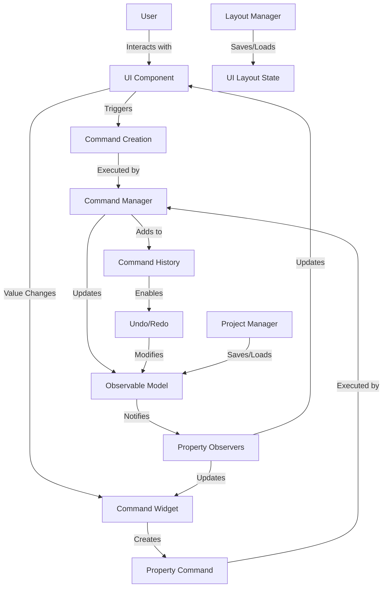
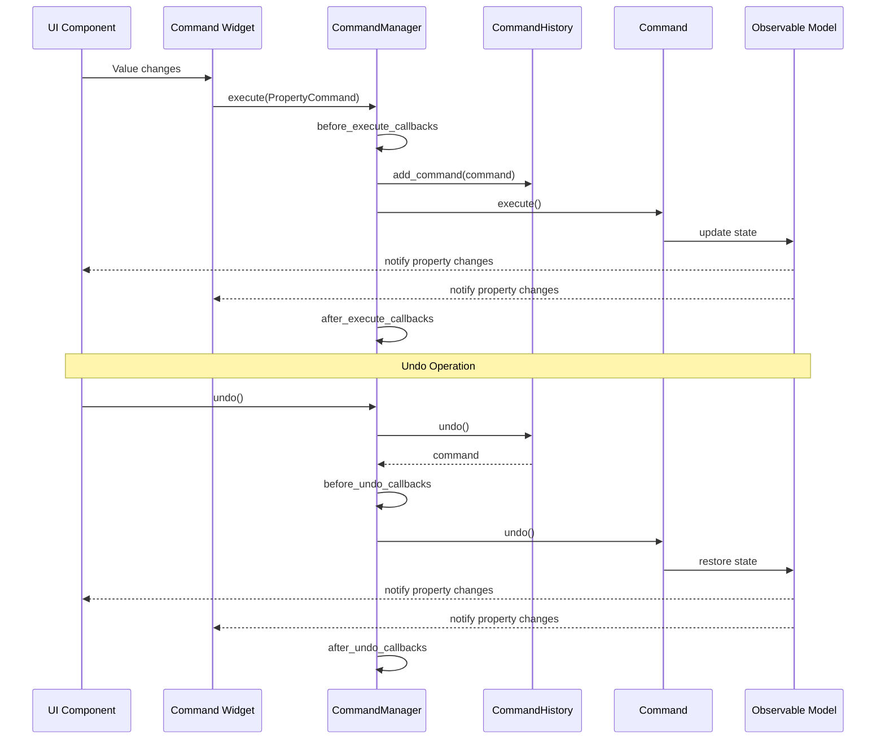
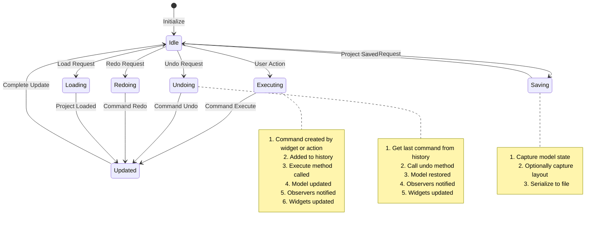

# PySignalDecipher Command System Architecture

The PySignalDecipher command system is a comprehensive framework that implements the Command pattern and Observable pattern to provide a robust undo/redo system with property change tracking. This document explains the role of each component and how they interact.

## Core Architecture Overview



## Core Components

### Observable Pattern (`core/observable.py`)

#### `Observable` Class
- **Role**: Base class for any object that needs to track property changes
- **Usage**: 
  - **Internal**: Framework foundation
  - **User**: Used directly when creating custom model classes
- **How it works**: Provides property change notifications, unique identity management, and parent-child relationship tracking
- **Key Methods**:
  - `add_property_observer()`: Register a callback for property changes
  - `remove_property_observer()`: Unregister a callback
  - `_notify_property_changed()`: Internal method called when a property changes
  - `get_id()/set_id()`: Manage unique object identity

```python
# User code example
class MyModel(Observable):
    def __init__(self):
        super().__init__()
        self._name = "Default"
        
    @property
    def name(self):
        return self._name
        
    @name.setter
    def name(self, value):
        old_value = self._name
        self._name = value
        self._notify_property_changed("name", old_value, value)
```

#### `ObservableProperty` Class
- **Role**: Descriptor that creates properties with automatic change notification
- **Usage**: 
  - **Internal**: Framework feature
  - **User**: Used directly in model class definitions
- **How it works**: Implements `__get__` and `__set__` to handle property access and automatically notify observers
- **Example**:

```python
# User code example - much cleaner with ObservableProperty
class MyModel(Observable):
    name = ObservableProperty[str]("Default")
    count = ObservableProperty[int](0)
```

### Command Pattern (`core/command.py`)

#### `Command` Abstract Class
- **Role**: Base class for all commands
- **Usage**: 
  - **Internal**: Framework foundation
  - **User**: Extended when creating custom commands
- **How it works**: Defines the command interface with execute/undo/redo methods
- **Key Methods**:
  - `execute()`: Perform the command action
  - `undo()`: Reverse the command action
  - `redo()`: Re-perform the command (default is to call execute)

```python
# User code example for custom command
class MyCustomCommand(Command):
    def __init__(self, target, parameter):
        self.target = target
        self.parameter = parameter
        self.old_state = target.save_state()  # Store state for undo
        
    def execute(self):
        self.target.perform_action(self.parameter)
        
    def undo(self):
        self.target.restore_state(self.old_state)
```

#### `PropertyCommand` Class
- **Role**: Command for changing a single property value
- **Usage**: 
  - **Internal**: Used automatically by command-aware widgets
  - **User**: Typically not created directly
- **How it works**: Stores old and new property values to enable undo/redo

#### `CompoundCommand` Class
- **Role**: Groups multiple commands into a single unit
- **Usage**: 
  - **Internal**: Used for multi-step operations
  - **User**: Used when multiple related changes need to be treated as one
- **How it works**: Maintains a list of commands that are executed, undone, and redone together

#### `MacroCommand` Class
- **Role**: User-level named commands for UI operations
- **Usage**: 
  - **Internal**: Framework feature
  - **User**: Used for high-level user operations
- **How it works**: Extends CompoundCommand with descriptive names and metadata

### Command Management (`core/command_manager.py`)

#### `CommandHistory` Class
- **Role**: Tracks command execution for undo/redo
- **Usage**: 
  - **Internal**: Used by CommandManager
  - **User**: Not typically used directly
- **How it works**: Maintains stacks of executed and undone commands
- **Key Methods**:
  - `add_command()`: Add a command to history
  - `undo()`: Move command from executed to undone stack
  - `redo()`: Move command from undone to executed stack
  - `can_undo()/can_redo()`: Check if undo/redo is available

#### `CommandManager` Class
- **Role**: Central hub for command execution and history
- **Usage**: 
  - **Internal**: Core system component
  - **User**: Used directly to execute commands
- **How it works**: Manages command execution/undo/redo and notifies listeners
- **Key Methods**:
  - `execute()`: Execute a command and add to history
  - `undo()`: Undo the most recent command
  - `redo()`: Redo most recently undone command
  - `Callback hooks`: Before/after execute, before/after undo



## UI Integration

### Command Widget (`widgets/base.py`)

#### `CommandWidgetBase` Class
- **Role**: Base mixin for creating command-aware widgets
- **Usage**: 
  - **Internal**: Mixed into widget implementations
  - **User**: Used directly when creating command-aware widgets
- **How it works**: Connects widget value changes to model properties via commands
- **Key Methods**:
  - `bind_to_model()`: Connect widget to a model property
  - `unbind_from_model()`: Disconnect from model
  - `_update_widget_from_model()`: Update widget from model property
  - `_on_widget_value_changed()`: Handle widget value changes
  - `_create_property_command()`: Create command for property changes

```python
# User code example
class CommandLineEdit(QLineEdit, CommandWidgetBase):
    def __init__(self, parent=None):
        QLineEdit.__init__(self, parent)
        CommandWidgetBase.__init__(self)
        self._setup_command_widget("text")
        self.textChanged.connect(self._on_widget_value_changed)
    
    def _get_widget_value(self):
        return self.text()
        
    def _set_widget_value(self, value):
        self.setText(value if value is not None else "")

# Usage
line_edit = CommandLineEdit()
line_edit.bind_to_model(model, "name")
```

This approach provides a clean, direct connection between widgets and models with built-in command support. The widget mixin handles all the details of:

1. Tracking when a user edits a value
2. Creating appropriate commands for changes
3. Updating the widget when the model property changes
4. Managing the binding lifecycle
5. Preventing update loops

Using the `CommandWidgetBase` as a mixin allows creating custom command-aware versions of any widget type, while maintaining the widget's original behavior and appearance.

### Dock Management (`widgets/docks/`)

#### `DockManager` Class
- **Role**: Manages dock widgets and their states
- **Usage**: 
  - **Internal**: Used by layout system
  - **User**: Used directly for dock management
- **How it works**: Tracks dock widgets, their relationships, and serialization
- **Key Methods**:
  - `register_dock()`: Register a dock widget
  - `save_dock_state()`: Save a dock's state
  - `restore_dock_state()`: Restore a dock's state

#### `CommandDockWidget` Class
- **Role**: Command-aware dock widget
- **Usage**: 
  - **Internal**: Framework feature
  - **User**: Used directly as base for dock widgets
- **How it works**: Creates commands for dock state changes, such as position, floating state, etc.
- **Key Features**:
  - Tracks dock movement and state changes
  - Creates appropriate commands for dock operations
  - Integrates with dock manager

#### `ObservableDockWidget` Class
- **Role**: Dock widget that is also Observable
- **Usage**: 
  - **Internal**: Framework feature
  - **User**: Used directly for bindable docks
- **How it works**: Exposes dock properties as observable properties
- **Key Features**:
  - Exposes title, floating state, visibility as observable properties
  - Enables binding dock properties to model properties
  - Maintains synchronization between dock state and properties

## Layout and Dock Management

### Layout Manager (`layout/layout_manager.py`)

#### `LayoutManager` Class
- **Role**: Saves and restores UI layouts
- **Usage**: 
  - **Internal**: Framework feature
  - **User**: Used directly to save/load layouts
- **How it works**: Captures and restores widget states, geometry, and relationships
- **Key Methods**:
  - `capture_current_layout()`: Capture current UI state
  - `apply_layout()`: Restore a saved layout
  - `save_layout_preset()`: Save layout with a name
  - `load_layout_preset()`: Load a named layout

## Project Management

### Project Manager (`project/project_manager.py`)

#### `ProjectManager` Class
- **Role**: Handles project save/load operations
- **Usage**: 
  - **Internal**: Framework feature
  - **User**: Used directly for project operations
- **How it works**: Manages serialization of model state and UI layout
- **Key Methods**:
  - `save_project()`: Save model to file
  - `load_project()`: Load model from file
  - `new_project()`: Create a new model

## Serialization System (Planned)

### Serialization Manager (`serialization/manager.py`)

#### `SerializationManager` Class
- **Role**: Central hub for serialization operations
- **Usage**: 
  - **Internal**: Used by other components
  - **User**: Not typically used directly
- **How it works**: Manages serializers, format adapters, and serialization context
- **Key Methods**:
  - `serialize()`: Serialize an object to a specified format
  - `deserialize()`: Deserialize data into objects
  - `register_type()`: Register a type for serialization
  - `register_serializer()`: Register custom serializer functions

### Registry Engine (`serialization/registry.py`)

#### `RegistryEngine` Class
- **Role**: Manages type registration and factory functions
- **Usage**: 
  - **Internal**: Used by SerializationManager
  - **User**: Not typically used directly
- **How it works**: Associates type names with classes, factories, and serializers
- **Key Methods**:
  - `register_type()`: Register a type with a name
  - `register_factory()`: Register a factory function for a type
  - `create_instance()`: Create an instance of a registered type
  - `find_best_serializer()`: Find the appropriate serializer for an object

## Usage Patterns

### Model Definition

```python
class SignalModel(Observable):
    name = ObservableProperty[str]("Unnamed Signal")
    amplitude = ObservableProperty[float](1.0)
    frequency = ObservableProperty[float](1.0)
    
    def process(self):
        # Process signal data
        pass
```

### Custom Command-Aware Widgets

```python
class CommandSlider(QSlider, CommandWidgetBase):
    def __init__(self, orientation=Qt.Horizontal, parent=None):
        QSlider.__init__(self, orientation, parent)
        CommandWidgetBase.__init__(self)
        self._setup_command_widget("value")
        self.valueChanged.connect(self._on_widget_value_changed)
    
    def _get_widget_value(self):
        return self.value()
        
    def _set_widget_value(self, value):
        try:
            self.setValue(int(value))
        except (ValueError, TypeError):
            self.setValue(self.minimum())

# Usage
amplitude_slider = CommandSlider(Qt.Horizontal)
amplitude_slider.setRange(0, 100)
amplitude_slider.bind_to_model(signal_model, "amplitude")
```

### Command Execution

```python
# Get the command manager
cmd_mgr = get_command_manager()

# Create and execute a command
command = MyCustomCommand(target, parameter)
cmd_mgr.execute(command)

# Undo last command
if cmd_mgr.can_undo():
    cmd_mgr.undo()

# Redo last undone command
if cmd_mgr.can_redo():
    cmd_mgr.redo()
```

### Layout Management

```python
# Get layout manager
layout_mgr = get_layout_manager()

# Save current layout
layout_mgr.save_layout_preset("default")

# Load a layout
layout_mgr.load_layout_preset("default")
```

### Project Operations

```python
# Get project manager
project_mgr = get_project_manager()

# Save project
project_mgr.save_project(model, "signal_project.json")

# Load project
model = project_mgr.load_project("signal_project.json")

# Create new project
model = project_mgr.new_project("signal_model")
```

## System Workflow



## Key System Features

### 1. Two-Way Data Binding
The system provides seamless two-way data binding between widgets and model properties:
- When a widget value changes, the model is updated through a command
- When a model property changes, all bound widgets are updated
- All changes are automatically tracked in the command history

### 2. Command-Based State Changes
All state changes go through the command system, which provides:
- Consistent state modification
- Automatic undo/redo capability
- History tracking
- Event notifications

### 3. Observable Property Tracking
The observable pattern enables:
- Automatic notification of property changes
- Dependency tracking between properties
- Clean model definition with typed properties
- Separation of UI and model logic

### 4. Layout Persistence
The layout system enables:
- Saving and restoring widget arrangements
- Managing dock widget relationships
- Persisting layout with projects or separately
- Preset management for different view configurations

### 5. Serialization System (Planned)
The serialization system will provide:
- Object identity and reference preservation
- Support for multiple serialization formats
- Type-safe deserialization
- Custom serialization for complex objects

## Implementation Best Practices

### 1. Model-First Approach
- Define models with observable properties first
- Keep business logic in models
- Use commands for all model modifications
- Bind widgets to models, not the other way around

### 2. Command Granularity
- Keep commands small and focused
- Use compound commands for complex operations
- Define clear command names for user-visible operations
- Store only necessary state for undo/redo

### 3. Widget Extensions
- Create command-aware versions of common widgets
- Keep widget appearance and behavior consistent with originals
- Use mixins to separate command logic from widget implementation
- Implement standard patterns for different widget types

### Current Limitations

1. **Incomplete Serialization**: The serialization system is planned but not fully implemented
2. **Reference Resolution**: No standard approach for complex object references
3. **Limited Widget Types**: Not all widget types have command-aware versions yet
4. **Documentation Coverage**: Some advanced features need more documentation

These limitations will be addressed in future versions of the system.