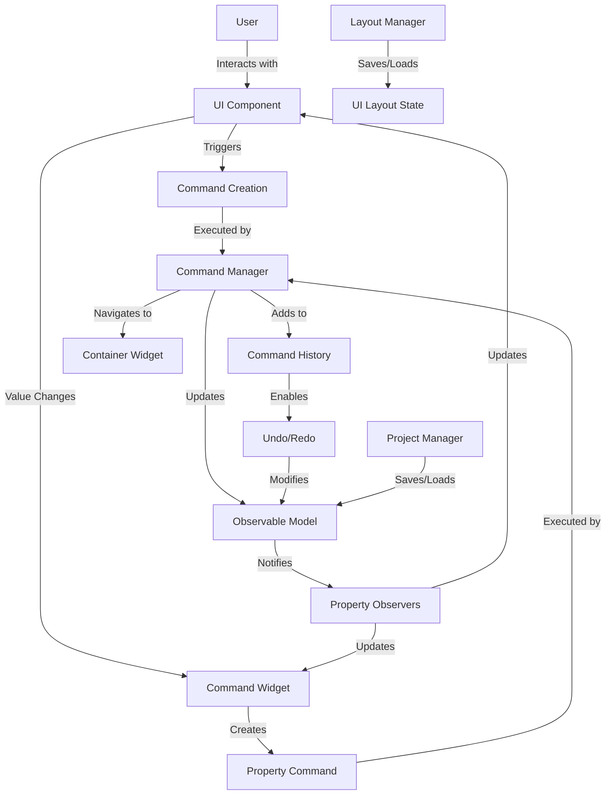
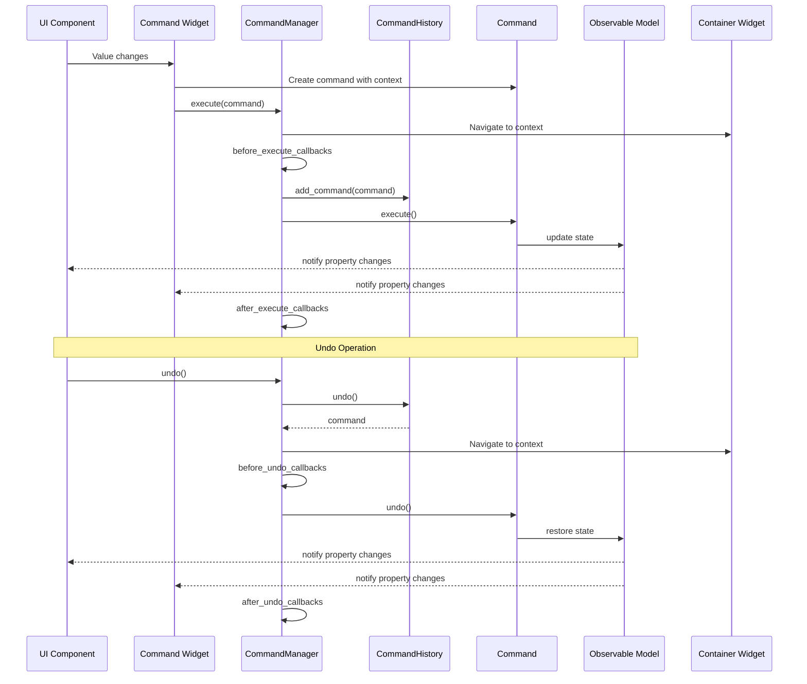
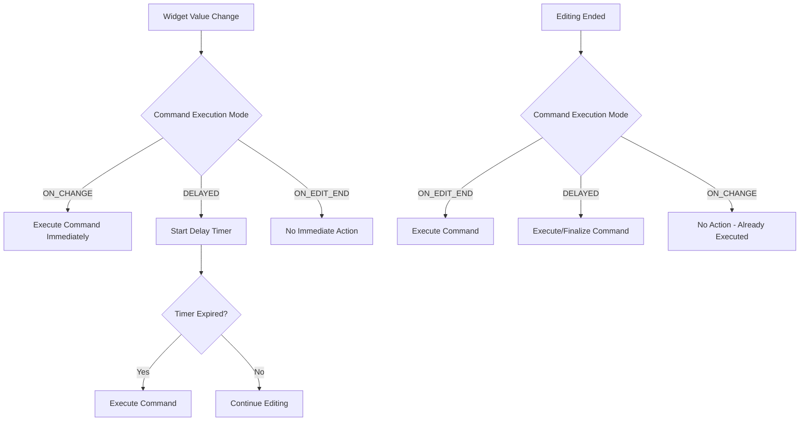

# PySignalDecipher Command System Architecture

The PySignalDecipher command system is a comprehensive framework that implements the Command pattern and Observable pattern to provide a robust undo/redo system with property change tracking. This document explains the role of each component and how they interact.

## Core Architecture Overview



## Core Components

### Observable Pattern (`core/observable.py`)

#### `Observable` Class
- **Role**: Base class for any object that needs to track property changes
- **Usage**: 
  - **Internal**: Framework foundation
  - **User**: Used directly when creating custom model classes
- **How it works**: Provides property change notifications, unique identity management, and parent-child relationship tracking
- **Key Methods**:
  - `add_property_observer()`: Register a callback for property changes
  - `remove_property_observer()`: Unregister a callback
  - `_notify_property_changed()`: Internal method called when a property changes
  - `get_id()/set_id()`: Manage unique object identity

```python
# User code example
class MyModel(Observable):
    def __init__(self):
        super().__init__()
        self._name = "Default"
        
    @property
    def name(self):
        return self._name
        
    @name.setter
    def name(self, value):
        old_value = self._name
        self._name = value
        self._notify_property_changed("name", old_value, value)
```

#### `ObservableProperty` Class
- **Role**: Descriptor that creates properties with automatic change notification
- **Usage**: 
  - **Internal**: Framework feature
  - **User**: Used directly in model class definitions
- **How it works**: Implements `__get__` and `__set__` to handle property access and automatically notify observers
- **Example**:

```python
# User code example - much cleaner with ObservableProperty
class MyModel(Observable):
    name = ObservableProperty[str]("Default")
    count = ObservableProperty[int](0)
```

### Command Pattern (`core/command.py`)

#### `Command` Abstract Class
- **Role**: Base class for all commands
- **Usage**: 
  - **Internal**: Framework foundation
  - **User**: Extended when creating custom commands
- **How it works**: Defines the command interface with execute/undo/redo methods
- **Key Methods**:
  - `execute()`: Perform the command action
  - `undo()`: Reverse the command action
  - `redo()`: Re-perform the command (default is to call execute)
  - `set_execution_context()`: Set the widget context for navigation
  - `get_execution_context()`: Get the widget context for navigation

```python
# User code example for custom command
class MyCustomCommand(Command):
    def __init__(self, target, parameter):
        super().__init__()
        self.target = target
        self.parameter = parameter
        self.old_state = target.save_state()  # Store state for undo
        
    def execute(self):
        self.target.perform_action(self.parameter)
        
    def undo(self):
        self.target.restore_state(self.old_state)
```

#### `PropertyCommand` Class
- **Role**: Command for changing a single property value
- **Usage**: 
  - **Internal**: Used automatically by command-aware widgets
  - **User**: Typically not created directly
- **How it works**: Stores old and new property values to enable undo/redo

#### `CompoundCommand` Class
- **Role**: Groups multiple commands into a single unit
- **Usage**: 
  - **Internal**: Used for multi-step operations
  - **User**: Used when multiple related changes need to be treated as one
- **How it works**: Maintains a list of commands that are executed, undone, and redone together

#### `MacroCommand` Class
- **Role**: User-level named commands for UI operations
- **Usage**: 
  - **Internal**: Framework feature
  - **User**: Used for high-level user operations
- **How it works**: Extends CompoundCommand with descriptive names and metadata

### Command Management (`core/command_manager.py`)

#### `CommandHistory` Class
- **Role**: Tracks command execution for undo/redo
- **Usage**: 
  - **Internal**: Used by CommandManager
  - **User**: Not typically used directly
- **How it works**: Maintains stacks of executed and undone commands
- **Key Methods**:
  - `add_command()`: Add a command to history
  - `undo()`: Move command from executed to undone stack
  - `redo()`: Move command from undone to executed stack
  - `can_undo()/can_redo()`: Check if undo/redo is available

#### `CommandManager` Class
- **Role**: Central hub for command execution and history
- **Usage**: 
  - **Internal**: Core system component
  - **User**: Used directly to execute commands
- **How it works**: Manages command execution/undo/redo and notifies listeners
- **Key Methods**:
  - `execute()`: Execute a command and add to history
  - `undo()`: Undo the most recent command
  - `redo()`: Redo most recently undone command
  - `_navigate_to_command_context()`: Navigate to the UI location of the command
  - `Callback hooks`: Before/after execute, before/after undo

### Widget Context System (`core/widget_context.py`)

#### `WidgetContextRegistry` Class
- **Role**: Tracks which container holds each widget
- **Usage**: 
  - **Internal**: Used by command navigation system
  - **User**: Not typically used directly
- **How it works**: Maintains a registry of widget-to-container relationships
- **Key Methods**:
  - `register_widget_container()`: Associate a widget with its container
  - `get_widget_container()`: Look up a widget's container
  - `unregister_widget()`: Remove a widget from the registry



## UI Integration

### Command Widget (`widgets/base.py`)

#### `CommandWidgetBase` Class
- **Role**: Base mixin for creating command-aware widgets
- **Usage**: 
  - **Internal**: Mixed into widget implementations
  - **User**: Used directly when creating command-aware widgets
- **How it works**: Connects widget value changes to model properties via commands
- **Key Methods**:
  - `bind_to_model()`: Connect widget to a model property
  - `unbind_from_model()`: Disconnect from model
  - `_update_widget_from_model()`: Update widget from model property
  - `_on_widget_value_changed()`: Handle widget value changes
  - `_create_property_command()`: Create command with context information

```python
# User code example
class CommandLineEdit(QLineEdit, CommandWidgetBase):
    def __init__(self, parent=None):
        QLineEdit.__init__(self, parent)
        CommandWidgetBase.__init__(self)
        self._setup_command_widget("text")
        self.textChanged.connect(self._on_widget_value_changed)
    
    def _get_widget_value(self):
        return self.text()
        
    def _set_widget_value(self, value):
        self.setText(value if value is not None else "")

# Usage
line_edit = CommandLineEdit()
line_edit.bind_to_model(model, "name")
```

### Container Widgets (`widgets/containers/`)

#### `ContainerWidget` Interface (`widgets/containers/base_container.py`)
- **Role**: Base interface for container widgets
- **Usage**: 
  - **Internal**: Implemented by container widgets
  - **User**: Used when creating custom containers
- **How it works**: Defines interface for navigable containers
- **Key Methods**:
  - `activate_child()`: Activate a specific child widget
  - `get_container_id()`: Get unique container identifier
  - `register_child()`: Register a child widget with this container

#### `CommandTabWidget` Class (`widgets/containers/tab_widget.py`)
- **Role**: Tab widget that supports command-based navigation
- **Usage**: 
  - **Internal**: Framework feature
  - **User**: Used directly as a container for command-aware widgets
- **How it works**: Extends QTabWidget to implement the ContainerWidget interface
- **Key Features**:
  - Automatically registers child widgets
  - Supports navigation to specific tabs
  - Integrates with command navigation system

#### `CommandDockWidget` Class (`widgets/containers/dock_widget.py`)
- **Role**: Dock widget that supports command-based navigation
- **Usage**: 
  - **Internal**: Framework feature
  - **User**: Used directly as a container for command-aware widgets
- **How it works**: Extends QDockWidget to implement the ContainerWidget interface
- **Key Features**:
  - Tracks dock state changes
  - Creates commands for dock operations
  - Integrates with command navigation system

### Command Widget Command Execution Modes

The `CommandWidgetBase` class supports different command execution modes, allowing flexibility in when commands are created and executed:



#### Available Execution Modes

1. **ON_CHANGE**: Commands are executed immediately when the widget value changes. This creates a separate command for each keystroke or change.

2. **DELAYED**: Commands are created after a short delay (default 300ms) from the first change, and also when editing completes. This balances responsiveness with efficiency.

3. **ON_EDIT_END**: Commands are only created when editing is complete (e.g., when the user presses Enter or focus leaves the widget). This creates a single command for an entire editing session.

## Project Management

### Project Manager (`project/project_manager.py`)

#### `ProjectManager` Class
- **Role**: Handles project save/load operations
- **Usage**: 
  - **Internal**: Framework feature
  - **User**: Used directly for project operations
- **How it works**: Manages serialization of model state and UI layout
- **Key Methods**:
  - `save_project()`: Save model to file
  - `load_project()`: Load model from file
  - `new_project()`: Create a new model

## Serialization System

### Serialization Manager (`serialization/manager.py`)

#### `SerializationManager` Class
- **Role**: Central hub for serialization operations
- **Usage**: 
  - **Internal**: Used by other components
  - **User**: Not typically used directly
- **How it works**: Manages serializers, format adapters, and serialization context
- **Key Methods**:
  - `serialize()`: Serialize an object to a specified format
  - `deserialize()`: Deserialize data into objects
  - `register_type()`: Register a type for serialization
  - `register_serializer()`: Register custom serializer functions

### Registry Engine (`serialization/registry.py`)

#### `RegistryEngine` Class
- **Role**: Manages type registration and factory functions
- **Usage**: 
  - **Internal**: Used by SerializationManager
  - **User**: Not typically used directly
- **How it works**: Associates type names with classes, factories, and serializers
- **Key Methods**:
  - `register_type()`: Register a type with a name
  - `register_factory()`: Register a factory function for a type
  - `create_instance()`: Create an instance of a registered type
  - `find_best_serializer()`: Find the appropriate serializer for an object

## Usage Patterns

### Model Definition

```python
class SignalModel(Observable):
    name = ObservableProperty[str]("Unnamed Signal")
    amplitude = ObservableProperty[float](1.0)
    frequency = ObservableProperty[float](1.0)
    
    def process(self):
        # Process signal data
        pass
```

### Custom Command-Aware Widgets

```python
class CommandSlider(QSlider, CommandWidgetBase):
    def __init__(self, orientation=Qt.Horizontal, parent=None):
        QSlider.__init__(self, orientation, parent)
        CommandWidgetBase.__init__(self)
        self._setup_command_widget("value")
        self.valueChanged.connect(self._on_widget_value_changed)
    
    def _get_widget_value(self):
        return self.value()
        
    def _set_widget_value(self, value):
        try:
            self.setValue(int(value))
        except (ValueError, TypeError):
            self.setValue(self.minimum())

# Usage
amplitude_slider = CommandSlider(Qt.Horizontal)
amplitude_slider.setRange(0, 100)
amplitude_slider.bind_to_model(signal_model, "amplitude")
```

### Using Container Widgets

```python
# Create a command-aware tab widget
tab_widget = CommandTabWidget(parent, "main_tabs")

# Add tabs with command-aware widgets
tab1 = QWidget()
tab1_layout = QVBoxLayout(tab1)
tab1_edit = CommandLineEdit()
tab1_edit.bind_to_model(model, "name")
tab1_layout.addWidget(tab1_edit)

tab2 = QWidget()
tab2_layout = QVBoxLayout(tab2)
tab2_slider = CommandSlider(Qt.Horizontal)
tab2_slider.bind_to_model(model, "amplitude")
tab2_layout.addWidget(tab2_slider)

# Add both tabs to the container
tab_widget.addTab(tab1, "Properties")
tab_widget.addTab(tab2, "Controls")

# Create a command-aware dock widget
dock = CommandDockWidget("signal_dock", "Signal Editor", main_window)

# Add content to the dock
dock_content = QWidget()
dock_layout = QVBoxLayout(dock_content)
dock_edit = CommandLineEdit()
dock_edit.bind_to_model(model, "frequency")
dock_layout.addWidget(dock_edit)
dock.setWidget(dock_content)

# Now when undo/redo operations are performed, the system will
# automatically navigate to the correct tab or dock that contains
# the widget that created the command
```

### Command Execution

```python
# Get the command manager
cmd_mgr = get_command_manager()

# Create and execute a command
command = MyCustomCommand(target, parameter)
cmd_mgr.execute(command)

# Undo last command
if cmd_mgr.can_undo():
    cmd_mgr.undo()

# Redo last undone command
if cmd_mgr.can_redo():
    cmd_mgr.redo()
```