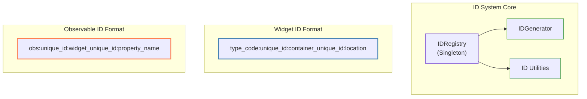
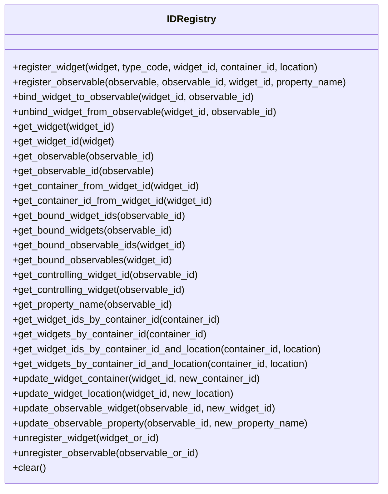

# Widget & Observable ID System Documentation

This document provides a concise overview of the ID system for tracking and referencing widgets and observables in the PySignalDecipher application. The system provides memory-efficient unique identifiers for widgets, observables, and their relationships, allowing for serialization, navigation, and reference management without maintaining direct object references.

## Overview

The ID system creates and manages unique identifiers for both widgets and observables, encoding their type, relationships, and properties.



## ID Formats

### Widget ID Format
Each widget ID follows this format:
```
[type_code]:[unique_id]:[container_unique_id]:[location]
```

Where:
- `type_code`: Short code indicating widget type (e.g., 'le', 't')
- `unique_id`: Base62-encoded unique identifier
- `container_unique_id`: The unique_id of the parent container (or "0" if none)
- `location`: Container-specific location identifier (or "0" if not applicable)

Examples:
- `le:1Z:0:0` - A line edit widget with no container
- `t:2J:0:1` - A tab container (in slot 1) with no parent
- `pb:3a:2J:2` - A push button widget in a container with unique_id 2J, at location 2

### Observable ID Format
Each observable ID follows this format:
```
obs:[unique_id]:[widget_unique_id]:[property_name]
```

Where:
- `obs`: Fixed code indicating this is an observable
- `unique_id`: Base62-encoded unique identifier
- `widget_unique_id`: The unique_id of the controlling widget (or "0" if none)
- `property_name`: The name of the property this observable represents (or empty if not applicable)

Examples:
- `obs:4a:0:` - An observable with no controlling widget or property
- `obs:5C:1Z:name` - An observable for the "name" property, controlled by widget with unique_id 1Z
- `obs:6D:3a:value` - An observable for the "value" property, controlled by widget with unique_id 3a

## Core API

### Integration with Widgets

To use the ID system in your widgets, modify your base widget class as follows:

```python
class CommandWidgetBase(Generic[T]):
    def __init__(self, widget_id=None, container_id=None):
        self.registry = get_id_registry()
        self.widget_register(widget_id, container_id)
        ...
        
    def widget_register(self, widget_id, container_id):
        raise NotImplementedError("Subclasses must implement widget_register")
```

Then implement the registration in your subclasses:

```python
def widget_register(self, widget_id, container_id):
    widget_code = "ZZ"  # Use appropriate type code from TypeCodes class
    self.widget_id = self.registry.register_widget(self, widget_code, widget_id, container_id)
```

### Integration with Observables

For observable objects, implement registration as follows:

```python
class Person(Observable):
    name = ObservableProperty[str]("John Doe")
    email = ObservableProperty[str]("john@example.com")
    
    def __init__(self):
        super().__init__()
        self.registry = get_id_registry()
        self.observable_id = self.registry.register_observable(self)
```

### Binding Widgets to Observables

To bind a widget to an observable:

```python
# Create an observable and register it
person = Person()
person_observable_id = registry.get_observable_id(person)

# Create a widget and register it
name_field = LineEditWidget()
name_widget_id = registry.get_widget_id(name_field)

# Bind the widget to the observable's name property
registry.register_observable(person.name, None, name_widget_id, "name")

# Or update an existing observable binding
registry.update_observable_widget(name_observable_id, name_widget_id)
registry.update_observable_property(name_observable_id, "name")
```

### Core Registry Methods



## Usage Examples

### Widget Registration and Management

```python
# Get the registry
registry = get_id_registry()

# Register a widget (generate new ID)
widget_id = registry.register_widget(widget, "le")

# Register with existing ID or container reference
widget_id = registry.register_widget(widget, "pb", widget_id, container_id)

# Register with location
widget_id = registry.register_widget(widget, "pb", widget_id, container_id, "3")

# Get widget by ID
widget = registry.get_widget("pb:3a:2J:3")

# Get ID for a widget
widget_id = registry.get_widget_id(widget)

# Get container from widget ID
container = registry.get_container_from_widget_id("pb:3a:2J:3")

# Get container's ID from widget ID
container_id = registry.get_container_id_from_widget_id("pb:3a:2J:3")

# Get all widget IDs in a container
widget_ids = registry.get_widget_ids_by_container_id("t:2J:0:1")

# Get all widget objects in a container
widgets = registry.get_widgets_by_container_id("t:2J:0:1")

# Get widgets at a specific location in a container
widget_ids = registry.get_widget_ids_by_container_id_and_location("t:2J:0:1", "3")
widgets = registry.get_widgets_by_container_id_and_location("t:2J:0:1", "3")

# Update a widget's container
registry.update_widget_container(widget_id, new_container_id)

# Update a widget's location
registry.update_widget_location(widget_id, "4")

# Unregister a widget
registry.unregister_widget(widget)  # or registry.unregister_widget(widget_id)
```

### Observable Registration and Management

```python
# Register an observable (generate new ID)
observable_id = registry.register_observable(person)

# Register with property name
observable_id = registry.register_observable(person.name, None, None, "name")

# Register with controlling widget
observable_id = registry.register_observable(person.name, None, widget_id, "name")

# Get observable by ID
observable = registry.get_observable("obs:5C:1Z:name")

# Get ID for an observable
observable_id = registry.get_observable_id(observable)

# Get property name
property_name = registry.get_property_name("obs:5C:1Z:name")  # Returns "name"

# Get controlling widget
widget = registry.get_controlling_widget("obs:5C:1Z:name")

# Update an observable's controlling widget
registry.update_observable_widget(observable_id, new_widget_id)

# Update an observable's property name
registry.update_observable_property(observable_id, "new_property")

# Unregister an observable
registry.unregister_observable(observable)  # or registry.unregister_observable(observable_id)
```

### Binding Widgets and Observables

```python
# Bind a widget to an observable
registry.bind_widget_to_observable(widget_id, observable_id)

# Unbind a widget from an observable
registry.unbind_widget_from_observable(widget_id, observable_id)

# Get all observables bound to a widget
observable_ids = registry.get_bound_observable_ids(widget_id)
observables = registry.get_bound_observables(widget_id)

# Get all widgets bound to an observable
widget_ids = registry.get_bound_widget_ids(observable_id)
widgets = registry.get_bound_widgets(observable_id)
```

### Utility Functions

```python
from command_system.id_system.utils import (
    extract_type_code, extract_unique_id, 
    extract_container_unique_id, extract_location,
    extract_widget_unique_id, extract_property_name,
    is_observable_id, is_widget_id
)

# Check ID types
is_widget = is_widget_id("pb:3a:2J:3")  # -> True
is_obs = is_observable_id("obs:5C:1Z:name")  # -> True

# Extract parts from a widget ID
type_code = extract_type_code("pb:3a:2J:3")  # -> "pb"
unique_id = extract_unique_id("pb:3a:2J:3")  # -> "3a"
container_id = extract_container_unique_id("pb:3a:2J:3")  # -> "2J"
location = extract_location("pb:3a:2J:3")  # -> "3"

# Extract parts from an observable ID
type_code = extract_type_code("obs:5C:1Z:name")  # -> "obs"
unique_id = extract_unique_id("obs:5C:1Z:name")  # -> "5C"
widget_id = extract_widget_unique_id("obs:5C:1Z:name")  # -> "1Z"
property_name = extract_property_name("obs:5C:1Z:name")  # -> "name"
```

## Type Codes Reference

The system uses short type codes to identify different widget types:

| Widget Type | Code |
|-------------|------|
| **Observable** |  |
| Observable | obs |
| **Containers** |  |
| Tab Container | t |
| Dock Container | d |
| Window Container | w |
| Custom Container | x |
| **Command Widgets** |  |
| Line Edit Widget | le |
| Check Box Widget | cb |
| Push Button | pb |
| Radio Button | rb |
| Combo Box | co |
| Slider | sl |
| Spin Box | sp |
| Text Edit | te |
| List Widget | lw |
| Tree Widget | tw |
| Table Widget | tb |
| Custom Widget | cw |