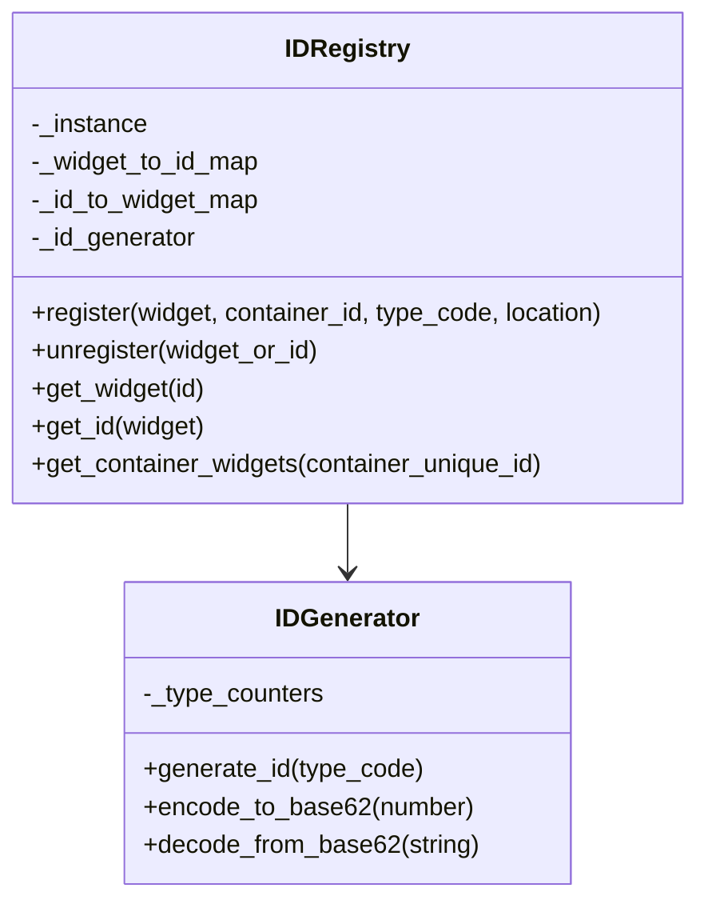
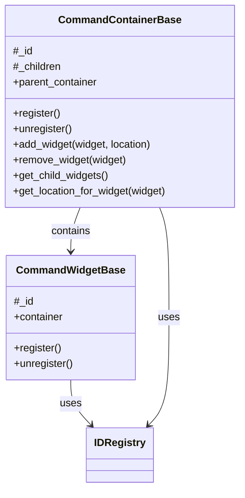
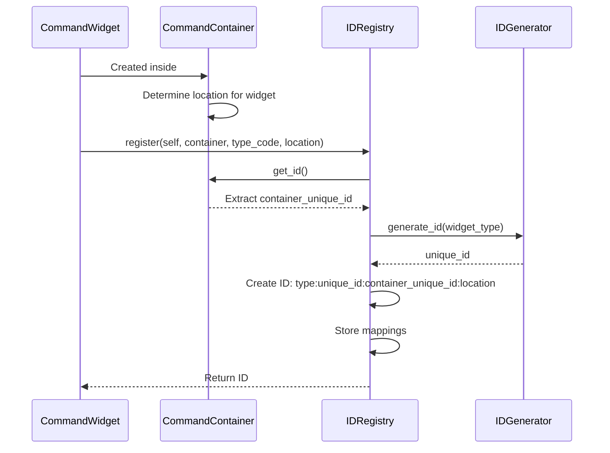
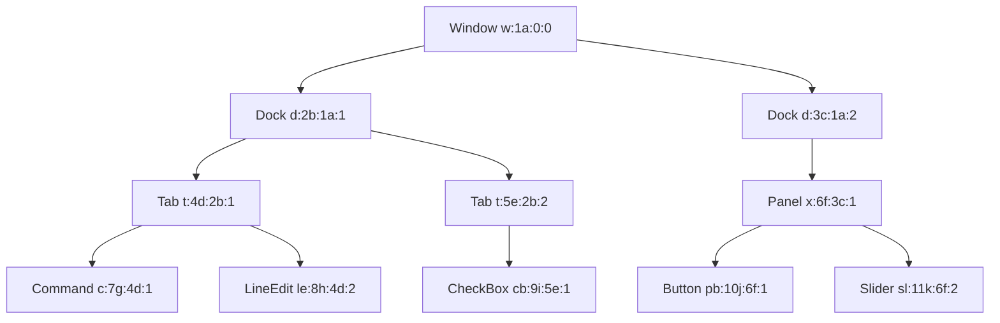
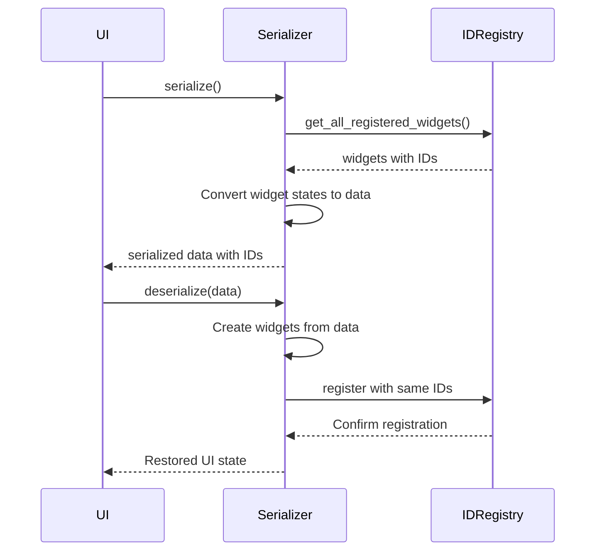
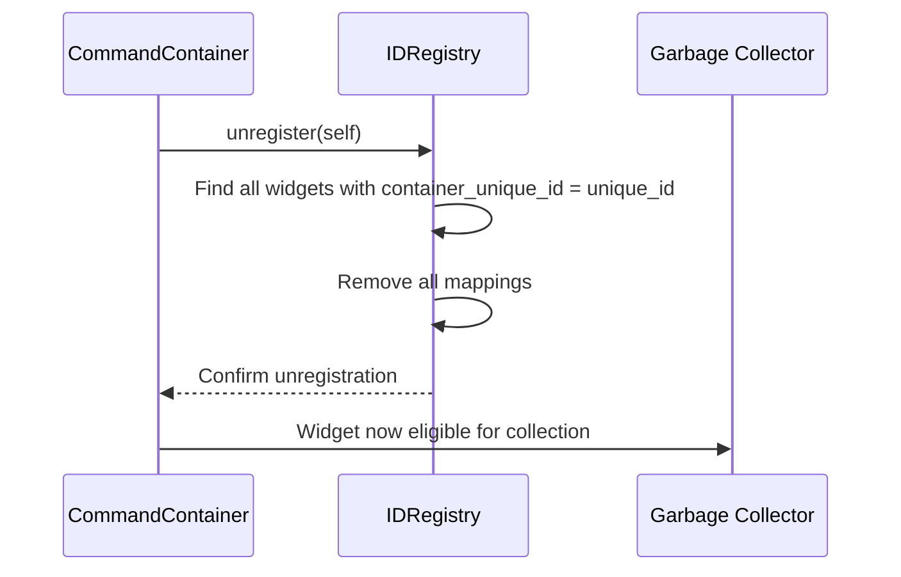

# Widget ID System Design

## Overview

This document outlines a memory-efficient ID system for managing widgets in a Python/PySide6 UI application. The system provides a way to reference, register, and retrieve widgets without maintaining direct references to them, especially useful for command widgets and containers that can be nested hierarchically.

## Core Requirements

- Register/unregister any widget with a unique ID
- Retrieve widget references from IDs
- Support for nested container hierarchies (tabs, docks, etc.)
- Handle dynamic container creation and destruction
- Integration with serialization/deserialization
- Memory efficiency
- Support for "command widgets" and "command containers"

## ID Format Specification

Each widget ID follows this format:
```
[type_code]:[unique_id]:[container_unique_id]:[location]
```

Where:
- `type_code`: 1-2 character code indicating widget type (e.g., 'c', 't')
- `unique_id`: Base62-encoded unique identifier generated by ID Manager
- `container_unique_id`: The unique_id of the parent container (or "0" if none)
- `location`: Container-specific location identifier (or "0" if not applicable)

Examples:
- `c:1Z:0:0` - A command widget with no container
- `t:2J:0:1` - A tab container (in slot 1) with no parent
- `c:3a:2J:2` - A command widget in tab index 2 of container with unique_id 2J
- `le:4R:3a:0` - A line edit widget in container with unique_id 3a with no specific location
- `cb:5q:2J:3` - A checkbox widget in location 3 of container with unique_id 2J

## Location Field by Container Type

The location field has different meanings depending on the container type:

| Container Type | Location Field Meaning |
|----------------|------------------------|
| Tab Container | Tab index (0, 1, 2...) |
| Dock Container | Dock area code (0=center, 1=north, 2=east, 3=south, 4=west) |
| Split Container | Split position (0=left, 1=right, 2=top, 3=bottom) |
| Grid Container | Grid coordinates encoded as "row,col" |
| Stack Container | Stack index (0, 1, 2...) |
| Window Container | Window position code |

## System Components

### ID Registry

Central component that maintains mappings between widgets and their IDs.



### ID Generator

Responsible for creating unique, compact IDs.

- Maintains counters for each widget type
- Encodes numbers to base62 for compact representation
- Ensures uniqueness across the application

### Widget Base Classes



## Registration Process



## Hierarchical Management



## Integration with Serialization

The ID system should work alongside the serialization system:



## Memory Management

- Weak references should be used where appropriate to prevent reference cycles
- Unregistration should happen automatically when widgets are destroyed
- Bulk unregistration should occur when container widgets are closed



## Type Codes

For brevity and memory efficiency, widget types use short codes:

| Widget Type | Code |
|-------------|------|
| **Containers** |  |
| Tab Container | t |
| Dock Container | d |
| Window Container | w |
| Custom Container | x |
| **Command Widgets** |  |
| Line Edit Widget | le |
| Check Box Widget | cb |
| Push Button | pb |
| Radio Button | rb |
| Combo Box | co |
| Slider | sl |
| Spin Box | sp |
| Text Edit | te |
| List Widget | lw |
| Tree Widget | tw |
| Table Widget | tb |
| Custom Widget | cw |

## Lookup Operations

The system should support efficient lookups:

1. Get widget by ID: `O(1)` operation
2. Get ID by widget: `O(1)` operation
3. Get all widgets in a container: `O(n)` where n is the number of widgets (filter by container_unique_id)
4. Get widget's container: `O(1)` by extracting the container_unique_id from the ID
5. Get container hierarchy: `O(h)` where h is the height of the container tree

## Implementation Considerations

1. The ID Registry should be implemented as a singleton
2. Base classes should automatically register/unregister with the registry
3. Container widgets should define their own logic for assigning and interpreting location values
4. The ID system should be thread-safe for UI applications
5. Performance-critical operations should be optimized
6. Diagnostic tools should be included for debugging ID-related issues

## Integration Points

The ID system will interface with:

1. UI Component Creation
2. Serialization/Deserialization System
3. Command System
4. Dynamic Container Management

## Example Usage Flow

1. A new line edit widget is created inside a tab container
2. The container determines the appropriate location (e.g., tab index 2)
3. The widget automatically registers with the ID Registry
4. The registry generates an ID using the widget type, container unique_id, and location
5. The command system can reference the widget by ID without keeping a direct reference
6. When the widget is removed, it unregisters itself
7. If a container is closed, all its child widgets are automatically unregistered

## Container Operations

When working with containers, special operations are needed:

1. **Container Creation:** When a new container is created, it generates its own ID
2. **Widget Addition:** When a widget is added to a container, the container assigns a location and the widget updates its ID
3. **Container Deletion:** When a container is deleted, all widgets referencing it as container_unique_id are unregistered
4. **Widget Movement:** When a widget moves within a container, only the location part of its ID needs to be updated
5. **Container Movement:** When a container moves between containers, it updates its container_unique_id and triggers location updates for all its children

## ID Parsing Functions

The system should include utility functions for working with IDs:

```python
def parse_id(id_string):
    """Parse an ID string into its components"""
    parts = id_string.split(':')
    return {
        'type_code': parts[0],
        'unique_id': parts[1],
        'container_unique_id': parts[2],
        'location': parts[3]
    }

def get_container_id(registry, id_string):
    """Get the full ID of a widget's container"""
    parts = parse_id(id_string)
    container_unique_id = parts['container_unique_id']
    if container_unique_id == '0':
        return None
    return registry.get_id_by_unique_id(container_unique_id)
```

This design provides a flexible, memory-efficient system that scales well with complex UI hierarchies while supporting serialization and dynamic container management. The clear distinction between the unique_id and container_unique_id makes it easy to track widget relationships without redundancy.