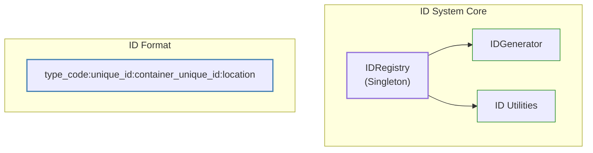
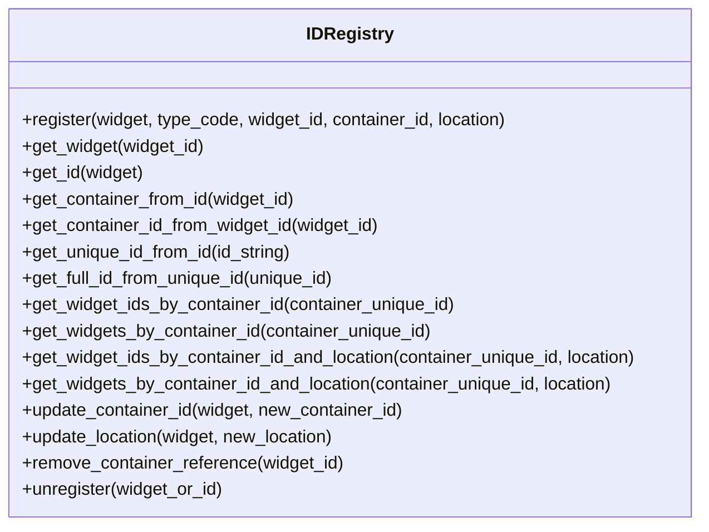

# Widget ID System Documentation

This document provides a concise overview of the ID system for tracking and referencing widgets in the PySignalDecipher application. The system provides memory-efficient unique identifiers for widgets and containers, allowing for serialization, navigation, and reference management without maintaining direct object references.

## Overview

The ID system creates and manages unique identifiers for widgets that encode their type, hierarchy, and position in the UI.



## ID Format

Each widget ID follows this format:
```
[type_code]:[unique_id]:[container_unique_id]:[location]
```

Where:
- `type_code`: Short code indicating widget type (e.g., 'le', 't')
- `unique_id`: Base62-encoded unique identifier
- `container_unique_id`: The unique_id of the parent container (or "0" if none)
- `location`: Container-specific location identifier (or "0" if not applicable)

Examples:
- `le:1Z:0:0` - A line edit widget with no container
- `t:2J:0:1` - A tab container (in slot 1) with no parent
- `pb:3a:2J:2` - A push button widget in a container with unique_id 2J, at location 2

## Core API

### Integration with Widgets

To use the ID system in your widgets, modify your base widget class as follows:

```python
class CommandWidgetBase(Generic[T]):
    def __init__(self, widget_id=None, container_id=None):
        self.registry = get_id_registry()
        self.widget_register(widget_id, container_id)
        ...
        
    def widget_register(self, widget_id, container_id):
        raise NotImplementedError("Subclasses must implement widget_register")
```

Then implement the registration in your subclasses:

```python
def widget_register(self, widget_id, container_id):
    widget_code = "ZZ"  # Use appropriate type code from TypeCodes class
    self.widget_id = self.registry.register(self, widget_code, widget_id, container_id)
```

### Core Registry Methods



### Usage Examples

```python
# Get the registry
registry = get_id_registry()

# Register a widget (generate new ID)
widget_id = registry.register(widget, "le")

# Register with existing ID or container reference
widget_id = registry.register(widget, "pb", widget_id, container_id)

# Register with location
widget_id = registry.register(widget, "pb", widget_id, container_id, "3")

# Get widget by ID
widget = registry.get_widget("pb:3a:2J:3")

# Get ID for a widget
widget_id = registry.get_id(widget)

# Get container from widget ID
container = registry.get_container_from_id("pb:3a:2J:3")

# Get container's ID from widget ID
container_id = registry.get_container_id_from_widget_id("pb:3a:2J:3")

# Get unique ID portion from full ID
unique_id = registry.get_unique_id_from_id("pb:3a:2J:3")  # Returns "3a"

# Get full ID from unique ID
full_id = registry.get_full_id_from_unique_id("3a")  # Returns "pb:3a:2J:3"

# Get all widget IDs in a container
widget_ids = registry.get_widget_ids_by_container_id("2J")

# Get all widget objects in a container
widgets = registry.get_widgets_by_container_id("2J")

# Get widgets at a specific location in a container
widget_ids = registry.get_widget_ids_by_container_id_and_location("2J", "3")
widgets = registry.get_widgets_by_container_id_and_location("2J", "3")

# Update a widget's container
registry.update_container_id(widget, new_container_id)

# Update a widget's location
registry.update_location(widget, "4")

# Remove container reference
updated_id = registry.remove_container_reference(widget_id)  # TODO: Reconsider approach

# Unregister a widget
registry.unregister(widget)  # or registry.unregister(widget_id)
```

### Utility Functions

```python
from command_system.id_system.utils import (
    extract_type_code, extract_unique_id, 
    extract_container_unique_id, extract_location
)

# Extract parts from an ID
type_code = extract_type_code("pb:3a:2J:3")  # -> "pb"
unique_id = extract_unique_id("pb:3a:2J:3")  # -> "3a"
container_id = extract_container_unique_id("pb:3a:2J:3")  # -> "2J"
location = extract_location("pb:3a:2J:3")  # -> "3"
```

## Type Codes Reference

The system uses short type codes to identify different widget types:

| Widget Type | Code |
|-------------|------|
| **Containers** |  |
| Tab Container | t |
| Dock Container | d |
| Window Container | w |
| Custom Container | x |
| **Command Widgets** |  |
| Line Edit Widget | le |
| Check Box Widget | cb |
| Push Button | pb |
| Radio Button | rb |
| Combo Box | co |
| Slider | sl |
| Spin Box | sp |
| Text Edit | te |
| List Widget | lw |
| Tree Widget | tw |
| Table Widget | tb |
| Custom Widget | cw |