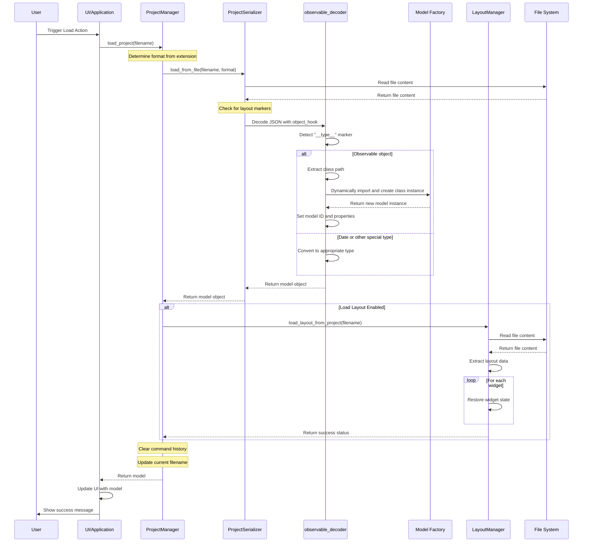

```mermaid
sequenceDiagram
    participant User
    participant UI as UI/Application
    participant PM as ProjectManager
    participant PS as ProjectSerializer
    participant OD as observable_decoder
    participant MF as Model Factory
    participant LM as LayoutManager
    participant File as File System
    
    User->>UI: Trigger Load Action
    UI->>PM: load_project(filename)
    
    Note over PM: Determine format from extension
    PM->>PS: load_from_file(filename, format)
    
    PS->>File: Read file content
    File-->>PS: Return file content
    
    Note over PS: Check for layout markers
    PS->>OD: Decode JSON with object_hook
    
    OD->>OD: Detect "__type__" marker
    
    alt Observable object
        OD->>OD: Extract class path
        OD->>MF: Dynamically import and create class instance
        MF-->>OD: Return new model instance
        OD->>OD: Set model ID and properties
    else Date or other special type
        OD->>OD: Convert to appropriate type
    end
    
    OD-->>PS: Return model object
    PS-->>PM: Return model object
    
    alt Load Layout Enabled
        PM->>LM: load_layout_from_project(filename)
        LM->>File: Read file content
        File-->>LM: Return file content
        
        LM->>LM: Extract layout data
        
        loop For each widget
            LM->>LM: Restore widget state
        end
        
        LM-->>PM: Return success status
    end
    
    Note over PM: Clear command history
    Note over PM: Update current filename
    PM-->>UI: Return model
    UI->>UI: Update UI with model
    UI->>User: Show success message
```