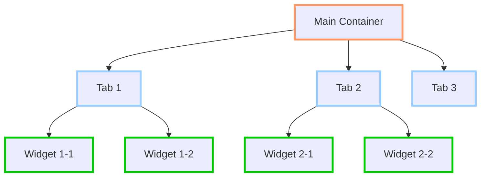
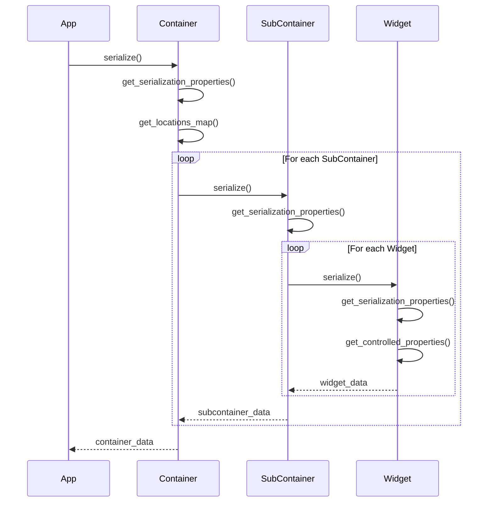
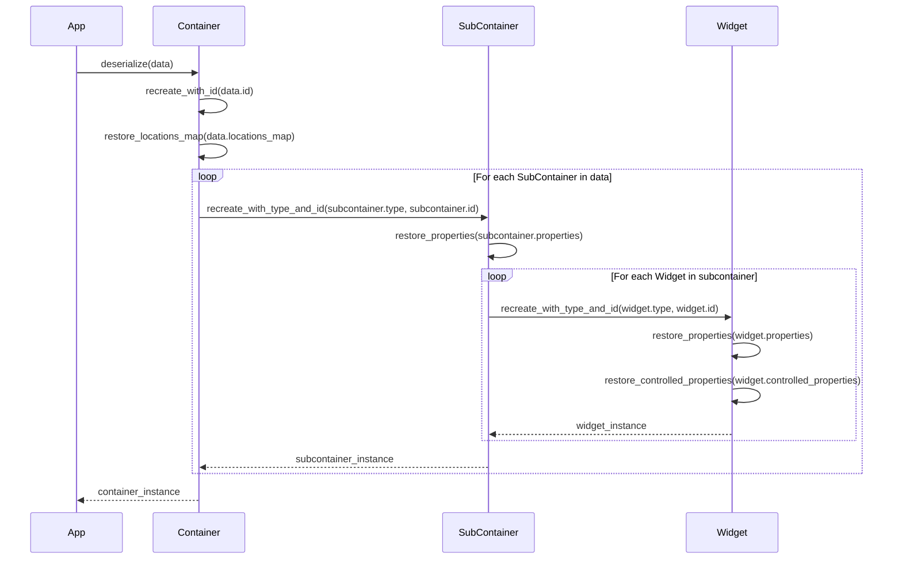
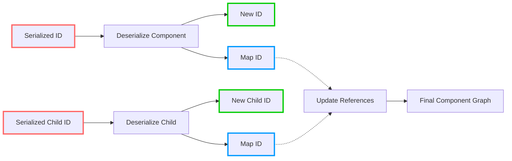

# ID System and Serialization Major Update

## Current Limitations

The current ID system and serialization approach has fundamental limitations when dealing with dynamic components:

1. **Location-based IDs are fragile**: When components are added or removed, locations shift, breaking serialized references
2. **No distinction between static and dynamic components**: The system treats all components the same way, making it difficult to maintain consistent IDs across sessions
3. **Container hierarchy is not properly modeled**: Subcontainers (tabs, docks, etc.) lack proper identity, making serialization/deserialization unpredictable

## New Approach Overview

We propose a hierarchical ID system that provides consistent addressing for components while supporting dynamic creation and removal:

1. **Stable container identities**: Each container and subcontainer gets a stable ID
2. **Location tracking at container level**: Containers maintain location maps rather than encoding location in IDs
3. **Hierarchical ID generators**: Each subcontainer gets its own ID generator 
4. **Location-based addressing**: Components use composite location IDs to ensure stable addressing across sessions

## ID System Changes

### 1. Repurposed ID Format

```
// Current Widget/Container Format
[type_code]:[unique_id]:[container_unique_id]:[location]

// New Widget/Container Format
[type_code]:[unique_id]:[container_unique_id]:[subcontainer_location]-[widget_location_id]
```

Key changes:
- `location` is now a composite identifier: `[subcontainer_location]-[widget_location_id]`
- Each subcontainer has its own ID generator to create stable `widget_location_id` values
- Container maintains a map of `subcontainer_id -> location` instead of embedding in IDs

### 2. Container Hierarchy



Each component has:
- A stable unique ID generated by its parent's ID generator
- A stable location identifier within its parent context

## Serialization Process

### Serialization Flow



### Container Serialization Data

```json
{
  "id": "t:1A",
  "type_code": "t",
  "locations_map": {
    "t:2B": "0",
    "t:3C": "1",
    "t:4D": "2"
  },
  "subcontainers": [
    {
      "id": "t:2B",
      "type": "tab",
      "title": "Welcome",
      "location": "0",
      "children": [
        {
          "id": "pb:5E:2B:0-1",
          "type_code": "pb",
          "properties": {
            "text": "Click Me"
          },
          "controlled_properties": [
            "op:6F:7G:label:5E"
          ]
        }
      ]
    }
  ]
}
```

### Deserialization Flow



## ID Mapping During Deserialization

When deserializing, we need to map old IDs to new ones:

1. Create components with their specified type but generate new IDs
2. Maintain a mapping table: `old_id -> new_id`
3. Use this mapping table to update all references in the component hierarchy
4. For objects that don't exist in the new session, create them or provide fallbacks



## Implementation Plan

1. **Update ID System**
   - Modify `IDGenerator` to support hierarchical ID generation
   - Update ID format to use composite location format
   - Add methods to manage location maps in containers

2. **Update Container System**
   - Refactor containers to track subcontainer locations
   - Update container registration to use hierarchical ID generators
   - Modify location handling in containers

3. **Update Serialization System**
   - Implement serialization methods in container classes
   - Create ID mapping during deserialization
   - Add property reference update mechanisms

4. **Add Signal Mechanism**
   - Add signals for ID changes
   - Implement empty slot methods for future extensions

## Benefits of New Approach

1. **Stable addressing**: Components maintain stable addresses even as the UI changes
2. **Consistent serialization/deserialization**: Predictable behavior across sessions
3. **Better separation of concerns**: Containers manage their hierarchies properly
4. **Simplified undo/redo**: Can capture and restore state more reliably
5. **Flexible hierarchy**: Can handle arbitrary nesting of containers

## Example Use Case: Tab Container

```python
# Serializing a tab container
def serialize_tab_container(container):
    # Get basic container properties
    result = {
        "id": container.widget_id,
        "type_code": container.type_code,
        "locations_map": container.get_locations_map()
    }
    
    # Serialize subcontainers (tabs)
    subcontainers = []
    for tab_id, location in container.locations_map.items():
        tab = get_id_registry().get_widget(tab_id)
        if tab:
            tab_data = {
                "id": tab.widget_id,
                "type": tab.tab_type,
                "title": tab.title,
                "location": location,
                "children": []
            }
            
            # Serialize tab children
            for child in tab.get_children():
                child_data = child.get_serialization()
                tab_data["children"].append(child_data)
                
            subcontainers.append(tab_data)
    
    result["subcontainers"] = subcontainers
    return result

# Deserializing a tab container
def deserialize_tab_container(data, parent=None):
    # Create container with specified ID
    container = CommandTabWidget(parent)
    container.widget_id = get_id_registry().register(
        container, data["type_code"], data["id"])
        
    # Restore locations map
    container.restore_locations_map(data["locations_map"])
    
    # Create ID mapping table
    id_map = {data["id"]: container.widget_id}
    
    # Recreate tabs
    for tab_data in data["subcontainers"]:
        # Create tab with specified type and ID
        tab = container.create_tab_with_id(
            tab_data["type"], tab_data["id"], tab_data["location"])
        tab.set_title(tab_data["title"])
        
        # Update ID mapping
        id_map[tab_data["id"]] = tab.widget_id
        
        # Recreate tab children
        for child_data in tab_data["children"]:
            child = deserialize_widget(child_data, tab)
            if child:
                # Update ID mapping
                id_map[child_data["id"]] = child.widget_id
    
    # Update all references using ID mapping
    container.update_references(id_map)
    
    return container
```