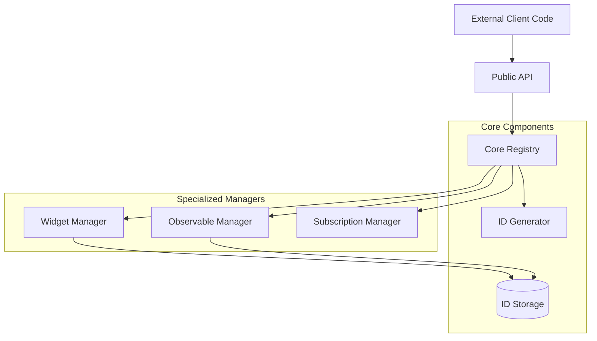
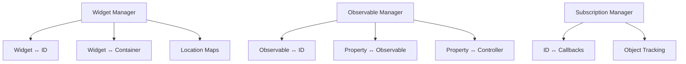
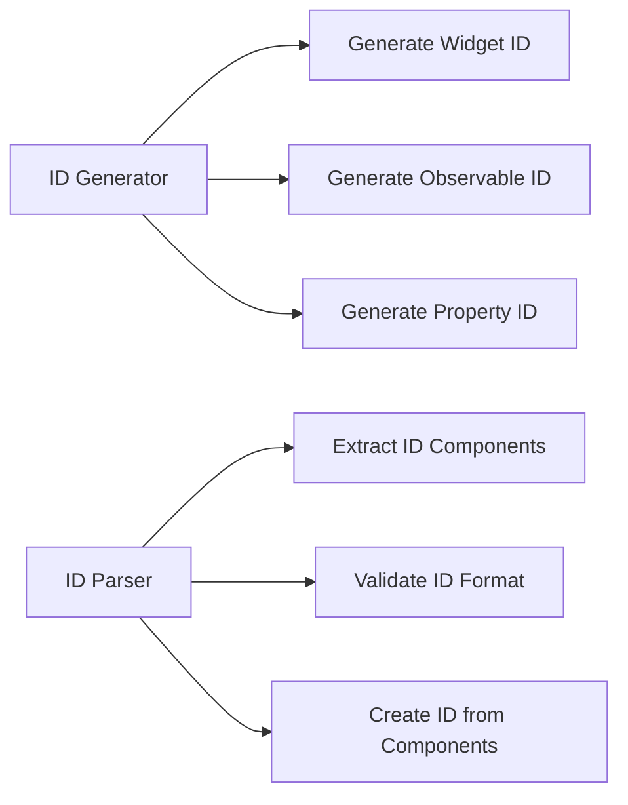
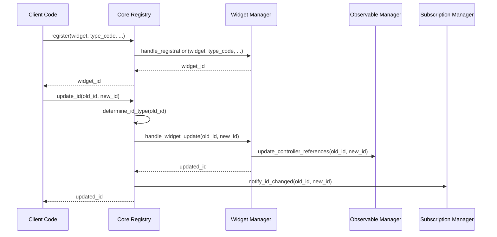

# ID System Restructuring Plan

## Goals

1. Simplify the ID system architecture while maintaining the external API
2. Create a cleaner, more logical file organization
3. Limit each file to max 700 lines of code
4. Improve diagnostics and debugging capabilities
5. Make it easier to navigate and understand
6. Allow for better testing and maintenance

## Current Issues

1. The current ID system is overly complex with too much code in single files
2. The registry.py file is over 1400 lines long and handles too many responsibilities
3. Related functionalities are spread across multiple files without clear boundaries
4. Diagnostic capabilities are limited
5. The update_id functionality has inconsistencies (e.g., not updating unique IDs)
6. Testing is difficult due to the monolithic structure

## New File Structure

```
command_system/id_system/
│
├── __init__.py                  # Public API exports (under 100 lines)
├── types.py                     # Type definitions and constants (under 200 lines)
├── core/
│   ├── __init__.py              # Core module exports
│   ├── generator.py             # ID generation logic (under 400 lines)
│   ├── parser.py                # ID parsing and utility functions (under 400 lines)
│   └── registry.py              # Core registry functionality (under 700 lines)
│
├── managers/
│   ├── __init__.py              # Managers module exports
│   ├── widget_manager.py        # Widget/container relationship management (under 500 lines)
│   ├── observable_manager.py    # Observable/property relationship management (under 500 lines)
│   └── subscription_manager.py  # Subscription system (under 400 lines)
│
├── utils/
│   ├── __init__.py              # Utils module exports
│   ├── diagnostic.py            # Diagnostic and debugging tools (under 300 lines)
│   ├── location.py              # Location path utilities (under 300 lines)
│   └── validation.py            # ID validation utilities (under 200 lines)
│
└── simple/
    ├── __init__.py              # Simple registry exports
    └── simple_registry.py       # Simple ID registry (under 300 lines)
```

## Architectural Changes

### 1. Registry Restructuring

The main registry will be split into three primary components:

1. **Core Registry**: Handles basic ID registration and lookups
2. **Relationship Managers**: Specialized managers for different component types
3. **Subscription Manager**: Dedicated module for ID change subscriptions



### 2. Component Specialization

Each manager will be responsible for a specific set of relationships:



### 3. ID Generation and Parsing

ID generation and parsing will be separated into dedicated modules:



### 4. Registry Access Pattern

The registry will follow a facade pattern with specialized manager delegation:



## Implementation Plan

### Phase 1: Core Refactoring

1. Create the new directory structure
2. Split the existing code into the core modules
3. Implement the basic facade registry with manager delegation
4. Write comprehensive tests for the core functionality

### Phase 2: Manager Implementation

1. Implement the specialized widget manager
2. Implement the observable manager
3. Refactor the subscription manager
4. Update the ID generator and parser utilities

### Phase 3: Enhancements

1. Add improved diagnostic capabilities
2. Implement proper unique ID updating in the update_id method
3. Add comprehensive documentation
4. Create visualization tools for ID relationships

### Phase 4: Testing and Validation

1. Write comprehensive unit tests for all components
2. Create integration tests for the entire system
3. Validate against the existing API in docs/id_system.md
4. Performance benchmarking and optimization

## API Compatibility

The public API exposed in `__init__.py` will remain unchanged:

```python
# Public API exports remain the same
from .core import IDRegistry, get_id_registry
from .core.generator import IDGenerator
from .simple import get_simple_id_registry
from .utils import (
    extract_type_code, extract_unique_id,
    # other utility functions...
)
```

## Specific Improvements

### Fix for Unique ID Updating

The current issue with `update_id` not updating the unique ID will be addressed in the new implementation:

```python
def update_id(self, old_id: str, new_id: str, update_unique_id: bool = False) -> Optional[str]:
    """
    Update a component's ID, optionally including its unique ID.
    
    Args:
        old_id: Current ID
        new_id: Target ID
        update_unique_id: Whether to also update the unique ID (default: False)
        
    Returns:
        Updated ID or None if failed
    """
    # Get component and validate
    component = self._get_component_by_id(old_id)
    if not component:
        return None
        
    # Extract components from both IDs
    old_parts = self._parser.parse_id(old_id)
    new_parts = self._parser.parse_id(new_id)
    
    # Ensure type codes match
    if old_parts.type_code != new_parts.type_code:
        return None
    
    # Create target ID based on whether we update the unique ID
    if update_unique_id:
        target_id = new_id  # Use new ID as is
    else:
        # Create ID with old unique ID but other components from new ID
        target_parts = new_parts._replace(unique_id=old_parts.unique_id)
        target_id = self._parser.create_id_from_parts(target_parts)
    
    # Delegate to appropriate manager based on ID type
    if self._parser.is_widget_id(old_id):
        return self._widget_manager.update_widget_id(old_id, target_id, component)
    elif self._parser.is_observable_id(old_id):
        return self._observable_manager.update_observable_id(old_id, target_id, component)
    elif self._parser.is_property_id(old_id):
        return self._observable_manager.update_property_id(old_id, target_id, component)
    
    return None
```

### Improved Diagnostics

A new diagnostic module will provide tools for debugging and visualizing the ID system:

```python
def get_id_relationships(id_string: str) -> Dict[str, Any]:
    """Get all relationships for a specific ID."""
    registry = get_id_registry()
    
    relationships = {
        "id": id_string,
        "type": get_id_type(id_string),
        "component": registry.get_component(id_string),
    }
    
    if is_widget_id(id_string):
        container_id = registry.get_container_id_from_widget_id(id_string)
        relationships.update({
            "container": container_id,
            "children": registry.get_widget_ids_by_container_id(id_string),
            "location": extract_location(id_string),
        })
    
    if is_observable_id(id_string):
        relationships.update({
            "properties": registry.get_property_ids_by_observable_id(id_string),
        })
    
    if is_property_id(id_string):
        relationships.update({
            "observable": registry.get_observable_id_from_property_id(id_string),
            "controller": registry.get_controller_id_from_property_id(id_string),
        })
    
    return relationships

def visualize_id_hierarchy(id_string: str) -> str:
    """Generate a visualization of an ID's hierarchy."""
    # Implementation to create a Mermaid diagram or similar
    pass
```

## Benefits of the New Structure

1. **Modularity**: Clear separation of concerns with specialized managers
2. **Maintainability**: Smaller files focused on specific functionality
3. **Testability**: Easier to test individual components
4. **Extensibility**: New features can be added without modifying core code
5. **Diagnostics**: Better tools for debugging and visualization
6. **Performance**: Potential for optimization in critical paths
7. **Compatibility**: Maintains the existing public API

## Migration Strategy

1. **Develop in Parallel**: Build the new system alongside the old one
2. **Comprehensive Tests**: Ensure all functionality is covered by tests
3. **Staged Rollout**: Replace components one at a time
4. **Backward Compatibility**: Maintain compatibility with existing code
5. **Documentation**: Update documentation as components are replaced

## Timeline

1. **Core Refactoring** (1-2 weeks)
2. **Manager Implementation** (2-3 weeks)
3. **Enhancements** (1-2 weeks)
4. **Testing and Validation** (1-2 weeks)

Total estimated time: 5-9 weeks, depending on complexity and testing requirements.