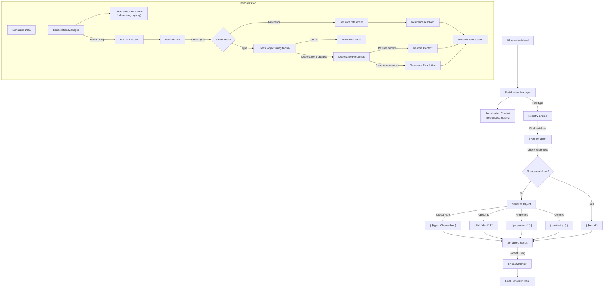

```mermaid
flowchart TD
    Model[Observable Model] --> SerMgr[Serialization Manager]
    SerMgr --> Context["Serialization Context\n(references, registry)"]
    
    SerMgr -- "Find type" --> Registry[Registry Engine]
    Registry -- "Find serializer" --> TypeSer[Type Serializer]
    
    TypeSer -- "Check references" --> RefCheck{Already serialized?}
    RefCheck -- "Yes" --> RefObj["{ $ref: id }"]
    RefCheck -- "No" --> SerObj[Serialize Object]
    
    SerObj -- "Object type" --> TypeData["{ $type: 'Observable' }"]
    SerObj -- "Object ID" --> IdData["{ $id: 'abc-123' }"]
    SerObj -- "Properties" --> PropData["{ properties: {...} }"]
    SerObj -- "Context" --> CtxData["{ context: {...} }"]
    
    TypeData --> Result["Serialized Result"]
    IdData --> Result
    PropData --> Result
    CtxData --> Result
    RefObj --> Result
    
    Result -- "Format using" --> Adapter[Format Adapter]
    Adapter --> FinalData["Final Serialized Data"]
    
    subgraph "Deserialization"
        SerData[Serialized Data] --> DeserMgr[Serialization Manager]
        DeserMgr --> DeserContext["Deserialization Context\n(references, registry)"]
        
        DeserMgr -- "Parse using" --> DeserAdapter[Format Adapter]
        DeserAdapter --> ParsedData[Parsed Data]
        
        ParsedData -- "Check type" --> RefOrType{Is reference?}
        RefOrType -- "Reference" --> GetRef["Get from references"]
        RefOrType -- "Type" --> CreateObj["Create object using factory"]
        
        CreateObj -- "Add to" --> RefTable["Reference Table"]
        GetRef --> RefResolved[Reference resolved]
        
        CreateObj -- "Deserialize properties" --> DeserProps[Deserialize Properties]
        DeserProps -- "Restore context" --> CtxRestore[Restore Context]
        DeserProps -- "Resolve references" --> RefResolve[Reference Resolution]
        
        RefResolved --> Result2[Deserialized Objects]
        CtxRestore --> Result2
        RefResolve --> Result2
    end
```