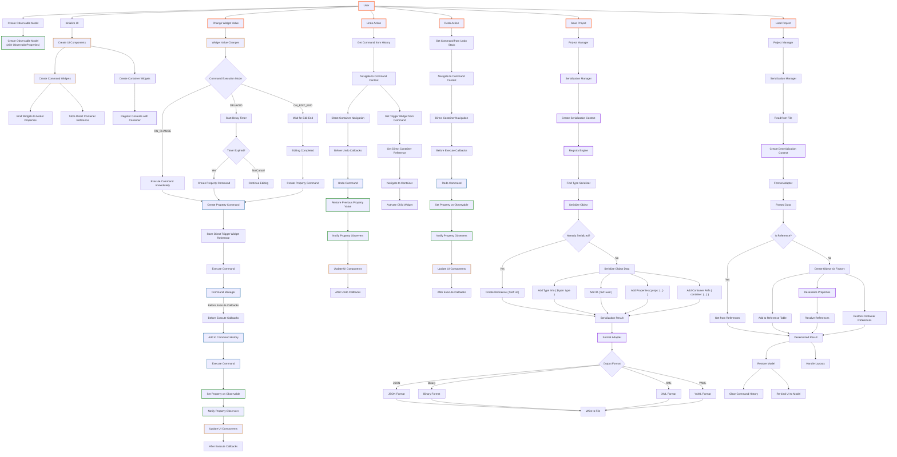

```mermaid
flowchart TD
    %% User actions
    User[User] --> ModelCreate[Create Observable Model]
    User --> UIInit[Initialize UI]
    User --> ValueChange[Change Widget Value]
    User --> UndoAction[Undo Action]
    User --> RedoAction[Redo Action]
    User --> SaveProject[Save Project]
    User --> LoadProject[Load Project]
    
    %% Model initialization
    ModelCreate --> ObservableModel["Create Observable Model\n(with ObservableProperties)"]
    
    %% UI initialization
    UIInit --> UIComponents[Create UI Components]
    UIComponents --> CmdWidgets[Create Command Widgets]
    UIComponents --> Containers[Create Container Widgets]
    CmdWidgets --> Binding[Bind Widgets to Model Properties]
    Containers --> RegisterContents[Register Contents with Container]
    
    %% Widget to container relationship - Direct References
    CmdWidgets --> DirectContainerRef[Store Direct Container Reference]
    
    %% Value change flow
    ValueChange --> WidgetValue[Widget Value Changes]
    WidgetValue --> ExecMode{Command Execution Mode}
    ExecMode -- "ON_CHANGE" --> ImmediateCmd[Execute Command Immediately]
    ExecMode -- "DELAYED" --> DelayTimer[Start Delay Timer]
    ExecMode -- "ON_EDIT_END" --> WaitEdit[Wait for Edit End]
    
    DelayTimer --> TimerExpired{Timer Expired?}
    TimerExpired -- Yes --> CreateDelayedCmd[Create Property Command]
    TimerExpired -- No/Cancel --> ContinueEditing[Continue Editing]
    
    WaitEdit --> EditCompleted[Editing Completed]
    EditCompleted --> CreateEditEndCmd[Create Property Command]
    
    %% Command creation
    CreateEditEndCmd --> CreateCommand[Create Property Command]
    CreateDelayedCmd --> CreateCommand
    ImmediateCmd --> CreateCommand
    
    CreateCommand --> StoreTriggerWidget[Store Direct Trigger Widget Reference]
    StoreTriggerWidget --> ExecuteCommand[Execute Command]
    
    %% Command execution
    ExecuteCommand --> CommandManager[Command Manager]
    CommandManager -- "Before Execute Callbacks" --> BeforeExec[Before Execute Callbacks]
    BeforeExec --> AddHistory[Add to Command History]
    AddHistory --> DoExecute[Execute Command]
    DoExecute --> PropChange[Set Property on Observable]
    PropChange --> NotifyObs[Notify Property Observers]
    NotifyObs --> UpdateUI[Update UI Components]
    UpdateUI --> AfterExec[After Execute Callbacks]
    
    %% Undo flow
    UndoAction --> GetUndoCmd[Get Command from History]
    GetUndoCmd --> NavigateContext[Navigate to Command Context]
    NavigateContext --> DirectNav[Direct Container Navigation]
    DirectNav --> BeforeUndo[Before Undo Callbacks]
    BeforeUndo --> UndoCommand[Undo Command]
    UndoCommand --> RestoreProp[Restore Previous Property Value]
    RestoreProp --> NotifyUndo[Notify Property Observers]
    NotifyUndo --> UpdateUIUndo[Update UI Components]
    UpdateUIUndo --> AfterUndo[After Undo Callbacks]
    
    %% Redo flow
    RedoAction --> GetRedoCmd[Get Command from Undo Stack]
    GetRedoCmd --> NavigateRedoContext[Navigate to Command Context]
    NavigateRedoContext --> DirectNavRedo[Direct Container Navigation]
    DirectNavRedo --> BeforeRedo[Before Execute Callbacks]
    BeforeRedo --> RedoCommand[Redo Command]
    RedoCommand --> SetProp[Set Property on Observable]
    SetProp --> NotifyRedo[Notify Property Observers]
    NotifyRedo --> UpdateUIRedo[Update UI Components]
    UpdateUIRedo --> AfterRedo[After Execute Callbacks]
    
    %% Direct container navigation
    NavigateContext --> GetTriggerWidget[Get Trigger Widget from Command]
    GetTriggerWidget --> GetDirectContainer[Get Direct Container Reference]
    GetDirectContainer --> DirectContainerNav[Navigate to Container]
    DirectContainerNav --> ActivateWidget[Activate Child Widget]
    
    %% New Serialization System
    SaveProject --> ProjectManager[Project Manager]
    ProjectManager --> SerManager[Serialization Manager]
    
    %% Serialization process
    SerManager --> SerContext[Create Serialization Context]
    SerContext --> RegEngine[Registry Engine]
    RegEngine --> FindSerializer[Find Type Serializer]
    FindSerializer --> SerObj[Serialize Object]
    SerObj --> CheckRef{Already Serialized?}
    CheckRef -- Yes --> RefObj["Create Reference { $ref: id }"]
    CheckRef -- No --> SerData[Serialize Object Data]
    
    SerData --> TypeInfo["Add Type Info { $type: type }"]
    SerData --> IDInfo["Add ID { $id: uuid }"]
    SerData --> PropInfo["Add Properties { props: {...} }"]
    SerData --> ContainerInfo["Add Container Refs { container: {...} }"]
    
    TypeInfo --> SerResult[Serialization Result]
    IDInfo --> SerResult
    PropInfo --> SerResult
    ContainerInfo --> SerResult
    RefObj --> SerResult
    
    SerResult --> FormatAdapter[Format Adapter]
    FormatAdapter --> OutputFormat{Output Format}
    OutputFormat -- JSON --> JSONFormat[JSON Format]
    OutputFormat -- Binary --> BinaryFormat[Binary Format]
    OutputFormat -- XML --> XMLFormat[XML Format]
    OutputFormat -- YAML --> YAMLFormat[YAML Format]
    
    JSONFormat --> FileOutput[Write to File]
    BinaryFormat --> FileOutput
    XMLFormat --> FileOutput
    YAMLFormat --> FileOutput
    
    %% Deserialization process
    LoadProject --> ProjManager[Project Manager]
    ProjManager --> DeserManager[Serialization Manager]
    DeserManager --> ReadFile[Read from File]
    ReadFile --> DeserContext[Create Deserialization Context]
    DeserContext --> InputAdapter[Format Adapter]
    InputAdapter --> ParsedData[Parsed Data]
    
    ParsedData --> CheckType{Is Reference?}
    CheckType -- Yes --> GetFromRef[Get from References]
    CheckType -- No --> CreateObject[Create Object via Factory]
    CreateObject --> RegisterRef[Add to Reference Table]
    
    CreateObject --> DeserProps[Deserialize Properties]
    CreateObject --> RestoreContainer[Restore Container References]
    DeserProps --> ResolveRefs[Resolve References]
    
    GetFromRef --> DeserResult[Deserialized Result]
    RegisterRef --> DeserResult
    RestoreContainer --> DeserResult
    ResolveRefs --> DeserResult
    
    DeserResult --> RestoreModel[Restore Model]
    DeserResult --> HandleLayers[Handle Layouts]
    RestoreModel --> ClearHistory[Clear Command History]
    RestoreModel --> RebindUI[Re-bind UI to Model]
    
    %% Styling with only colored borders
    classDef userAction stroke:#ff7f50,stroke-width:3px;
    classDef commandOp stroke:#4682b4,stroke-width:2px;
    classDef observable stroke:#228b22,stroke-width:2px;
    classDef uiComponent stroke:#cd853f,stroke-width:2px;
    classDef container stroke:#9370db,stroke-width:2px;
    classDef serialization stroke:#8a2be2,stroke-width:2px;
    
    class User,ValueChange,UndoAction,RedoAction,SaveProject,LoadProject userAction;
    class CommandManager,CreateCommand,AddHistory,DoExecute,UndoCommand,RedoCommand commandOp;
    class ObservableModel,PropChange,RestoreProp,SetProp,NotifyObs,NotifyUndo,NotifyRedo observable;
    class UIComponents,CmdWidgets,WidgetValue,UpdateUI,UpdateUIUndo,UpdateUIRedo uiComponent;
    class Containers,RegisterContents,DirectContainerNav,ActivateWidget container;
    class SerManager,RegEngine,FormatAdapter,SerContext,DeserContext,SerObj,DeserProps serialization;
```