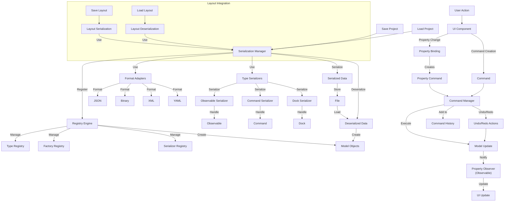

```mermaid
flowchart TD
    User[User Action] --> UI[UI Component]
    UI -- "Property Change" --> Binding[Property Binding]
    UI -- "Command Creation" --> CMD[Command]
    
    Binding -- "Creates" --> PropCmd[Property Command]
    PropCmd --> CmdMgr[Command Manager]
    CMD --> CmdMgr
    
    CmdMgr -- "Execute" --> ModelUpdate[Model Update]
    CmdMgr -- "Add to" --> History[Command History]
    
    ModelUpdate -- "Notify" --> PropObserver["Property Observer\n(Observable)"]
    PropObserver -- "Update" --> UIUpdate[UI Update]
    
    CmdMgr -- "Undo/Redo" --> UndoRedo[Undo/Redo Actions]
    UndoRedo --> ModelUpdate
    
    %% New Serialization Flow
    SaveProject[Save Project] --> SerMgr[Serialization Manager]
    LoadProject[Load Project] --> SerMgr
    
    SerMgr -- "Register" --> Registry[Registry Engine]
    SerMgr -- "Use" --> FormatAdapters[Format Adapters]
    SerMgr -- "Use" --> TypeSerializers[Type Serializers]
    
    Registry -- "Manage" --> Types[Type Registry]
    Registry -- "Manage" --> Factories[Factory Registry]
    Registry -- "Manage" --> Serializers[Serializer Registry]
    
    FormatAdapters -- "Format" --> JSON[JSON]
    FormatAdapters -- "Format" --> Binary[Binary]
    FormatAdapters -- "Format" --> XML[XML]
    FormatAdapters -- "Format" --> YAML[YAML]
    
    TypeSerializers -- "Serialize" --> ObsSer[Observable Serializer]
    TypeSerializers -- "Serialize" --> CmdSer[Command Serializer]
    TypeSerializers -- "Serialize" --> DockSer[Dock Serializer]
    
    ObsSer -- "Handle" --> Observable[Observable]
    CmdSer -- "Handle" --> Command[Command]
    DockSer -- "Handle" --> Dock[Dock]
    
    SerMgr -- "Serialize" --> SerData[Serialized Data]
    SerData -- "Store" --> File[File]
    
    SerMgr -- "Deserialize" --> DeserData[Deserialized Data]
    File -- "Load" --> DeserData
    
    DeserData -- "Create" --> ModelObjects[Model Objects]
    Registry -- "Create" --> ModelObjects
    
    subgraph "Layout Integration"
        SaveLayout[Save Layout] --> LayoutSer[Layout Serialization]
        LoadLayout[Load Layout] --> LayoutDeser[Layout Deserialization]
        LayoutSer -- "Use" --> SerMgr
        LayoutDeser -- "Use" --> SerMgr
    end
```