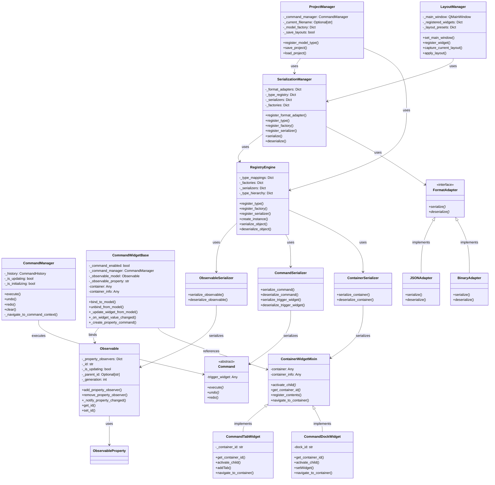

```mermaid
classDiagram
    %% Core Command System (Current Components)
    class Observable {
        -_property_observers: Dict
        -_id: str
        -_is_updating: bool
        -_parent_id: Optional[str]
        -_generation: int
        +add_property_observer()
        +remove_property_observer()
        +_notify_property_changed()
        +get_id()
        +set_id()
    }
    
    class Command {
        <<abstract>>
        -trigger_widget: Any
        +execute()* 
        +undo()*
        +redo()
    }
    
    class CommandManager {
        -_history: CommandHistory
        -_is_updating: bool
        -_is_initializing: bool
        +execute()
        +undo()
        +redo()
        +clear()
        -_navigate_to_command_context()
    }
    
    class CommandWidgetBase {
        -_command_enabled: bool
        -_command_manager: CommandManager
        -_observable_model: Observable
        -_observable_property: str
        -container: Any
        -container_info: Any
        +bind_to_model()
        +unbind_from_model()
        +_update_widget_from_model()
        +_on_widget_value_changed()
        +_create_property_command()
    }
    
    class ContainerWidgetMixin {
        -container: Any
        -container_info: Any
        +activate_child()*
        +get_container_id()*
        +register_contents()
        +navigate_to_container()
    }
    
    class CommandTabWidget {
        -_container_id: str
        +get_container_id()
        +activate_child()
        +addTab()
        +navigate_to_container()
    }
    
    class CommandDockWidget {
        -dock_id: str
        +get_container_id()
        +activate_child()
        +setWidget()
        +navigate_to_container()
    }
    
    %% Serialization System (New Components)
    class SerializationManager {
        -_format_adapters: Dict
        -_type_registry: Dict
        -_serializers: Dict
        -_factories: Dict
        +register_format_adapter()
        +register_type()
        +register_factory()
        +register_serializer()
        +serialize()
        +deserialize()
    }
    
    class RegistryEngine {
        -_type_mappings: Dict
        -_factories: Dict
        -_serializers: Dict
        -_type_hierarchy: Dict
        +register_type()
        +register_factory()
        +register_serializer()
        +create_instance()
        +serialize_object()
        +deserialize_object()
    }
    
    class FormatAdapter {
        <<interface>>
        +serialize()*
        +deserialize()*
    }
    
    class JSONAdapter {
        +serialize()
        +deserialize()
    }
    
    class BinaryAdapter {
        +serialize()
        +deserialize()
    }
    
    class ObservableSerializer {
        +serialize_observable()
        +deserialize_observable()
    }
    
    class CommandSerializer {
        +serialize_command()
        +deserialize_command()
        +serialize_trigger_widget()
        +deserialize_trigger_widget()
    }
    
    class ContainerSerializer {
        +serialize_container()
        +deserialize_container()
    }
    
    class ProjectManager {
        -_command_manager: CommandManager
        -_current_filename: Optional[str]
        -_model_factory: Dict
        -_save_layouts: bool
        +register_model_type()
        +save_project()
        +load_project()
    }
    
    class LayoutManager {
        -_main_window: QMainWindow
        -_registered_widgets: Dict
        -_layout_presets: Dict
        +set_main_window()
        +register_widget()
        +capture_current_layout()
        +apply_layout()
    }
    
    %% Relationships
    SerializationManager --> RegistryEngine : uses
    SerializationManager --> FormatAdapter : uses
    FormatAdapter <|-- JSONAdapter : implements
    FormatAdapter <|-- BinaryAdapter : implements
    
    RegistryEngine --> ObservableSerializer : uses
    RegistryEngine --> CommandSerializer : uses
    RegistryEngine --> ContainerSerializer : uses
    
    ObservableSerializer --> Observable : serializes
    CommandSerializer --> Command : serializes
    ContainerSerializer --> ContainerWidgetMixin : serializes
    
    ProjectManager --> SerializationManager : uses
    ProjectManager --> RegistryEngine : uses
    
    LayoutManager --> SerializationManager : uses
    
    CommandManager --> Command : executes
    Observable --> ObservableProperty : uses
    CommandWidgetBase --> Observable : binds
    CommandWidgetBase --> ContainerWidgetMixin : references
    
    ContainerWidgetMixin <|-- CommandTabWidget : implements
    ContainerWidgetMixin <|-- CommandDockWidget : implements
```