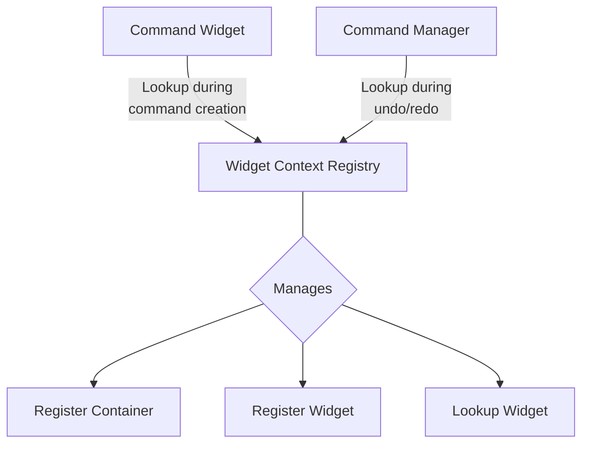
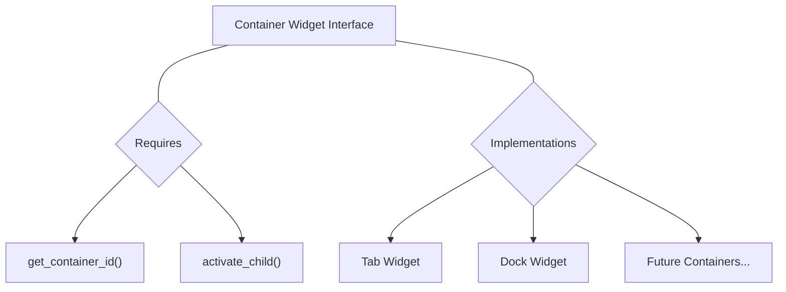
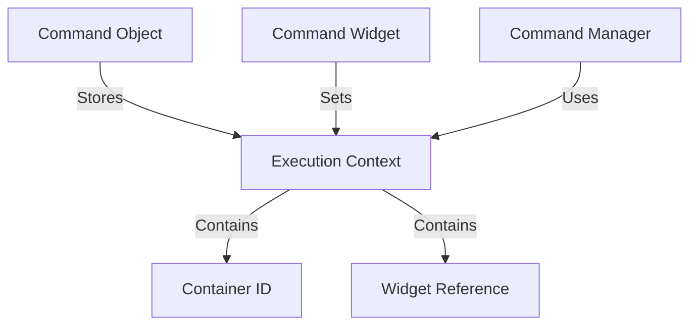
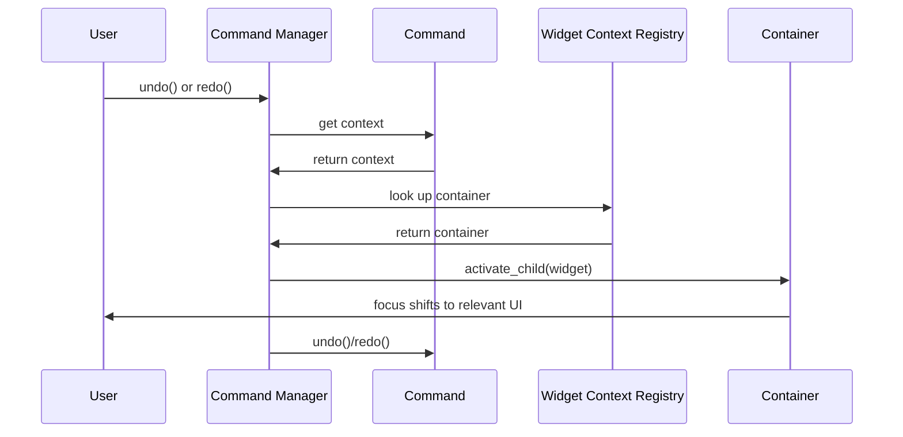

# PySignalDecipher Navigation and Container System Design

## 1. System Overview

The goal of this redesign is to create a clean, extensible system that allows commands to "remember" where they were created, enabling automatic navigation during undo/redo operations. This will significantly improve user experience by focusing attention on the UI elements that are changing.

## 2. Core Components

### 2.1. Widget Context Registry


- **Purpose**: Track which container holds each widget
- **Key Functions**:
  - Register widget-container relationships
  - Look up container for a given widget
  - Handle widget lifecycle and cleanup

### 2.2. Container Widget Interface


- **Purpose**: Define common interface for containers
- **Key Methods**:
  - `activate_child()`: Focus/display specific child
  - `get_container_id()`: Unique identifier
  - `register_child()`: Track container-child relationship

### 2.3. Command Context Enhancement


- **Purpose**: Store origin information with commands
- **Implementation**:
  - Add context field to base Command class
  - Record widget and container during command creation
  - Use context during undo/redo for navigation

## 3. Navigation Flow



## 4. Implementation Plan

### 4.1. Core Framework Updates

1. **Add Widget Context Registry**
   - Create `widget_context.py` in core directory
   - Implement context registry with singleton pattern
   - Add methods for registration and lookup

2. **Extend Command Class**
   - Add context field to store origin information
   - Add getter/setter methods for context

3. **Update Command Manager**
   - Add navigation method for context lookup
   - Call navigation before command execution/undo/redo

### 4.2. Container Framework

1. **Create Base Container Interface**
   - Define abstract base class in `containers/base_container.py`
   - Specify required methods

2. **Implement Container Types**
   - Create `containers/tab_widget.py` implementation
   - Create `containers/dock_widget.py` implementation

3. **Update CommandWidgetBase**
   - Modify to capture context during command creation
   - Support binding and registration with containers

## 5. Example Usage

### 5.1. Creating a Container
```python
# Create a tab container
tabs = CommandTabWidget(parent, "main_tabs")

# Add widgets to tabs
tab1 = QWidget()
edit1 = CommandLineEdit()
edit1.bind_to_model(model, "name")
tab1_layout = QVBoxLayout(tab1)
tab1_layout.addWidget(edit1)

# Add to container (auto-registers edit1 with the tab container)
tabs.addTab(tab1, "Properties")
```

### 5.2. Command Creation with Context
```python
# Inside CommandWidgetBase._create_property_command
def _create_property_command(self, new_value):
    command = PropertyCommand(self._model, self._property, new_value)
    
    # Get container context and attach to command
    context = get_widget_context_registry().get_widget_container(self)
    if context:
        command.set_execution_context(context)
    
    return command
```

### 5.3. Navigation During Undo/Redo
```python
# Inside CommandManager.undo
def undo(self):
    command = self._history.undo()
    if command:
        # Navigate to command context before executing
        self._navigate_to_command_context(command)
        command.undo()
    
def _navigate_to_command_context(self, command):
    context = command.get_execution_context()
    if context and 'container' in context:
        container = context['container']
        widget = context['widget']
        container.activate_child(widget)
```

## 6. Benefits and Advantages

1. **Improved User Experience**
   - Automatic focus on relevant UI elements during undo/redo
   - No need to manually locate which widget changed

2. **Extensible Architecture**
   - New container types can be easily added
   - Consistent interface for all containers

3. **Minimal Core Changes**
   - Most existing code remains unchanged
   - Only adds capabilities without breaking existing functionality

4. **Clear Separation of Concerns**
   - Navigation logic separate from command execution
   - Container interface separate from implementation details

## 7. Future Enhancements

1. **Multi-Window Support**
   - Track window ownership for cross-window navigation
   - Support for floating containers

2. **Compound Navigation**
   - Handle compound commands with multiple widget origins
   - Potentially navigate to primary/most relevant widget

3. **Visual Highlighting**
   - Briefly highlight the widget after navigation
   - Provide visual cue for what changed

4. **Nested Container Support**
   - Handle containers within containers (e.g., tabs in docks)
   - Recursive activation of parent containers