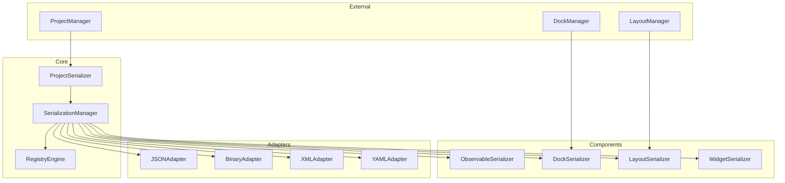
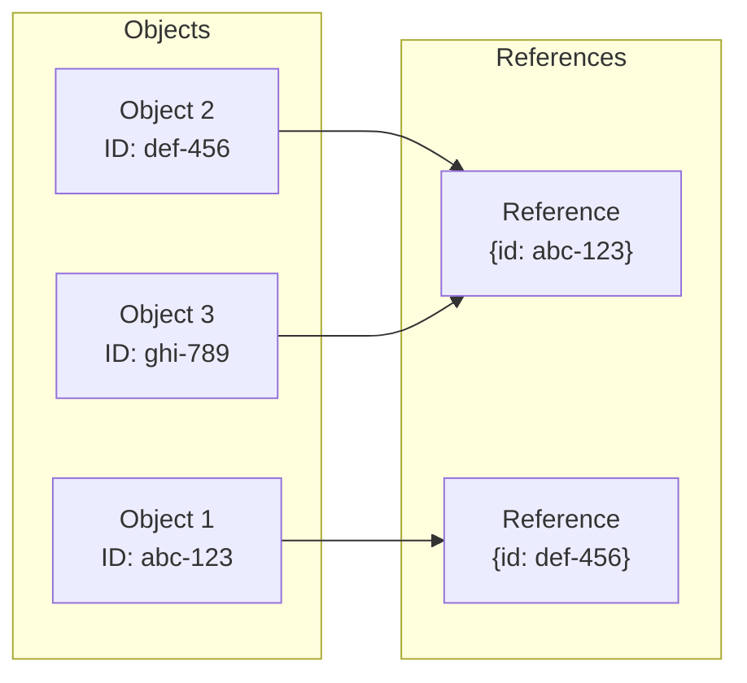
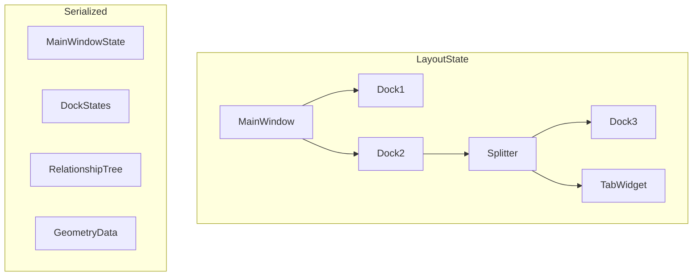
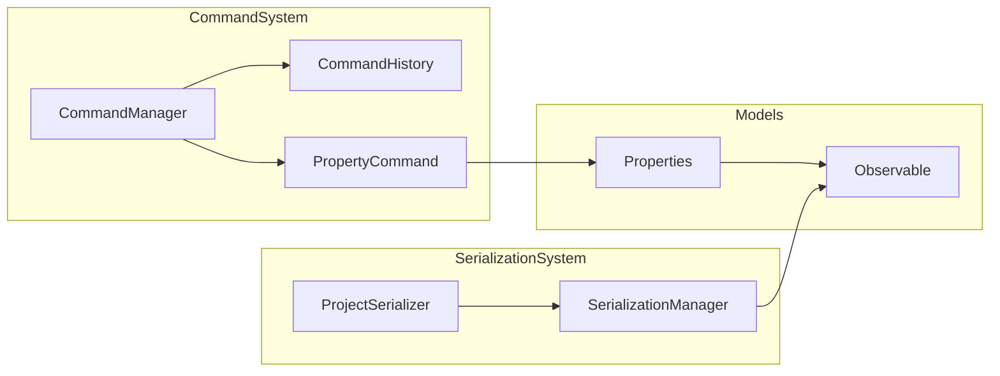

# PySignalDecipher Serialization System Design Approach

## 1. Core Design Principles

### 1.1. Separation of Concerns
- **Project Data** serialization should be independent from **Layout** serialization
- Each component should handle its own serialization/deserialization logic
- Clear interfaces between subsystems to allow easy replacement

### 1.2. Extensibility
- Registry-based system for custom types and factories
- Plugin architecture to allow extension without modifying core code
- Support for multiple serialization formats (JSON, Binary, XML, YAML)

### 1.3. Command Integration
- Leverage the existing command system for state management
- Avoid duplicating logic that's already in the command system
- Create clear separation between transient UI state and persistent model data

## 2. System Architecture



## 3. Key Components

### 3.1. SerializationManager
The central hub for serialization/deserialization operations. Provides:
- Type registration and discovery
- Format selection and adapter management
- Serialization context tracking for resolving references

### 3.2. RegistryEngine
Maintains registries of:
- Type mappings (string identifiers to class types)
- Factory functions for recreating objects
- Custom serializers for specific objects/types

### 3.3. Format Adapters
Adapters for each supported serialization format:
- JSON (default, human-readable)
- Binary (efficient storage)
- XML (legacy/interchange)
- YAML (human-friendly configuration)

### 3.4. Component Serializers
Specialized serializers for different component types:
- **ObservableSerializer**: Handles Observable objects and their properties
- **DockSerializer**: Serializes dock widget states and relationships
- **LayoutSerializer**: Handles layout structure and geometry
- **WidgetSerializer**: Generic widget state serialization

## 4. Object Identity and Reference System



### 4.1. Object Identity
- Every serializable object has a unique ID (using UUID)
- IDs are preserved across serialization/deserialization
- Objects can be recreated with their original IDs

### 4.2. Reference Resolution
- References are serialized as identifiers, not object copies
- Two-pass deserialization to handle circular dependencies:
  1. Create all objects with their IDs
  2. Resolve references between objects

## 5. Layout Serialization



### 5.1. Component Approach
- Each UI component serializes its own state
- Layout manager orchestrates the process and maintains relationships
- Component factories registered for recreation

### 5.2. Layout Hierarchy
- Preserve parent-child relationships
- Track tabified docks, splitter arrangements
- Handle floating windows and nested layouts

### 5.3. Layout-Project Integration
- Optional layout saving with projects
- Separate layout preset system for independent layouts
- Clear boundaries between layout and project data

## 6. Widget State Management

### 6.1. Observable Properties
- Leverage existing Observable mechanism for property tracking
- Observable properties are the primary serialization targets
- Command system handles property changes

### 6.2. Widget Type Registry
- Register widget types with factories for recreation
- Type identification system for class mapping
- Support for custom widget types

### 6.3. State vs. Layout
- Distinguish between:
  - **State**: The internal data (properties, values)
  - **Layout**: The UI arrangement (position, size, visibility)

## 7. Integration with Command System



### 7.1. Model-First Approach
- Models (Observable objects) are the primary serialization targets
- UI state derived from models where possible
- Commands modify models, not directly serialized

### 7.2. Command History Management
- Clear command history after successful load
- Consider serializing command history for advanced use cases
- Use command-like mechanism for layout changes

## 8. Implementation Strategy

### 8.1. Phase 1: Core Framework
- Implement SerializationManager and RegistryEngine
- Develop JSON adapter as primary format
- Create ObservableSerializer for model objects

### 8.2. Phase 2: Layout Integration
- Implement LayoutSerializer
- Develop DockSerializer and component factories
- Create layout serialization endpoints

### 8.3. Phase 3: Project Integration
- Integrate with ProjectManager
- Support alternate serialization formats
- Implement reference resolution system

### 8.4. Phase 4: Optimization and Testing
- Performance optimization
- Comprehensive testing system
- Documentation and examples

## 9. API Design Principles

### 9.1. Simple Core API
```
# Project operations
save_project(model, filename, format=FORMAT_JSON, save_layout=True)
load_project(filename, format=None)

# Layout operations
save_layout(filename, name=None)
load_layout(filename, name=None)

# Registration
register_type(type_name, class_type, factory)
register_serializer(type_name, serializer, deserializer)
```

### 9.2. Extensible Component API
```
# Serializer protocol
serialize(obj, context) -> dict
deserialize(data, context) -> obj

# Factory protocol
create_instance(type_name, **kwargs) -> obj
```

### 9.3. Clean Integration Points
- Clear hooks for extending serialization
- Plugin architecture for custom components
- Event notifications for serialization lifecycle

## 10. Error Handling and Robustness

### 10.1. Versioning
- Include schema version in serialized data
- Migration path for older formats
- Compatibility layer for backward compatibility

### 10.2. Validation
- Schema validation for serialized data
- Type checking during deserialization
- Error reporting and recovery mechanisms

### 10.3. Partial Recovery
- Ability to load partial data on corruption
- Fallback mechanisms for missing components
- Clear error reporting to users