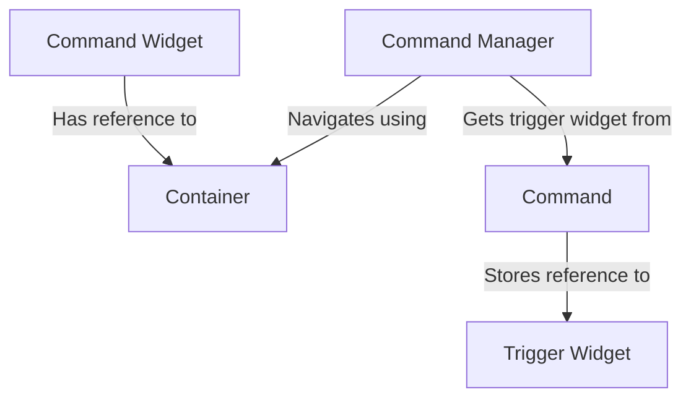
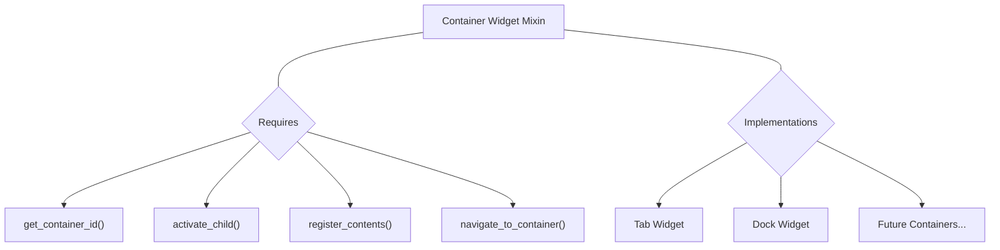
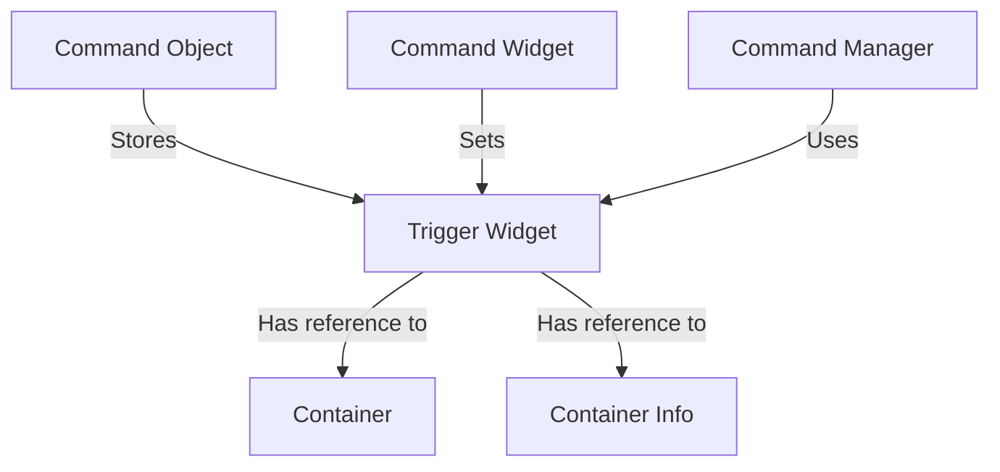
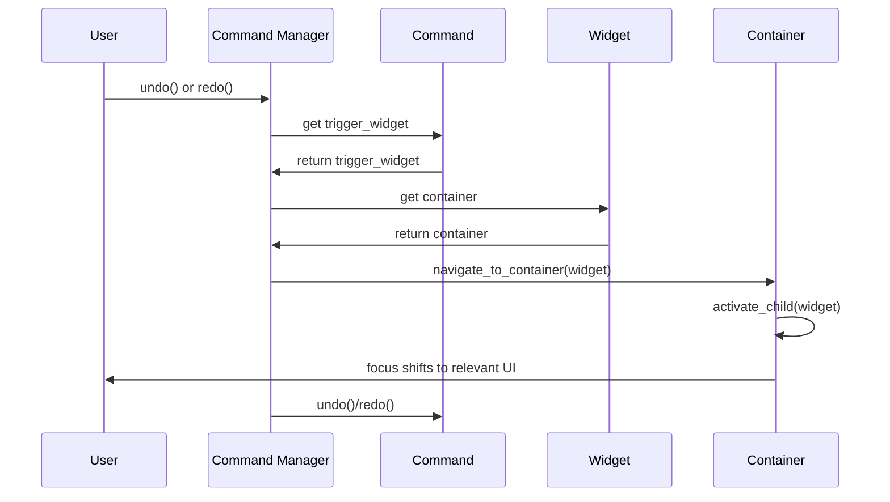

# PySignalDecipher Navigation and Container System Design

## 1. System Overview

The goal of this redesign is to create a clean, extensible system that allows commands to "remember" where they were created, enabling automatic navigation during undo/redo operations. This will significantly improve user experience by focusing attention on the UI elements that are changing.

## 2. Core Components

### 2.1. Direct Container Reference System


- **Purpose**: Track which container holds each widget
- **Key Approach**:
  - Each widget directly stores a reference to its container
  - Commands store the trigger widget that created them
  - Command manager uses these references for navigation

### 2.2. Container Widget Interface


- **Purpose**: Define common interface for containers
- **Key Methods**:
  - `activate_child()`: Focus/display specific child
  - `get_container_id()`: Unique identifier
  - `register_contents()`: Track container-child relationship
  - `navigate_to_container()`: Navigate to this container

### 2.3. Command Context Enhancement


- **Purpose**: Store origin information with commands
- **Implementation**:
  - Add trigger_widget field to base Command class
  - Each widget stores its container and container_info
  - Use these references during undo/redo for navigation

## 3. Navigation Flow



## 4. Implementation Plan

### 4.1. Core Framework Updates

1. **Add Command Widget Container References**
   - Add container and container_info fields to CommandWidgetBase
   - Use these fields to store container information

2. **Extend Command Class**
   - Add trigger_widget field to store the originating widget
   - Set this field when commands are created

3. **Update Command Manager**
   - Add navigation method to use trigger_widget for context lookup
   - Call navigation before command execution/undo/redo

### 4.2. Container Framework

1. **Create Container Widget Mixin**
   - Define mixin class in `containers/base_container.py`
   - Implement common container functionality

2. **Implement Container Types**
   - Create `containers/tab_widget.py` implementation
   - Create `containers/dock_widget.py` implementation

3. **Update Widgets for Container Integration**
   - Modify CommandWidgetBase to capture container information
   - Implement container registration in container widgets

## 5. Example Usage

### 5.1. Creating a Container
```python
# Create a tab container
tabs = CommandTabWidget(parent, "main_tabs")

# Add widgets to tabs
tab1 = QWidget()
edit1 = CommandLineEdit()
edit1.bind_to_model(model, "name")
tab1_layout = QVBoxLayout(tab1)
tab1_layout.addWidget(edit1)

# Add to container (auto-registers edit1 with the tab container)
tabs.addTab(tab1, "Properties")
```

### 5.2. Command Creation with Context
```python
# Inside CommandWidgetBase._create_property_command
def _create_property_command(self, new_value):
    command = PropertyCommand(self._model, self._property, new_value)
    
    # Store the widget reference in the command
    command.trigger_widget = self
    
    return command
```

### 5.3. Navigation During Undo/Redo
```python
# Inside CommandManager.undo
def undo(self):
    command = self._history.undo()
    if command:
        # Navigate to command context before executing
        self._navigate_to_command_context(command)
        command.undo()
    
def _navigate_to_command_context(self, command):
    if not command or not command.trigger_widget:
        return
        
    # Get the container from the trigger widget
    if command.trigger_widget.container:
        command.trigger_widget.container.navigate_to_container(
            command.trigger_widget, 
            command.trigger_widget.container_info
        )
```

## 6. Benefits and Advantages

1. **Simplified Architecture**
   - Direct container references eliminate need for central registry
   - Clearer component relationships and responsibilities
   - Less overhead for navigation lookups

2. **Improved User Experience**
   - Automatic focus on relevant UI elements during undo/redo
   - No need to manually locate which widget changed

3. **Extensible Architecture**
   - New container types can be easily added by implementing the mixin
   - Consistent interface for all containers

4. **Nested Container Support**
   - Hierarchical navigation through nested containers
   - Each container navigates to itself, then activates the child

## 7. Future Enhancements

1. **Multi-Window Support**
   - Track window ownership for cross-window navigation
   - Support for floating containers

2. **Visual Highlighting**
   - Briefly highlight the widget after navigation
   - Provide visual cue for what changed

3. **Extended Container Info**
   - Store additional context for specialized navigation
   - Support for complex container hierarchies

4. **Command Batching**
   - Group related commands with navigation preferences
   - Optimize navigation for compound operations