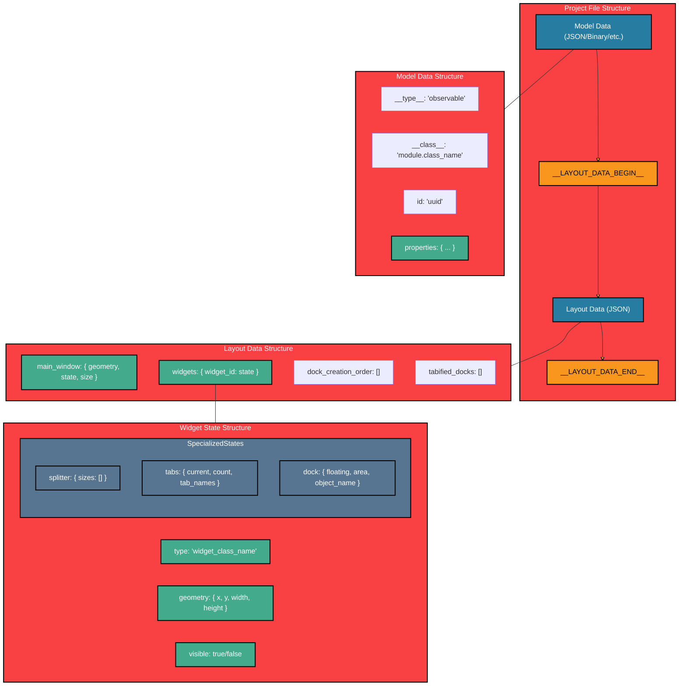

```mermaid
graph TD
    subgraph ProjectFile["Project File Structure"]
        ModelData["Model Data (JSON/Binary/etc.)"]
        LayoutMarkerStart["__LAYOUT_DATA_BEGIN__"]
        LayoutData["Layout Data (JSON)"]
        LayoutMarkerEnd["__LAYOUT_DATA_END__"]
    end
    
    ModelData --> LayoutMarkerStart --> LayoutData --> LayoutMarkerEnd
    
    subgraph ModelDataStructure["Model Data Structure"]
        TypeMarker["__type__: 'observable'"]
        ClassPath["__class__: 'module.class_name'"]
        ID["id: 'uuid'"]
        Properties["properties: { ... }"]
    end
    
    subgraph LayoutDataStructure["Layout Data Structure"]
        MainWindow["main_window: { geometry, state, size }"]
        Widgets["widgets: { widget_id: state }"]
        DockOrder["dock_creation_order: []"]
        TabifiedDocks["tabified_docks: []"]
    end
    
    subgraph WidgetStateStructure["Widget State Structure"]
        Type["type: 'widget_class_name'"]
        Geometry["geometry: { x, y, width, height }"]
        Visible["visible: true/false"]
        
        subgraph SpecializedStates
            SplitterState["splitter: { sizes: [] }"]
            TabsState["tabs: { current, count, tab_names }"]
            DockState["dock: { floating, area, object_name }"]
        end
    end
    
    ModelData --- ModelDataStructure
    LayoutData --- LayoutDataStructure
    Widgets --- WidgetStateStructure
    
    %% Style definitions with higher contrast colors
    classDef section fill:#f94144,stroke:#000,stroke-width:2px,color:white;
    classDef marker fill:#f8961e,stroke:#000,stroke-width:2px,color:black;
    classDef content fill:#277da1,stroke:#000,stroke-width:2px,color:white;
    classDef properties fill:#43aa8b,stroke:#000,stroke-width:2px,color:white;
    classDef specialized fill:#577590,stroke:#000,stroke-width:2px,color:white;
    
    class ProjectFile,ModelDataStructure,LayoutDataStructure,WidgetStateStructure section;
    class LayoutMarkerStart,LayoutMarkerEnd marker;
    class ModelData,LayoutData content;
    class Properties,MainWindow,Widgets,Type,Geometry,Visible properties;
    class SpecializedStates,SplitterState,TabsState,DockState specialized;
```