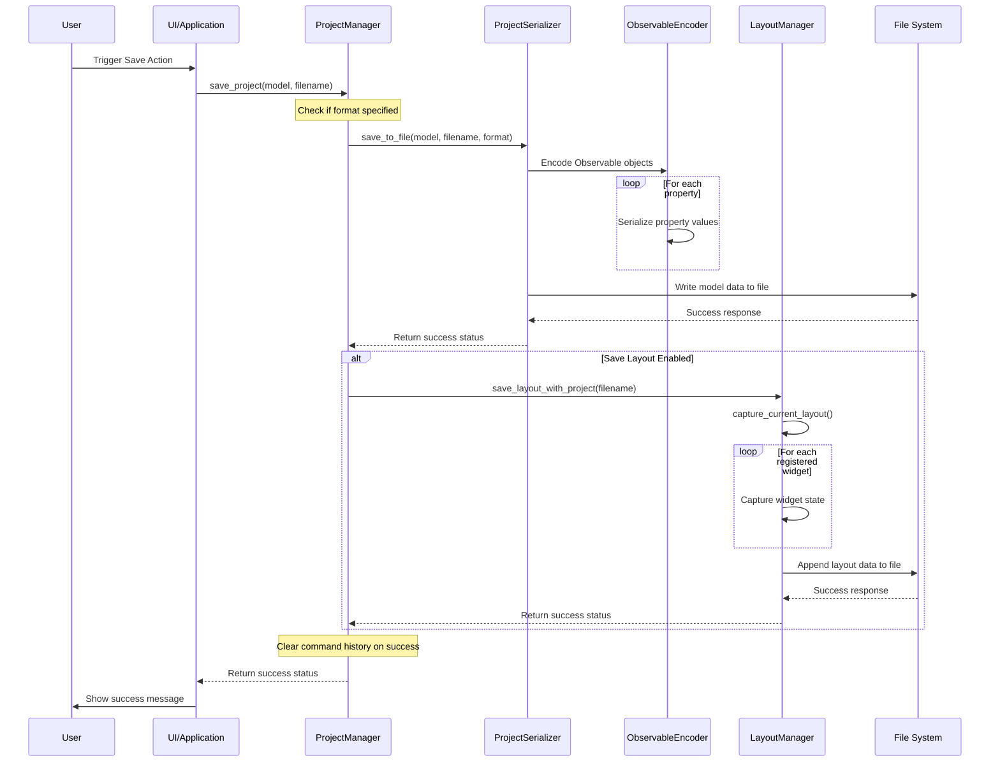

```mermaid
sequenceDiagram
    participant User
    participant UI as UI/Application
    participant PM as ProjectManager
    participant PS as ProjectSerializer
    participant OE as ObservableEncoder
    participant LM as LayoutManager
    participant File as File System
    
    User->>UI: Trigger Save Action
    UI->>PM: save_project(model, filename)
    
    Note over PM: Check if format specified
    PM->>PS: save_to_file(model, filename, format)
    
    PS->>OE: Encode Observable objects
    
    loop For each property
        OE->>OE: Serialize property values
    end
    
    PS->>File: Write model data to file
    File-->>PS: Success response
    PS-->>PM: Return success status
    
    alt Save Layout Enabled
        PM->>LM: save_layout_with_project(filename)
        LM->>LM: capture_current_layout()
        
        loop For each registered widget
            LM->>LM: Capture widget state
        end
        
        LM->>File: Append layout data to file
        File-->>LM: Success response
        LM-->>PM: Return success status
    end
    
    Note over PM: Clear command history on success
    PM-->>UI: Return success status
    UI->>User: Show success message
```