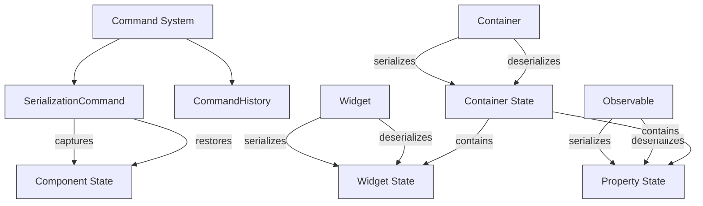
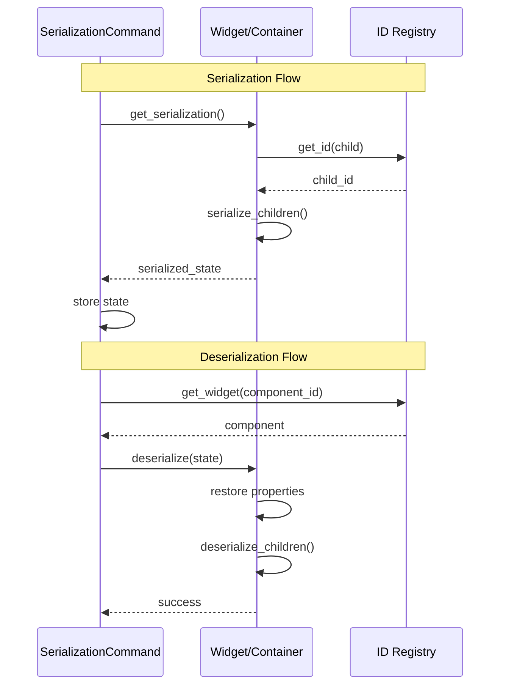

# Serialization System Documentation

This document explains the serialization system in the PySignalDecipher command system, which enables state capture, restoration, and undo/redo operations.

## Overview

The serialization system allows for capturing and restoring application state at various levels:

1. **Property Level**: Individual observable properties
2. **Widget Level**: Command widgets and their relationships
3. **Container Level**: Hierarchical container structures with nested components
4. **Command Level**: State snapshots for commands like tab operations

The system is deeply integrated with the ID system to ensure references remain valid across serialization boundaries.

## Architecture



## Serialization Format

### Observable Property Serialization

```json
{
  "property_id": "op:5D:0:name:0",
  "property_name": "name",
  "value": "Alice",
  "observable_id": "o:4C"
}
```

### Widget Serialization

```json
{
  "id": "le:1Z:0:0",
  "properties": {
    "text": {
      "property_id": "op:5D:0:name:0",
      "property_name": "name",
      "value": "Alice",
      "observable_id": "o:4C"
    }
  }
}
```

### Container Serialization

```json
{
  "id": "t:2J:0:1",
  "current_index": 0,
  "tab_position": 0,
  "tabs_closable": true,
  "document_mode": false,
  "moving_enabled": true,
  "subcontainers": [
    {
      "id": "t:3R:2J:0-1",
      "type": "wt:1",
      "location": "0",
      "children": {}
    },
    {
      "id": "t:4S:2J:1-2",
      "type": "wt:2",
      "location": "1",
      "children": {}
    }
  ]
}
```

## Key Components

### 1. Observable Property Serialization

Observable objects provide methods to serialize and deserialize individual properties:

```python
# Serializing a property
property_id = observable._property_id_cache.get("name")
serialized_property = observable.serialize_property(property_id)

# Deserializing a property
observable.deserialize_property(property_id, serialized_property)
```

### 2. Widget Serialization

Command widgets implement serialization methods to capture their state:

```python
# Serializing a widget
widget_state = widget.get_serialization()

# Restoring a widget from serialized data
widget.restore_widget(widget_state)
```

### 3. Container Serialization

Containers serialize their entire hierarchy recursively:

```python
# Serializing a container
container_state = container.get_serialization()

# Deserializing a container
container.deserialize(container_state)
```

### 4. SerializationCommand

The SerializationCommand base class provides standard methods for capturing and restoring component state:

```python
class SerializationCommand(Command):
    def __init__(self, component_id):
        super().__init__()
        self.component_id = component_id
        self.serialized_state = None
        
    def capture_state(self):
        """Capture component state before changes."""
        component = get_id_registry().get_widget(self.component_id)
        if component and hasattr(component, 'get_serialization'):
            self.serialized_state = component.get_serialization()
        
    def restore_state(self):
        """Restore component to previous state."""
        if not self.serialized_state:
            return False
            
        component = get_id_registry().get_widget(self.component_id)
        if component and hasattr(component, 'deserialize'):
            return component.deserialize(self.serialized_state)
        return False
```

## Serialization Flow



## Best Practices

1. **Use IDs, not references**: Always reference components by ID in serialized data
2. **Handle ID changes**: During deserialization, be prepared for ID changes
3. **Maintain hierarchies**: Properly serialize and deserialize parent-child relationships
4. **Validate data**: Check for missing or invalid data during deserialization
5. **Isolate state**: Keep serialized state independent from UI-specific details
6. **Version your format**: Consider adding version info if your serialization format may change

## Practical Examples

### Serializing and Deserializing a Form

```python
def save_form_state(form_container, filename):
    # Get serialized state
    state = form_container.get_serialization()
    
    # Save to file
    with open(filename, 'w') as f:
        json.dump(state, f)

def load_form_state(form_container, filename):
    # Load from file
    with open(filename, 'r') as f:
        state = json.load(f)
    
    # Restore state
    form_container.deserialize(state)
```

### Creating Commands with State Capture

```python
class FormChangeCommand(SerializationCommand):
    def __init__(self, form_id):
        super().__init__(form_id)
        self.capture_state()  # Capture initial state
        
    def execute(self):
        # Perform changes to the form
        form = get_id_registry().get_widget(self.component_id)
        if form:
            form.update_values(self.new_values)
        
    def undo(self):
        # Restore previous state
        self.restore_state()
```

## Troubleshooting

1. **Missing Components**: If a component can't be found during deserialization, check if its ID has changed
2. **Incomplete Restoration**: Ensure all required properties are included in serialized data
3. **Circular References**: Use IDs instead of direct references to avoid circular serialization issues
4. **Widget Type Mismatch**: Verify that widget types match when deserializing
5. **Out-of-Order Restoration**: Restore parent containers before their children