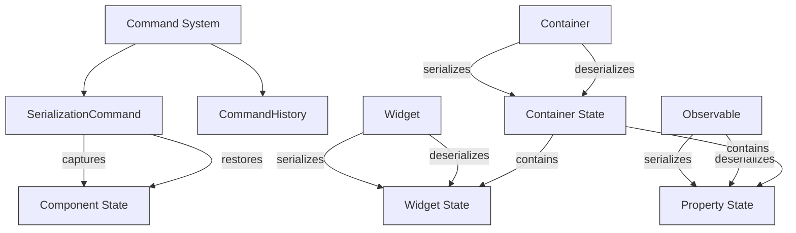
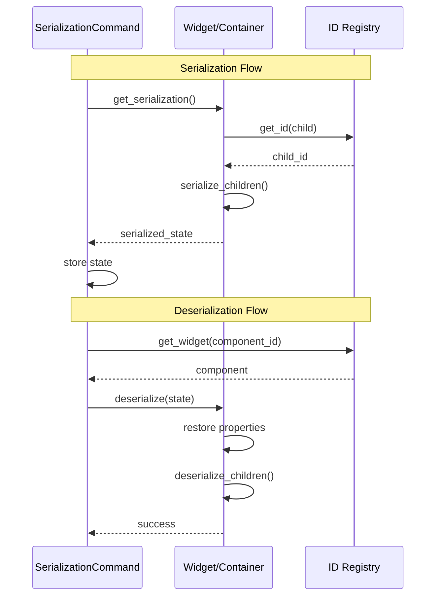

# Serialization System Documentation

This document explains the serialization system in the PySignalDecipher command system, which enables state capture, restoration, and undo/redo operations.

## Overview

The serialization system allows for capturing and restoring application state at various levels:

1. **Property Level**: Individual observable properties
2. **Widget Level**: Command widgets and their relationships
3. **Container Level**: Hierarchical container structures with nested components
4. **Command Level**: State snapshots for commands like tab operations

The system is deeply integrated with the ID system to ensure references remain valid across serialization boundaries.

## Architecture



## Serialization Format

### Observable Property Serialization

```json
{
  "property_id": "op:5D:0:name:0",
  "property_name": "name",
  "value": "Alice",
  "observable_id": "ob:4C"
}
```

### Observable Serialization

```json
{
  "id": "ob:4C",
  "properties": {
    "name": {
      "property_id": "op:5D:0:name:0",
      "property_name": "name",
      "value": "Alice",
      "observable_id": "ob:4C"
    },
    "age": {
      "property_id": "op:6E:0:age:0",
      "property_name": "age",
      "value": 30,
      "observable_id": "ob:4C"
    }
  }
}
```

### Widget Serialization

```json
{
  "id": "le:1Z:0:0",
  "properties": {
    "text": {
      "property_id": "op:5D:0:name:0",
      "property_name": "name",
      "value": "Alice",
      "observable_id": "ob:4C"
    }
  }
}
```

### Container Serialization

```json
{
  "id": "t:2J:0:1",
  "current_index": 0,
  "tab_position": 0,
  "tabs_closable": true,
  "document_mode": false,
  "moving_enabled": true,
  "subcontainers": [
    {
      "id": "t:3R:2J:0-1",
      "type": "wt:1",
      "location": "0",
      "children": {}
    },
    {
      "id": "t:4S:2J:1-2",
      "type": "wt:2",
      "location": "1",
      "children": {}
    }
  ]
}
```

## Key Components

### 1. Observable Property Serialization

Observable objects provide methods to serialize and deserialize individual properties:

```python
# Serializing a property
serialized_property = observable.serialize_property("name")

# Deserializing a property
observable.deserialize_property("name", serialized_property)
```

### 2. Observable Serialization

Observable objects can serialize and deserialize their entire state:

```python
# Serializing an observable
serialized_observable = observable.serialize()

# Deserializing an observable
observable.deserialize(serialized_observable)
```

### 3. Widget Serialization

Command widgets implement serialization methods to capture their state:

```python
# Serializing a widget
widget_state = widget.get_serialization()

# Restoring a widget from serialized data
widget.deserialize(widget_state)
```

### 4. Container Serialization

Containers serialize their entire hierarchy recursively:

```python
# Serializing a container
container_state = container.get_serialization()

# Deserializing a container
container.deserialize(container_state)

# Serializing a specific subcontainer
subcontainer_state = container.serialize_subcontainer(subcontainer_id)

# Deserializing a subcontainer
container.deserialize_subcontainer(type_id, location, subcontainer_state)
```

### 5. SerializationCommand

The SerializationCommand class provides a standardized way to capture and restore component state for undo/redo operations:

```python
class MySerializationCommand(SerializationCommand):
    def __init__(self, component_id):
        super().__init__(component_id)
        # Capture initial state before changes
        self.get_serialization()
        
    def execute(self):
        # Perform changes to the component
        component = get_id_registry().get_widget(self.component_id)
        if component:
            component.update_something()
        
    def undo(self):
        # Restore previous state
        self.deserialize()
```

### SerializationCommand Methods

The SerializationCommand provides several methods for different serialization scenarios:

- `get_serialization()`: Captures a component's serialized state
- `deserialize()`: Restores a component from captured state
- `serialize_subcontainer()`: Captures a container's subcontainer state
- `deserialize_subcontainer()`: Restores a subcontainer to a container

## Serialization Flow



## Implementation Examples

### 1. Basic Property Command with Serialization

```python
from command_system.core import SerializationCommand

class TabChangeCommand(SerializationCommand):
    def __init__(self, tab_widget_id, new_tab_index):
        super().__init__(tab_widget_id)
        self.new_tab_index = new_tab_index
        self.old_tab_index = None
        
        # Capture current state before changes
        self.get_serialization()
    
    def execute(self):
        tab_widget = get_id_registry().get_widget(self.component_id)
        if tab_widget:
            self.old_tab_index = tab_widget.currentIndex()
            tab_widget.setCurrentIndex(self.new_tab_index)
    
    def undo(self):
        # Restore previous state
        self.deserialize()
```

### 2. Subcontainer Serialization

```python
from command_system.core import SerializationCommand

class DockWidgetShowCommand(SerializationCommand):
    def __init__(self, dock_container_id, dock_widget_id):
        super().__init__(dock_container_id)
        self.dock_widget_id = dock_widget_id
        self.location = None
        
        # Get the container and capture the subcontainer's state
        self.serialize_subcontainer()
    
    def execute(self):
        container = get_id_registry().get_widget(self.component_id)
        if container:
            # Show the dock widget
            dock_widget = get_id_registry().get_widget(self.dock_widget_id)
            container.showDockWidget(dock_widget)
            # Store its location
            self.location = container.get_dock_location(self.dock_widget_id)
    
    def undo(self):
        # Restore the subcontainer's previous state
        self.deserialize_subcontainer()
```

### 3. Form Data Serialization

```python
class FormDataCommand(SerializationCommand):
    def __init__(self, form_id, new_values):
        super().__init__(form_id)
        self.new_values = new_values
        
        # Capture form state before changes
        self.get_serialization()
    
    def execute(self):
        form = get_id_registry().get_widget(self.component_id)
        if form:
            form.set_values(self.new_values)
    
    def undo(self):
        # Restore previous form state
        self.deserialize()
```

## Best Practices

1. **Always Use IDs, Not References**: Store component IDs instead of direct references to ensure proper serialization/deserialization.

2. **Capture State Before Changes**: Always capture the serialized state before making changes in command execution.

3. **Handle ID Changes During Deserialization**: Be prepared for components to have different IDs when deserializing.

4. **Maintain Hierarchies**: Properly serialize and deserialize parent-child relationships.

5. **Validate Deserialization Data**: Check for missing or invalid data during deserialization.

6. **Use SerializationCommand for Complex Operations**: Leverage the SerializationCommand class for operations that need to capture and restore state.

7. **Include All Required Context**: Ensure serialized data includes all information needed for restoration, including type information and relationships.

8. **Handle Errors Gracefully**: Implement error handling for serialization and deserialization failures.

## Troubleshooting

1. **Missing Components**: If a component can't be found during deserialization, check if its ID has changed. The ID system helps track these changes during serialization/deserialization.

2. **Incomplete Restoration**: Ensure all required properties are included in serialized data.

3. **Circular References**: Use IDs instead of direct references to avoid circular serialization issues.

4. **Container Hierarchy Issues**: Restore container hierarchy from the root down to maintain proper parent-child relationships.

5. **ID Mismatches**: If you're seeing ID mismatches during deserialization, ensure you're updating component IDs using the ID registry's methods.