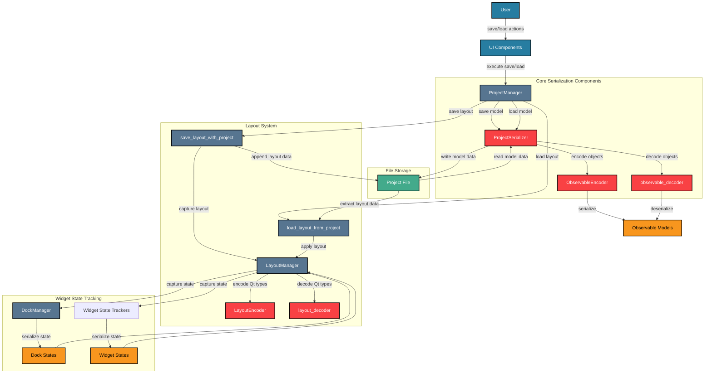

```mermaid
graph TD
    User[User] -->|"save/load actions"| UI[UI Components]
    UI -->|"execute save/load"| PM[ProjectManager]
    
    subgraph Core["Core Serialization Components"]
        PM -->|"save model"| PS[ProjectSerializer]
        PM -->|"load model"| PS
        PS -->|"encode objects"| OE[ObservableEncoder]
        PS -->|"decode objects"| OD[observable_decoder]
    end
    
    subgraph Layout["Layout System"]
        PM -->|"save layout"| SLWP[save_layout_with_project]
        PM -->|"load layout"| LLFP[load_layout_from_project]
        SLWP -->|"capture layout"| LM[LayoutManager]
        LLFP -->|"apply layout"| LM
        LM -->|"encode Qt types"| LE[LayoutEncoder]
        LM -->|"decode Qt types"| LD[layout_decoder]
    end
    
    subgraph Storage["File Storage"]
        PS -->|"write model data"| File[Project File]
        SLWP -->|"append layout data"| File
        File -->|"read model data"| PS
        File -->|"extract layout data"| LLFP
    end
    
    subgraph Widget["Widget State Tracking"]
        LM -->|"capture state"| DM[DockManager]
        LM -->|"capture state"| WS[Widget State Trackers]
        DM -->|"serialize state"| DS[Dock States]
        WS -->|"serialize state"| WIS[Widget States]
        DS --> LM
        WIS --> LM
    end
    
    OE -->|"serialize"| Model[Observable Models]
    OD -->|"deserialize"| Model
    
    %% Style definitions with higher contrast colors
    classDef process fill:#f94144,stroke:#000,stroke-width:2px,color:white;
    classDef component fill:#577590,stroke:#000,stroke-width:2px,color:white;
    classDef storage fill:#43aa8b,stroke:#000,stroke-width:2px,color:white;
    classDef model fill:#f8961e,stroke:#000,stroke-width:2px,color:black;
    classDef user fill:#277da1,stroke:#000,stroke-width:2px,color:white;
    
    class PS,OE,OD,LE,LD process;
    class PM,LM,DM,SLWP,LLFP component;
    class File storage;
    class Model,DS,WIS model;
    class User,UI user;
```