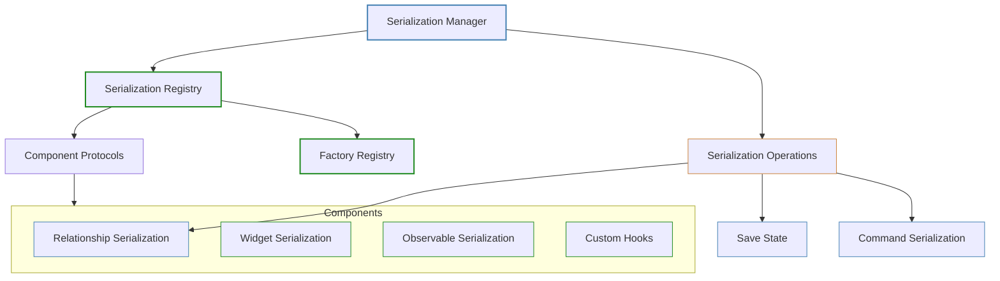
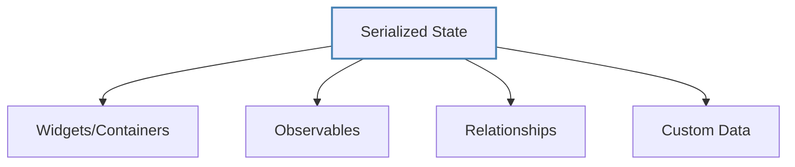
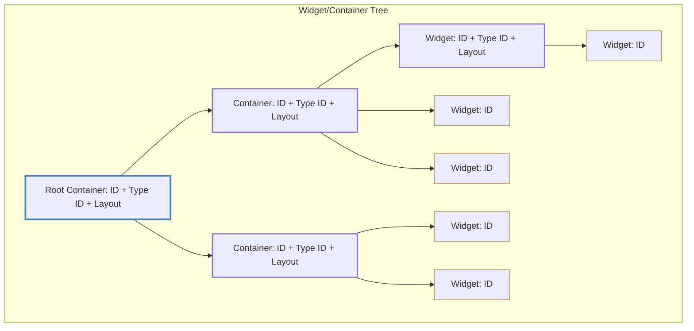
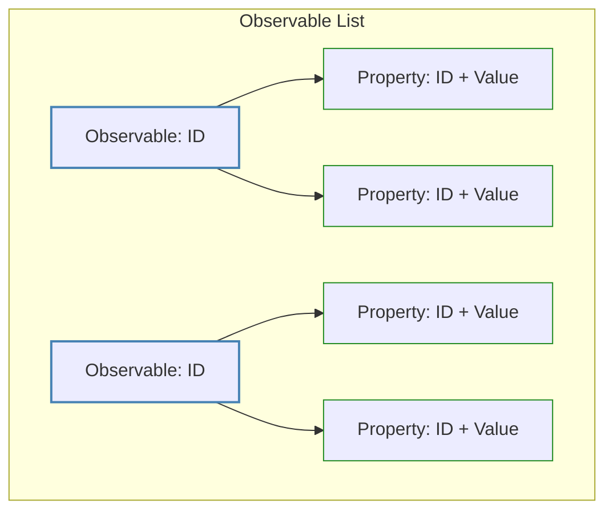
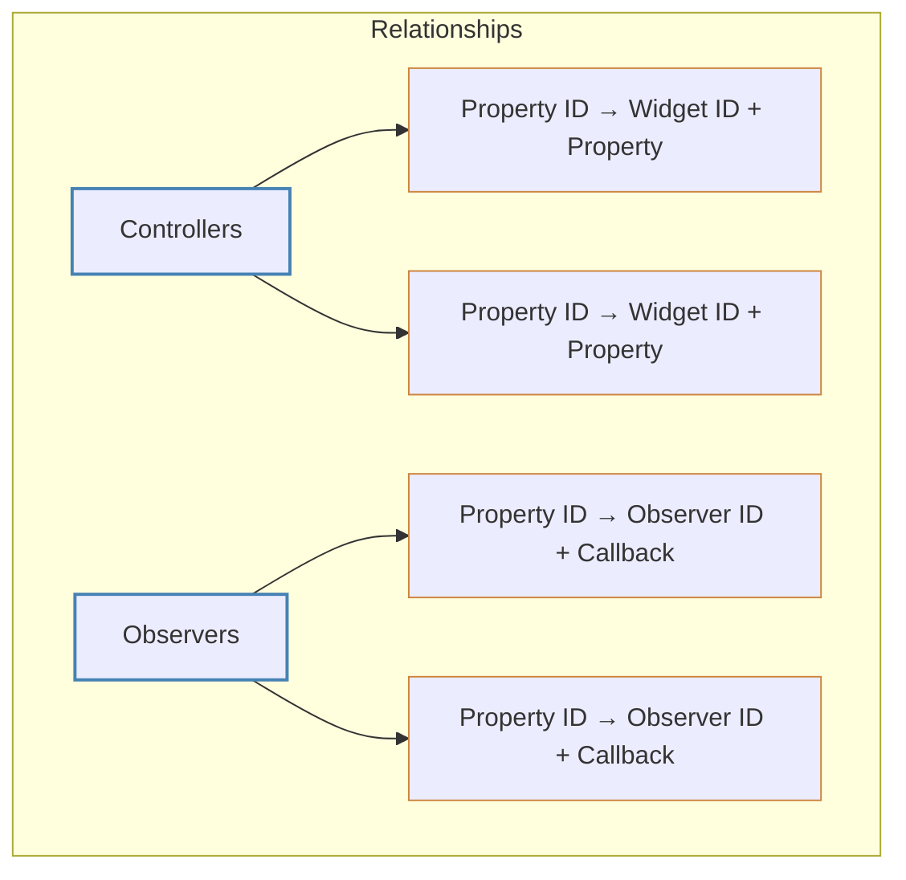
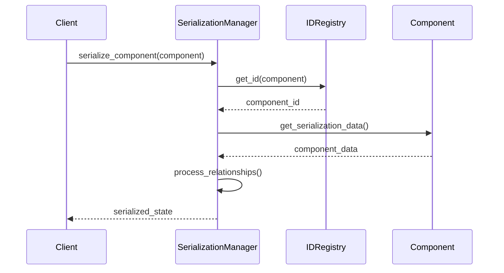
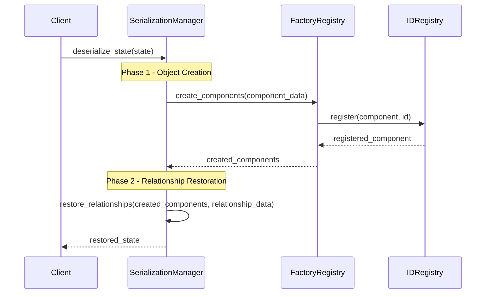
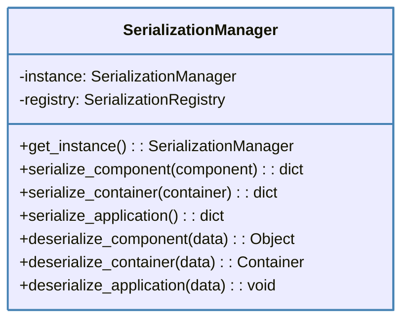
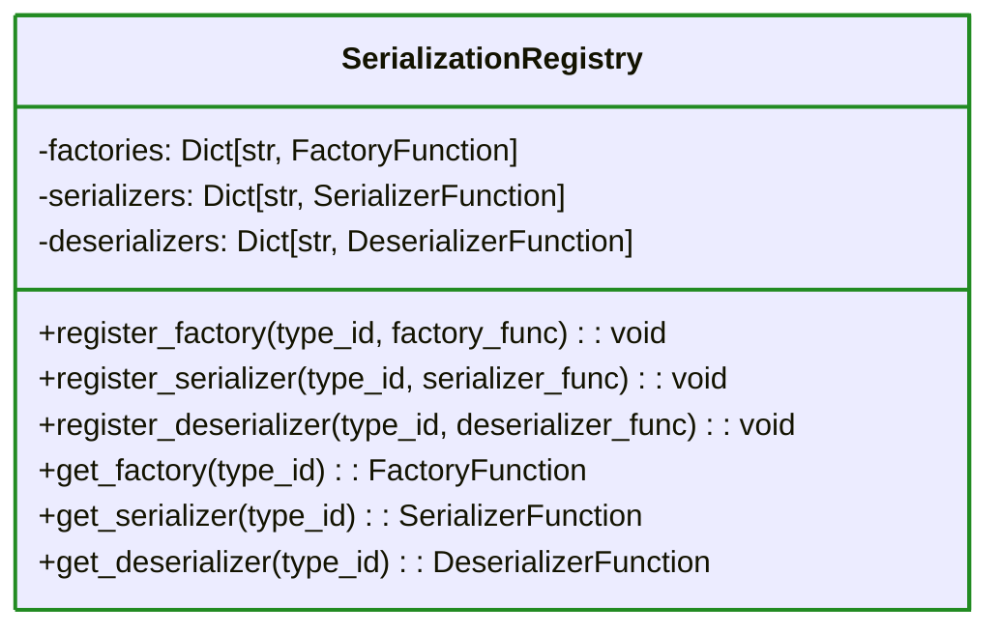
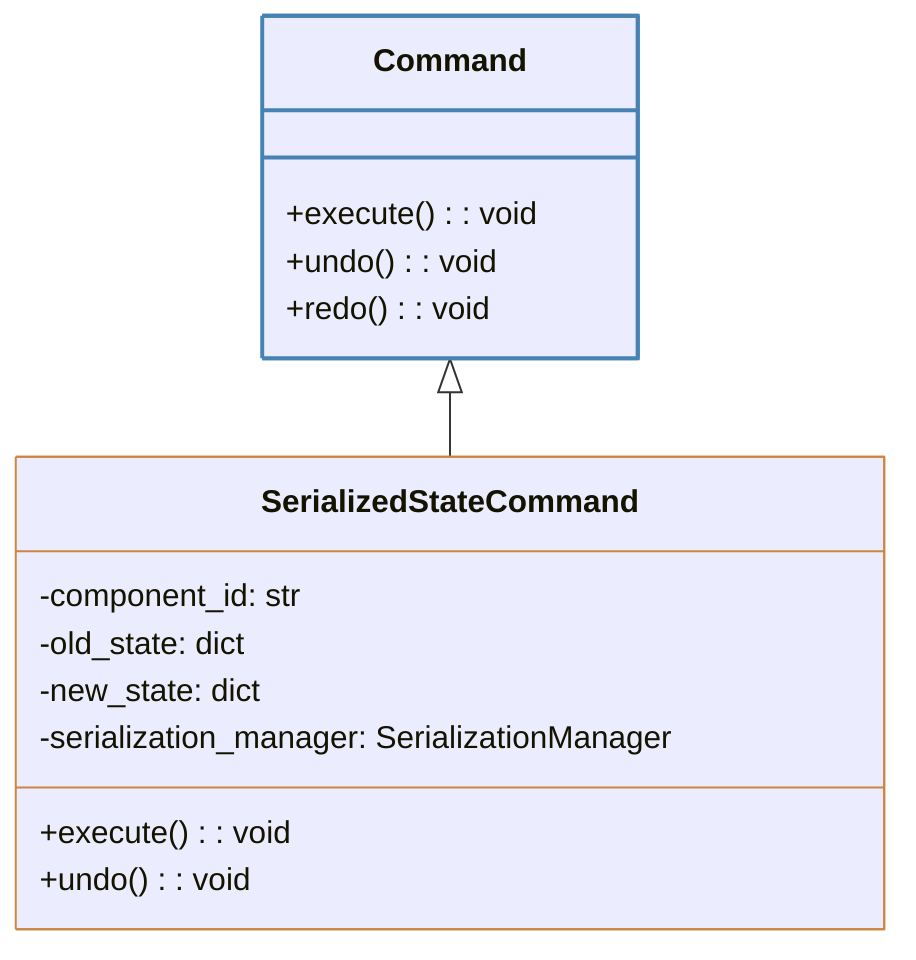

# Command System Serialization Architecture

This document outlines the design for a serialization system that integrates with the existing command system. The approach combines ID-based serialization with component hooks and a centralized registry.

## Core Design Principles

1. **Flexible Granularity**: Support serialization at different levels (individual components, containers, or the entire application)
2. **ID Preservation**: Maintain component identities during serialization/deserialization
3. **Relationship Integrity**: Properly restore all relationships between components
4. **Integration with Commands**: Support command-based operations for serialized states
5. **Extensibility**: Allow for custom serialization needs

## Architecture Overview



## Serialization Data Structure

The serialization system organizes data into distinct categories:



### Widget/Container Tree Structure

Widgets and containers are organized in a tree structure:



### Observable Structure

Observables are serialized as flat lists with their properties:



### Relationship Structure

Relationships between components are stored separately:



## Serialization and Deserialization Process

### Serialization Process



### Deserialization Process (Two-Phase)



## Component Types and Their Serialization

### 1. Widgets and Containers

Widgets and containers are serialized in a tree structure that preserves the hierarchy:

```json
{
  "id": "t:1A:0:0",
  "type_code": "t",
  "type_id": "tab_container",
  "layout": { "width": 800, "height": 600 },
  "children": [
    {
      "id": "pb:2B:1A:0",
      "type_code": "pb",
      "type_id": "button_type_1",
      "layout": { "x": 10, "y": 10, "width": 100, "height": 30 },
      "children": []
    },
    {
      "id": "x:3C:1A:1",
      "type_code": "x",
      "type_id": "panel_container",
      "layout": { "x": 120, "y": 10, "width": 200, "height": 200 },
      "children": [
        {
          "id": "le:4D:3C:0",
          "type_code": "le",
          "type_id": "line_edit_type_1",
          "layout": { "x": 10, "y": 10, "width": 180, "height": 30 },
          "children": []
        }
      ]
    }
  ]
}
```

Note that:
- Containers have both a `type_code`, `type_id`, and `children` array
- Leaf widgets have a `type_code`, `type_id`, and empty `children` array
- All nodes have `id` and `layout` information

### 2. Observables and Properties

Observables and their properties are serialized as flat lists:

```json
{
  "observables": [
    {
      "id": "o:4D",
      "properties": {
        "name": { "id": "op:5E:4D:name:0", "value": "John Doe" },
        "age": { "id": "op:6F:4D:age:3C", "value": 30 }
      }
    }
  ]
}
```

### 3. Relationships

Relationships are stored as maps of property IDs to their controllers and observers:

```json
{
  "controllers": {
    "op:6F:4D:age:3C": { "widget_id": "le:3C:1A:1", "widget_property": "text" }
  },
  "observers": {
    "op:5E:4D:name:0": [
      { "observer_id": "pb:2B:1A:0", "callback": "on_name_changed" }
    ]
  }
}
```

## Key Components

### SerializationManager

The central coordinator for serialization operations:



### SerializationRegistry

Maintains registrations for component types and their factory functions:



### Serializable Protocol

Components can implement this protocol to control their serialization:

```python
class Serializable:
    def get_serialization_data(self) -> dict:
        """Return data to be serialized for this component."""
        pass
        
    @classmethod
    def from_serialization_data(cls, data: dict) -> 'Serializable':
        """Create a new instance from serialized data."""
        pass
    
    def restore_relationships(self, serialized_state: dict) -> None:
        """Restore relationships after all objects are created."""
        pass
```

## Command Integration

### SerializedStateCommand

A command that encapsulates state changes through serialization:



This command would store the serialized state before and after an operation, allowing complete state restoration during undo/redo operations.

## Implementation Strategy

### Phase 1: Core Infrastructure

1. Implement `SerializationManager` and `SerializationRegistry`
2. Define basic serialization formats for each component type
3. Create the `Serializable` protocol

### Phase 2: Widget and Observable Serialization

1. Implement widget tree serialization
2. Implement observable list serialization
3. Add factory registration for standard components

### Phase 3: Relationship Restoration

1. Implement the two-phase deserialization process
2. Add relationship mapping serialization
3. Create logic to rebind properties and observers

### Phase 4: Command Integration

1. Create the `SerializedStateCommand` class
2. Update container operations to use serialized commands
3. Add support for partial serialization in existing commands

## Usage Examples

### Saving a Container State

```python
def save_container_state(container, filename):
    """Save a container's state to a file."""
    serialization_manager = get_serialization_manager()
    state = serialization_manager.serialize_container(container)
    with open(filename, 'w') as f:
        json.dump(state, f, indent=2)
```

### Restoring a Container State

```python
def load_container_state(parent, filename):
    """Load a container's state from a file."""
    with open(filename, 'r') as f:
        state = json.load(f)
    serialization_manager = get_serialization_manager()
    container = serialization_manager.deserialize_container(state, parent)
    return container
```

### Creating a Serialized Command for Container Operations

```python
def create_add_tab_command(tab_widget, tab_type_id):
    """Create a command to add a tab with serialization for undo/redo."""
    # Capture the container state before change
    serialization_manager = get_serialization_manager()
    old_state = serialization_manager.serialize_container(tab_widget)
    
    # Create the tab (directly, not as a command)
    tab_widget.add_widget(tab_type_id, str(tab_widget.count()))
    
    # Capture the container state after change
    new_state = serialization_manager.serialize_container(tab_widget)
    
    # Create a serialized state command
    return SerializedStateCommand(tab_widget.widget_id, old_state, new_state)
```

## Benefits of this Approach

1. **Hierarchical Serialization**: Components can be serialized individually or as part of a larger structure
2. **ID Preservation**: Components maintain their identities across serialization/deserialization
3. **Component-Level Integration**: Each component can control its serialization process
4. **Command System Integration**: Serialized states can be used for command operations
5. **Extensibility**: New component types can be added without changing the core system

## Next Steps

1. Implement the core serialization manager and registry
2. Add serialization support to the existing widget containers
3. Extend the observable system to support serialization
4. Integrate with the command system for undo/redo operations
5. Add serialization-aware commands for container operations

## Conclusion

This serialization architecture provides a flexible, extensible system that integrates seamlessly with the existing command system. It preserves the identity and relationships of components while supporting operations at various levels of granularity, from individual elements to entire application states.

The design balances simplicity with power, leveraging the existing ID system while adding the necessary hooks for component-specific serialization needs.