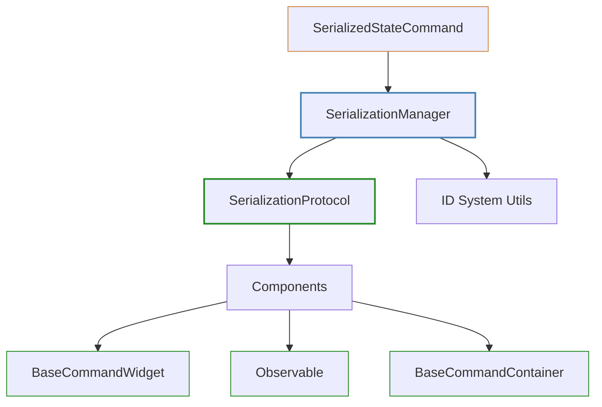
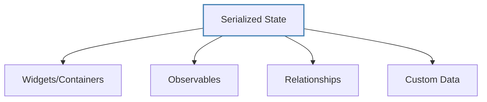
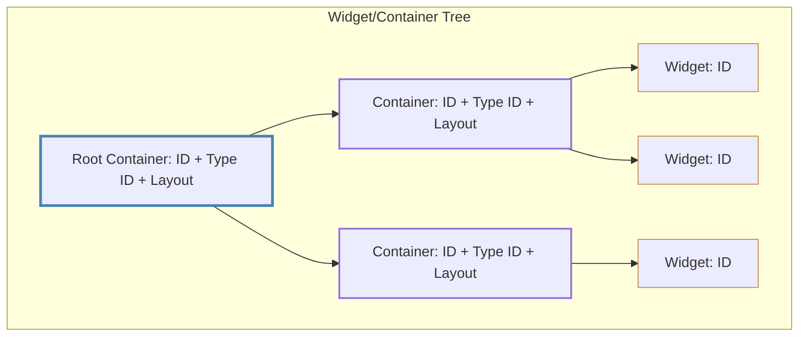
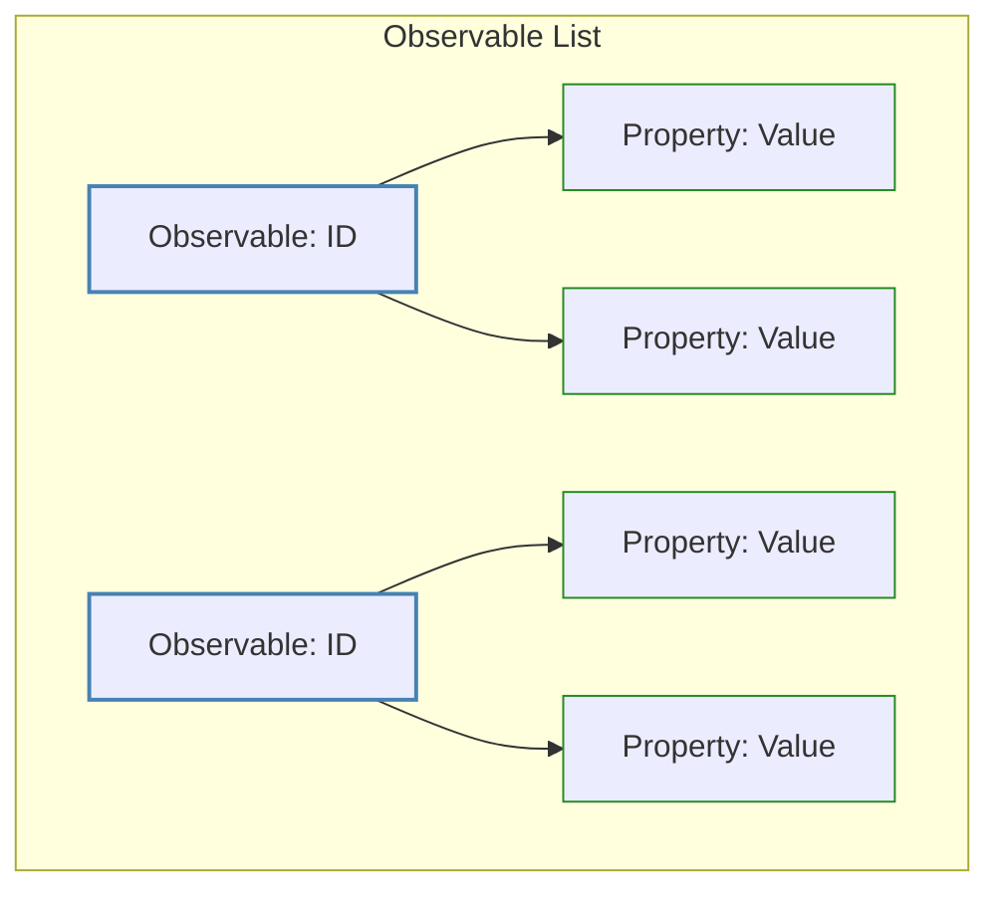
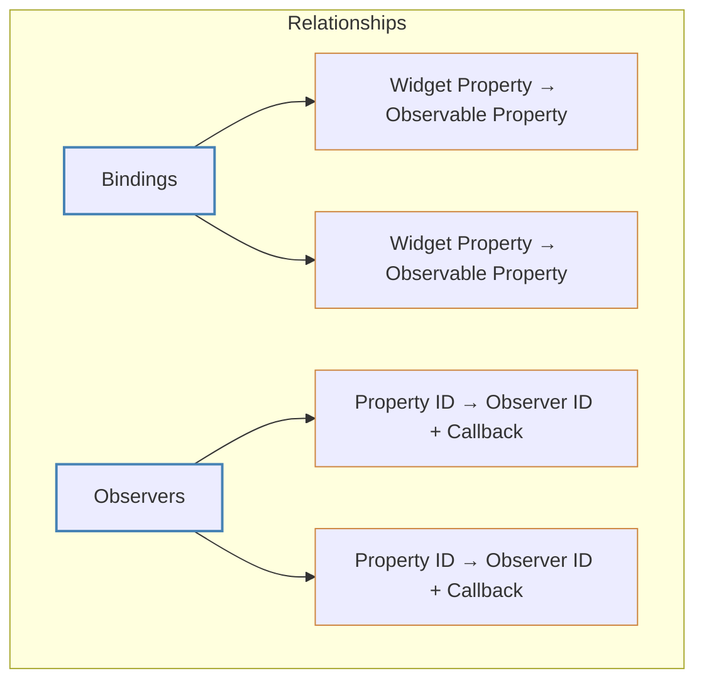
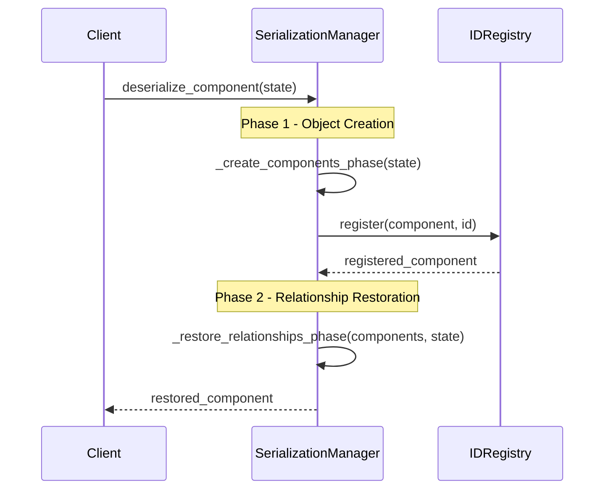

# Implementation Guide for PySignalDecipher Serialization System

This guide outlines a simplified yet comprehensive approach for implementing serialization in the PySignalDecipher command framework.

## Objectives

1. **Preserve component state** - Save and restore widget and observable states
2. **Maintain ID relationships** - Keep component relationships intact
3. **Support command operations** - Enable undo/redo through serialization
4. **Keep implementation simple** - Easy to navigate, adjust, and debug

## Architecture Overview



## Simplified File Structure

```
command_system/
  ├── core/
  │   └── command.py    # Add SerializedStateCommand here
  └── serialization/
      ├── __init__.py
      ├── serialization_manager.py    # Central coordinator
      └── serialization_protocol.py   # Component interface
```

Note: We'll utilize the existing utility functions in `id_system/utils.py` instead of creating redundant serialization utilities.

## Core Components

### 1. SerializationProtocol (serialization_protocol.py)

**Role**: Defines the interface that components must implement to support serialization. This protocol establishes the contract for how objects are serialized and deserialized.

**Content**:
- `get_serialization_data()` method - Returns a serializable dictionary representation of a component
- `from_serialization_data()` class method - Creates a new instance from serialized data
- `restore_relationships()` method - Restores connections between components after creation

**Implementation Example**:
```python
class SerializationProtocol:
    """Protocol for serializable components."""
    
    def get_serialization_data(self) -> dict:
        """
        Return serialization data for this component.
        
        The returned dictionary should contain all information needed
        to reconstruct this component, including:
        - Component ID
        - Type information
        - Property values
        - Children (for containers)
        
        Returns:
            Dict containing serializable component state
        """
        raise NotImplementedError()
    
    @classmethod
    def from_serialization_data(cls, data: dict):
        """
        Create component from serialization data.
        
        This is the first phase of deserialization that creates
        the component with its ID and basic properties.
        
        Args:
            data: Dictionary containing serialized component state
            
        Returns:
            Newly created component instance
        """
        raise NotImplementedError()
    
    def restore_relationships(self, serialized_state: dict) -> None:
        """
        Restore relationships after creation (second phase).
        
        This method is called after all components have been created
        to establish relationships between them, including:
        - Parent-child relationships
        - Property bindings
        - Observer connections
        
        Args:
            serialized_state: Complete serialized state containing all components
        """
        raise NotImplementedError()
```

### 2. SerializationManager (serialization_manager.py)

**Role**: Central coordinator for all serialization operations. Provides high-level methods for serializing and deserializing components at different scopes (component, container, application). Uses the existing ID system utilities for ID-related operations.

**Content**:
- Singleton implementation with `get_instance()` method
- Methods for serializing components, containers, and the application
- Two-phase deserialization implementation
- Default serialization handling for components without protocol implementation
- Helper methods for serialization-specific tasks

**Implementation Example**:
```python
from command_system.id_system import (
    get_id_registry, extract_type_code, extract_unique_id,
    is_widget_id, is_observable_id, is_observable_property_id
)

class SerializationManager:
    """
    Central manager for serialization operations.
    
    This singleton class coordinates all serialization and deserialization
    operations, handling the two-phase process and ensuring proper
    relationship restoration. It leverages the existing ID system utilities
    for ID-related operations.
    """
    _instance = None
    
    @classmethod
    def get_instance(cls):
        """Get the singleton instance."""
        if cls._instance is None:
            cls._instance = SerializationManager()
        return cls._instance
    
    def serialize_component(self, component) -> dict:
        """
        Serialize a single component.
        
        Args:
            component: Component to serialize
            
        Returns:
            Dictionary containing serialized state
        """
        # Get component ID
        id_registry = get_id_registry()
        component_id = id_registry.get_id(component)
        
        # Use protocol if implemented
        if hasattr(component, 'get_serialization_data'):
            data = component.get_serialization_data()
            data['id'] = component_id  # Ensure ID is included
            return data
            
        # Fall back to default implementation
        return self._default_serialize(component)
    
    def serialize_container(self, container) -> dict:
        """
        Serialize a container and all its children.
        
        This creates a complete representation of the container hierarchy,
        all contained observables, and their relationships.
        
        Args:
            container: Container component to serialize
            
        Returns:
            Dictionary containing serialized container state
        """
        # Implementation details using ID system utilities...
    
    def deserialize_component(self, data: dict, parent=None):
        """
        Deserialize a component using the two-phase approach.
        
        Args:
            data: Serialized component data
            parent: Optional parent component
            
        Returns:
            Reconstructed component
        """
        # Phase 1: Create components
        components = self._create_components_phase(data)
        
        # Phase 2: Restore relationships
        self._restore_relationships_phase(components, data)
        
        # Return the root component
        return components.get(data.get('root_id'))
    
    def _create_components_phase(self, data: dict) -> dict:
        """
        First phase: Create all components with correct IDs.
        
        Args:
            data: Serialized state
            
        Returns:
            Dictionary mapping component IDs to created components
        """
        # Implementation using ID system utilities...
    
    def _restore_relationships_phase(self, components: dict, data: dict) -> None:
        """
        Second phase: Restore relationships between components.
        
        Args:
            components: Dictionary of created components (ID -> component)
            data: Complete serialized state
        """
        # Implementation using ID system utilities...
    
    def _default_serialize(self, component) -> dict:
        """Default serialization for components without protocol implementation."""
        # Implementation details...
        
    # Helper methods for serialization-specific tasks
    def _collect_component_ids(self, serialized_state: dict) -> list:
        """Collect all component IDs from a serialized state."""
        # Implementation using ID system utilities...
```

### 3. SerializedStateCommand (in core/command.py)

**Role**: Command implementation that uses serialization to capture and restore component state for undo/redo operations.

**Content**:
- Extends the base `Command` class
- Captures component state before and after operations
- Uses the serialization manager for state operations

**Implementation Example**:
```python
class SerializedStateCommand(Command):
    """
    Command that captures serialized state for undo/redo.
    
    This command uses the serialization system to capture component state
    before and after operations, enabling undo/redo through state restoration.
    """
    
    def __init__(self, component, description="Change State"):
        """
        Initialize with component to track.
        
        Args:
            component: Component to track state changes
            description: Human-readable description of the command
        """
        super().__init__()
        self.component = component
        self.description = description
        
        # Capture initial state
        serialization_manager = get_serialization_manager()
        self.old_state = serialization_manager.serialize_component(component)
        self.new_state = None
    
    def execute(self) -> None:
        """
        Execute the command and capture new state.
        
        This implementation must be overridden in subclasses to
        perform the actual operation. The base implementation
        just captures the new state.
        """
        # Override in subclasses to perform operation
        # Then capture new state
        serialization_manager = get_serialization_manager()
        self.new_state = serialization_manager.serialize_component(self.component)
    
    def undo(self) -> None:
        """
        Undo the command by restoring old state.
        
        This restores the component to its state before the command
        was executed.
        """
        serialization_manager = get_serialization_manager()
        serialization_manager.deserialize_component(self.old_state)
    
    def redo(self) -> None:
        """
        Redo the command by restoring new state.
        
        This restores the component to its state after the command
        was executed.
        """
        if self.new_state:
            serialization_manager = get_serialization_manager()
            serialization_manager.deserialize_component(self.new_state)
        else:
            # Fall back to execute if new_state isn't captured
            self.execute()
```

## Component Integration

The serialization system integrates with existing component classes.

### BaseCommandWidget/Container

Add serialization support directly in base classes:

```python
class BaseCommandWidget(SerializationProtocol):
    # Existing code...
    
    def get_serialization_data(self) -> dict:
        """Get serializable state."""
        return {
            "id": self.widget_id,
            "type_code": self.type_code,
            "properties": self._get_serializable_properties()
        }
    
    def _get_serializable_properties(self) -> dict:
        """Get widget properties that should be serialized."""
        # Implementation specific to widget type
    
    @classmethod
    def from_serialization_data(cls, data: dict):
        """Create widget from serialization data."""
        # Create widget with ID and basic properties
        
    def restore_relationships(self, serialized_state: dict) -> None:
        """Restore property bindings."""
        # Rebind properties using controller information
```

### Observable

Add serialization support to Observable base class:

```python
class Observable(SerializationProtocol):
    # Existing code...
    
    def get_serialization_data(self) -> dict:
        """Get serializable state."""
        properties = {}
        property_ids = {}
        
        # Collect property values and IDs
        for name, value in self.__dict__.items():
            if name.startswith('_'):  # Skip private properties
                continue
            properties[name] = value
            
            # Get property ID if available
            if name in self._property_id_cache:
                property_ids[name] = self._property_id_cache[name]
                
        return {
            "id": self._id,
            "type_code": "o",
            "properties": properties,
            "property_ids": property_ids
        }
    
    @classmethod
    def from_serialization_data(cls, data: dict):
        """Create observable from serialization data."""
        # Create new instance with ID
        # Set property values
        
    def restore_relationships(self, serialized_state: dict) -> None:
        """Restore observers."""
        # Reconnect observers if needed
```

## Serialization Data Structure



### Widget/Container Tree Structure

Widgets and containers are organized in a tree structure:



### Widget/Container Format

```json
{
  "id": "t:1A:0:0",
  "type_code": "t",
  "type_id": "tab_container",
  "properties": {
    "layout": { "width": 800, "height": 600 }
  },
  "children": [
    {
      "id": "pb:2B:1A:0",
      "type_code": "pb",
      "type_id": "button_type_1",
      "properties": { 
        "text": "Click Me"
      },
      "children": []
    }
  ]
}
```

### Observable Structure

Observables are serialized as flat lists with their properties:



### Observable Format

```json
{
  "id": "o:4D",
  "type_code": "o",
  "properties": {
    "name": "John Doe",
    "age": 30
  },
  "property_ids": {
    "name": "op:5E:4D:name:3C",
    "age": "op:6F:4D:age:0"
  }
}
```

### Relationship Structure

Relationships between components are stored separately:



### Relationship Format

```json
{
  "bindings": [
    { 
      "widget_id": "le:3C:1A:1",
      "widget_property": "text",
      "observable_id": "o:4D",
      "property_name": "name"
    }
  ],
  "observers": {
    "op:5E:4D:name:0": [
      { "observer_id": "pb:2B:1A:0", "callback": "on_name_changed" }
    ]
  }
}
```

## Two-Phase Deserialization Process



The key to reliable deserialization:

1. **Create Phase**
   - Create all components with correct IDs
   - Set direct properties without relationships
   - Register with ID system

2. **Restore Phase**
   - Connect widgets to containers
   - Bind properties to observables
   - Restore observer callbacks

## Implementation Steps

### Step 1: Define Serialization Protocol (0.5 day)

1. Create `serialization_protocol.py` with the core interface
   - Define `get_serialization_data()` method
   - Define `from_serialization_data()` class method
   - Define `restore_relationships()` method
   
2. Define standard serialization formats for different component types
   - Widget/Container format
   - Observable format
   - Relationship format

### Step 2: Create Serialization Manager (0.5 day)

1. Implement `serialization_manager.py` with basic functionality
   - Create singleton implementation
   - Add `serialize_component()` method
   - Add `deserialize_component()` method with two-phase approach
   - Add helper methods for serialization-specific tasks
   
2. Import and utilize existing ID system utilities
   - Use `extract_type_code`, `extract_unique_id`, etc. from id_system
   - Use ID type checking functions like `is_widget_id`
   - Use ID registry for component lookups

### Step 3: Add Component Support (1-2 days)

1. Implement serialization in `BaseCommandWidget`
   - Add `get_serialization_data()` implementation
   - Add `from_serialization_data()` implementation
   - Add `restore_relationships()` implementation
   
2. Implement serialization in `Observable`
   - Add methods to capture property values
   - Add methods to restore property values
   - Add support for observer reconnection
   
3. Implement serialization in `BaseCommandContainer`
   - Add support for child widget serialization
   - Add support for container hierarchy
   - Add support for layout serialization

### Step 4: Command Integration (0.5 day)

1. Create `SerializedStateCommand` in `core/command.py`
   - Implement state capturing in `execute()`
   - Implement state restoration in `undo()`
   - Support both direct and derived usage
   
2. Update container operations to use serialized state commands
   - Convert tab operations to use serialization
   - Support undo/redo through state restoration
   - Test with complex container operations

## Example Usage

### Serializing a Container

```python
def save_tab_widget(tab_widget, filename):
    """Save tab widget state to file."""
    serialization_manager = get_serialization_manager()
    state = serialization_manager.serialize_component(tab_widget)
    with open(filename, 'w') as f:
        json.dump(state, f, indent=2)
```

### Deserializing a Container

```python
def load_tab_widget(parent, filename):
    """Load tab widget from file."""
    with open(filename, 'r') as f:
        state = json.load(f)
    serialization_manager = get_serialization_manager()
    tab_widget = serialization_manager.deserialize_component(state, parent)
    return tab_widget
```

### Adding a Tab with Undo Support

```python
# In CommandTabWidget
def add_tab(self, type_id):
    # Create a serialized state command
    cmd = SerializedStateCommand(self, f"Add tab of type {type_id}")
    
    # Override execute method
    def execute_impl():
        self.add_widget(type_id, str(self.count()))
        
        # Capture new state after changes
        cmd.new_state = get_serialization_manager().serialize_component(self)
    cmd.execute = execute_impl
    
    # Execute the command
    get_command_manager().execute(cmd)
```

## Conclusion

This simplified yet comprehensive serialization approach focuses on the essential components while maintaining full functionality. By integrating directly with existing base classes and leveraging the ID system, it provides a clean and maintainable solution for state preservation and restoration.

The two-phase deserialization process ensures that components are properly recreated with their relationships intact, while the SerializedStateCommand provides seamless integration with the command system for undo/redo operations.

This approach strikes a balance between simplicity and power, making it easy to implement, debug, and extend while still supporting all the required functionality.