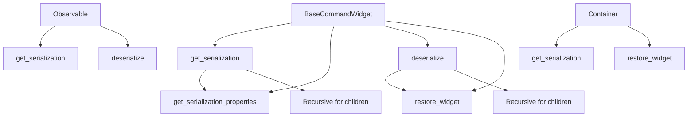
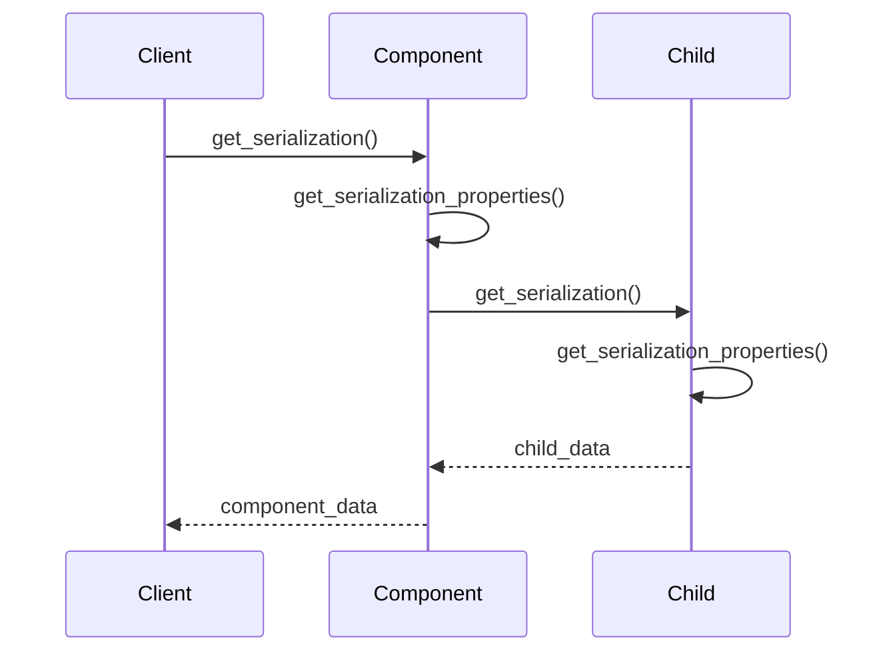
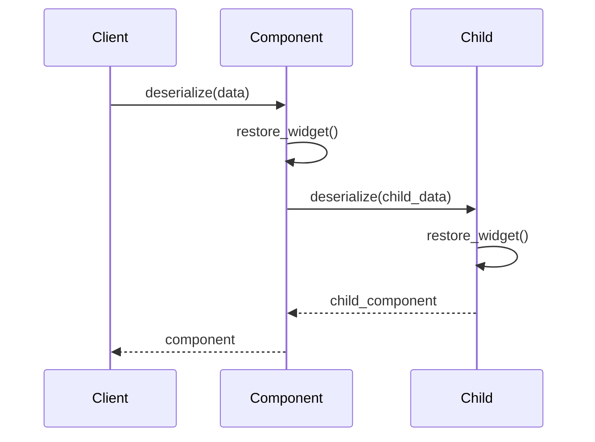

# Simplified Serialization System Documentation

This document outlines a straightforward approach for implementing component serialization in the PySignalDecipher command framework.

## Overview

The serialization system provides a simple and intuitive way to:

1. Convert components to a JSON-serializable format
2. Reconstruct components from serialized data
3. Preserve object relationships and hierarchies

## Architecture

The serialization system follows a simple design built directly into component classes:



## Core Methods

Every component implements the following core methods:

### `get_serialization()`

Main method to get a complete serialized representation of a component.

- For widgets, it captures widget-specific properties
- For containers, it recursively serializes all children
- For observables, it captures all observable properties

```python
def get_serialization(self):
    """
    Get serialized representation of this component.
    
    Returns:
        Dict containing serialized state
    """
    # Get basic properties
    result = self.get_serialization_properties()
    
    # Add children for containers
    if hasattr(self, 'get_child_widgets'):
        children = []
        for child in self.get_child_widgets():
            if hasattr(child, 'get_serialization'):
                children.append(child.get_serialization())
        
        if children:
            result['children'] = children
    
    return result
```

### `get_serialization_properties()`

Responsible for component-specific property serialization.

```python
def get_serialization_properties(self):
    """
    Get serializable properties for this component.
    Override in subclasses to add component-specific properties.
    
    Returns:
        Dict containing basic component properties
    """
    return {
        'id': self.widget_id,
        'type_code': self.type_code,
        'layout': self._get_layout_info() if hasattr(self, '_get_layout_info') else {}
    }
```

### `deserialize(data, parent=None)`

Static method to recreate a component from serialized data.

```python
@staticmethod
def deserialize(data, parent=None):
    """
    Create a component from serialized data.
    
    Args:
        data: Serialized component data dictionary
        parent: Optional parent component
        
    Returns:
        Newly created component instance
    """
    # Create appropriate widget type
    # Set basic properties
    # Handle children recursively
    pass
```

### `restore_widget(id, type_id, layout, children=None)`

Responsible for component-specific property restoration.

```python
def restore_widget(self, id, type_id, layout, children=None):
    """
    Restore this component's state from serialized data.
    Override in subclasses to handle component-specific restoration.
    
    Args:
        id: Component ID
        type_id: Component type ID
        layout: Layout information
        children: List of child component data (for containers)
        
    Returns:
        True if successful
    """
    # Set component-specific properties
    # For containers, deserialize children
    return True
```

## Serialization Data Structure

### Widget/Container Format

```json
{
  "id": "pb:2B:1A:0",
  "type_code": "pb",
  "layout": {
    "x": 10,
    "y": 20,
    "width": 100,
    "height": 30,
    "visible": true
  },
  "properties": {
    "text": "Click Me",
    "enabled": true
  },
  "children": [
    {
      "id": "le:3C:2B:0",
      "type_code": "le",
      "layout": {
        "x": 5,
        "y": 5,
        "width": 90,
        "height": 20,
        "visible": true
      },
      "properties": {
        "text": "Hello"
      }
    }
  ]
}
```

### Observable Format

```json
{
  "id": "o:4D",
  "type_code": "o",
  "properties": {
    "name": "John Doe",
    "age": 30,
    "email": "john@example.com"
  }
}
```

## Serialization Flow

### Serialization Process



### Deserialization Process



## Simple Serialization Manager

A lightweight serialization manager provides utility functions:

```python
def serialize_component(component):
    """Serialize any component to a dictionary."""
    if hasattr(component, 'get_serialization'):
        return component.get_serialization()
    return {'id': get_id_registry().get_id(component)}

def deserialize_component(data, parent=None):
    """Deserialize a component from a dictionary."""
    # Map type_code to appropriate component class
    # Call that class's deserialize method
    pass
```

## Integration with Command System

To support undo/redo through state serialization, a `SerializedStateCommand` captures component states:

```python
class SerializedStateCommand(Command):
    """Command that captures serialized state for undo/redo."""
    
    def __init__(self, component):
        super().__init__()
        self.component = component
        
        # Capture initial state
        self.old_state = serialize_component(component)
        self.new_state = None
    
    def execute(self):
        # Override in subclasses to perform operation
        # Then capture new state
        self.new_state = serialize_component(self.component)
    
    def undo(self):
        # Restore old state
        deserialize_component(self.old_state)
    
    def redo(self):
        # Restore new state
        deserialize_component(self.new_state)
```

## Example Usage

### Serializing a Container

```python
def save_container(container, filename):
    """Save container state to file."""
    state = container.get_serialization()
    with open(filename, 'w') as f:
        json.dump(state, f, indent=2)
```

### Deserializing a Container

```python
def load_container(filename, parent=None):
    """Load container from file."""
    with open(filename, 'r') as f:
        state = json.load(f)
    
    # Determine container type from type_code
    from command_system.pyside6_widgets.containers import CommandTabWidget
    return CommandTabWidget.deserialize(state, parent)
```

### Adding a Tab with Serialized Undo/Redo

```python
def add_tab(self, type_id):
    """Add a tab with serialized state for undo/redo."""
    cmd = SerializedStateCommand(self)
    
    def execute_impl():
        self._add_widget(type_id, str(self.count()))
        cmd.new_state = self.get_serialization()
        
    cmd.execute = execute_impl
    get_command_manager().execute(cmd)
```

## Implementation Strategy

### Phase 1: Base Methods

1. Add `get_serialization()` and `get_serialization_properties()` to base classes
2. Implement basic widget property serialization
3. Create simple serialization manager

### Phase 2: Basic Deserialization

1. Add `deserialize()` and `restore_widget()` to base classes
2. Implement basic component recreation
3. Test with simple widget types

### Phase 3: Container Support

1. Extend serialization for container hierarchies
2. Add support for child widget recreation
3. Test with tab containers and nested widgets

### Phase 4: Command Integration

1. Create `SerializedStateCommand`
2. Update container operations to use serialization
3. Test undo/redo with serialized states

## Benefits of this Approach

1. **Simplicity**: Direct methods on component classes are easy to understand
2. **Extensibility**: Easy to add serialization support to new components
3. **Hierarchy Support**: Automatically handles nested structures
4. **Debugging Ease**: Straightforward serialization flow is easy to trace and debug
5. **Integration**: Works naturally with the existing command system