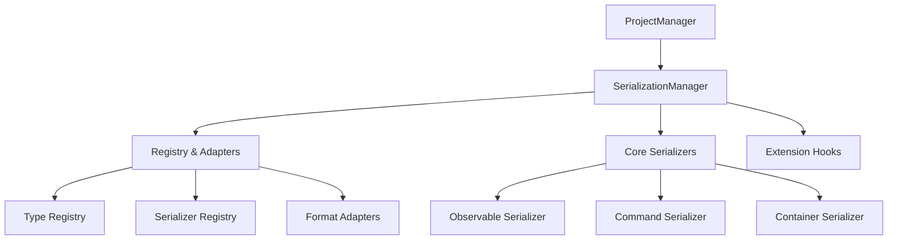

# Serialization System Implementation Plan

This document outlines the implementation plan for the new serialization system in the PySignalDecipher command framework, focusing on simplicity, maintainability, and integration with the container system.

## 1. Core Architecture



## 2. Implementation Phases

### Phase 1: Core Framework (1-2 weeks)

1. **Serialization Manager**
   - Central hub for serialization operations
   - Format adapter management
   - Serialization context handling
   - Reference tracking and resolution

2. **Registry Engine**
   - Type registration system
   - Factory function registry
   - Serializer lookup and matching
   - Type hierarchy support

3. **Format Adapters**
   - JSON adapter (primary format)
   - Binary adapter (for large datasets)
   - Support for custom serialization formats

### Phase 2: Model Serialization (1 week)

1. **Observable Serialization**
   - Property discovery and serialization
   - Reference preservation
   - Type identification
   - Parent-child relationship handling

2. **Command Serialization**
   - Command state extraction
   - Execution context serialization
   - CompoundCommand handling
   - MacroCommand support

3. **Container Integration**
   - Container state serialization
   - Widget/container relationship preservation
   - Layout context handling

### Phase 3: Project Integration (1 week)

1. **Project Manager Updates**
   - Serialization manager integration
   - Format selection support
   - Error handling and recovery
   - Project file structure

2. **Layout Integration**
   - Container layout serialization
   - Layout preset management
   - UI state persistence

3. **Command History Support**
   - Optional command history serialization
   - Command reconstruction on load
   - Execution context restoration

### Phase 4: Testing & Optimization (1 week)

1. **Comprehensive Testing**
   - Unit tests for serializers
   - Integration tests for complex objects
   - Reference resolution tests
   - Edge case handling

2. **Performance Optimization**
   - Profiling and bottleneck identification
   - Serialization speed improvements
   - Memory usage optimization

3. **Documentation & Examples**
   - API documentation
   - Usage examples
   - Integration tutorials

## 3. Key Implementation Details

### 3.1. SerializationManager

```python
class SerializationManager:
    """Central manager for serialization operations."""
    
    def __init__(self):
        self._format_adapters = {}  # Format name -> adapter
        self._registry = RegistryEngine()
        
    def register_adapter(self, format_name, adapter):
        """Register a format adapter."""
        self._format_adapters[format_name] = adapter
        
    def serialize(self, obj, format_name="json"):
        """Serialize an object to the specified format."""
        adapter = self._format_adapters.get(format_name)
        if not adapter:
            raise ValueError(f"No adapter for format: {format_name}")
            
        # Create serialization context
        context = {"registry": self._registry, "references": {}}
        
        # Convert to serializable form
        data = self._registry.serialize_object(obj, context)
        
        # Use adapter to produce final format
        return adapter.serialize(data)
        
    def deserialize(self, data, format_name="json"):
        """Deserialize data to an object."""
        adapter = self._format_adapters.get(format_name)
        if not adapter:
            raise ValueError(f"No adapter for format: {format_name}")
            
        # Parse using adapter
        parsed_data = adapter.deserialize(data)
        
        # Create deserialization context
        context = {"registry": self._registry, "references": {}}
        
        # Deserialize object
        return self._registry.deserialize_object(parsed_data, context)
```

### 3.2. Observable Serialization

```python
def serialize_observable(obj, context):
    """Serialize an Observable object."""
    registry = context["registry"]
    references = context["references"]
    
    # Handle references
    obj_id = obj.get_id()
    if obj_id in references:
        return {"$ref": obj_id}
    
    # Register object in references
    references[obj_id] = obj
    
    # Get type name
    type_name = registry.get_type_name(obj) or obj.__class__.__name__
    
    # Serialize properties
    properties = {}
    for name, value in get_serializable_properties(obj).items():
        properties[name] = registry.serialize_object(value, context)
    
    # Create serialized representation
    return {
        "$type": type_name,
        "$id": obj_id,
        "properties": properties
    }
```

### 3.3. Command Serialization with Context

```python
def serialize_command(command, context):
    """Serialize a Command object with execution context."""
    registry = context["registry"]
    
    # Get command type and state
    type_name = command.__class__.__name__
    state = {}
    
    # Extract serializable state
    for name, value in get_serializable_state(command).items():
        state[name] = registry.serialize_object(value, context)
    
    # Handle execution context
    if hasattr(command, "get_execution_context"):
        exec_context = command.get_execution_context()
        if exec_context:
            # Only serialize container ID, not widget reference
            state["execution_context"] = {
                "container_id": exec_context.get("container_id"),
                "container_type": exec_context.get("container_type")
            }
    
    # Handle compound commands
    if hasattr(command, "commands"):
        state["commands"] = [
            serialize_command(cmd, context)
            for cmd in command.commands
        ]
    
    return {
        "$type": type_name,
        "state": state
    }
```

### 3.4. Container Integration

The serialization system will recognize and handle container widgets:

```python
def serialize_container(container, context):
    """Serialize a container widget."""
    registry = context["registry"]
    
    # Get container ID and type
    container_id = container.get_container_id()
    container_type = container.__class__.__name__
    
    # Container-specific properties
    properties = {}
    
    # Tab widget specific
    if "TabWidget" in container_type:
        properties["tabs"] = []
        for i in range(container.count()):
            properties["tabs"].append({
                "title": container.tabText(i),
                "index": i
            })
        properties["current_index"] = container.currentIndex()
    
    # Dock widget specific
    elif "DockWidget" in container_type:
        properties["title"] = container.windowTitle()
        properties["floating"] = container.isFloating()
        properties["visible"] = container.isVisible()
    
    return {
        "$type": container_type,
        "$id": container_id,
        "properties": properties
    }
```

## 4. Project Manager Integration

```python
def save_project(self, model, filename, format_name=None):
    """Save project to file using serialization system."""
    # Get serialization manager
    ser_manager = get_serialization_manager()
    
    # Serialize model
    format_name = format_name or self._default_format
    serialized_data = ser_manager.serialize(model, format_name)
    
    # Write to file based on format
    if format_name == "json":
        with open(filename, 'w') as f:
            f.write(serialized_data)
    else:
        with open(filename, 'wb') as f:
            f.write(serialized_data)
    
    # Save layout if enabled
    if self._save_layouts and self._layout_manager:
        layout_data = self._layout_manager.capture_current_layout()
        # Append layout data to project file or save separately
    
    # Update current filename
    self._current_filename = filename
    return True
```

## 5. Error Handling and Recovery

To ensure robustness:

1. **Version Tracking**
   - Include schema version in serialized data
   - Handle version differences during deserialization

2. **Graceful Degradation**
   - Ignore unknown properties instead of failing
   - Keep as much state as possible on partial errors

3. **Validation**
   - Validate objects after deserialization
   - Provide detailed error information

4. **Backup and Recovery**
   - Create backups before saving
   - Support for recovering from corrupted files

## 6. Testing Strategy

1. **Unit Tests**
   - Test each serializer independently
   - Verify reference handling
   - Test complex object graphs

2. **Integration Tests**
   - Test complete project serialization/deserialization
   - Test with various object types and relationships
   - Test cross-references and circular dependencies

3. **Performance Tests**
   - Benchmark serialization speed with large projects
   - Measure memory consumption
   - Test with realistic data sets

## 7. Future Enhancements

1. **Schema Evolution**
   - Support for format migration
   - Property renaming and type conversion

2. **Incremental Serialization**
   - Save only changed objects
   - Support for large projects

3. **Compression**
   - Option for compressed serialization formats
   - Efficient binary encoding

4. **Network Serialization**
   - Support for distributed editing
   - Efficient change synchronization