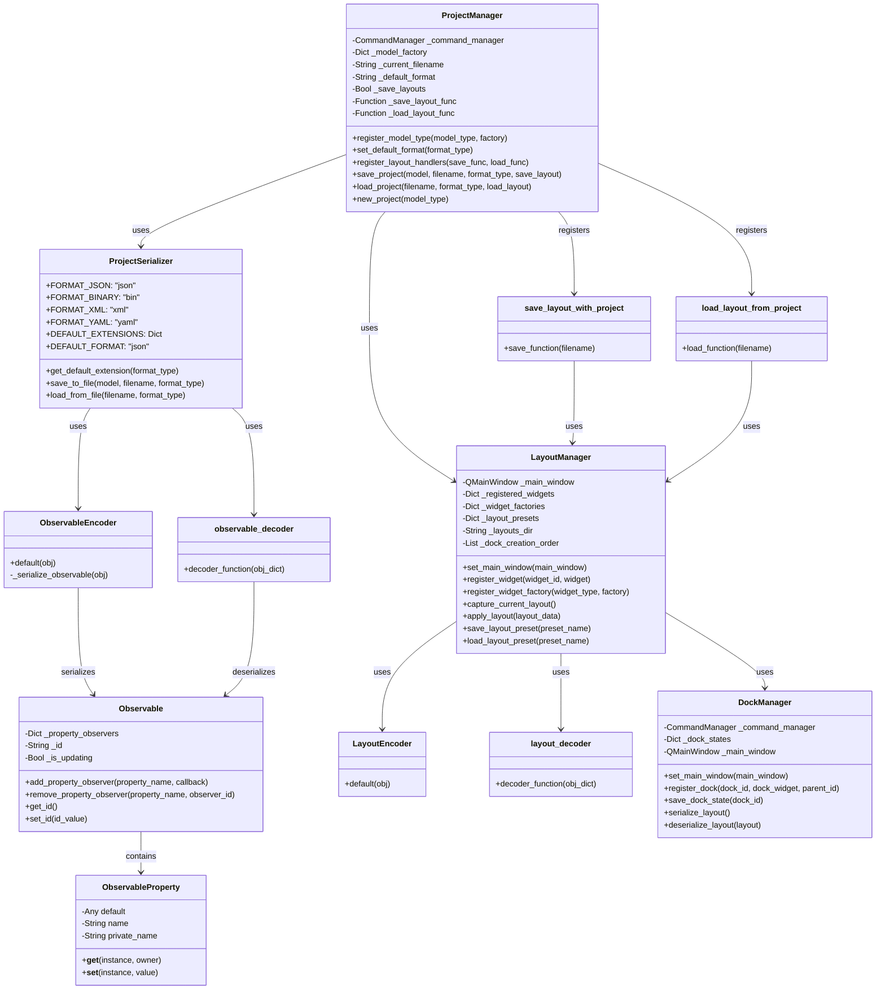

```mermaid
classDiagram
    class ProjectManager {
        -CommandManager _command_manager
        -Dict _model_factory
        -String _current_filename
        -String _default_format
        -Bool _save_layouts
        -Function _save_layout_func
        -Function _load_layout_func
        +register_model_type(model_type, factory)
        +set_default_format(format_type)
        +register_layout_handlers(save_func, load_func)
        +save_project(model, filename, format_type, save_layout)
        +load_project(filename, format_type, load_layout)
        +new_project(model_type)
    }
    
    class ProjectSerializer {
        +FORMAT_JSON: "json"
        +FORMAT_BINARY: "bin"
        +FORMAT_XML: "xml"
        +FORMAT_YAML: "yaml"
        +DEFAULT_EXTENSIONS: Dict
        +DEFAULT_FORMAT: "json"
        +get_default_extension(format_type)
        +save_to_file(model, filename, format_type)
        +load_from_file(filename, format_type)
    }
    
    class ObservableEncoder {
        +default(obj)
        -_serialize_observable(obj)
    }
    
    class observable_decoder {
        +decoder_function(obj_dict)
    }
    
    class LayoutManager {
        -QMainWindow _main_window
        -Dict _registered_widgets
        -Dict _widget_factories
        -Dict _layout_presets
        -String _layouts_dir
        -List _dock_creation_order
        +set_main_window(main_window)
        +register_widget(widget_id, widget)
        +register_widget_factory(widget_type, factory)
        +capture_current_layout()
        +apply_layout(layout_data)
        +save_layout_preset(preset_name)
        +load_layout_preset(preset_name)
    }
    
    class LayoutEncoder {
        +default(obj)
    }
    
    class layout_decoder {
        +decoder_function(obj_dict)
    }
    
    class save_layout_with_project {
        +save_function(filename)
    }
    
    class load_layout_from_project {
        +load_function(filename)
    }
    
    class Observable {
        -Dict _property_observers
        -String _id
        -Bool _is_updating
        +add_property_observer(property_name, callback)
        +remove_property_observer(property_name, observer_id)
        +get_id()
        +set_id(id_value)
    }
    
    class ObservableProperty {
        -Any default
        -String name
        -String private_name
        +__get__(instance, owner)
        +__set__(instance, value)
    }
    
    class DockManager {
        -CommandManager _command_manager
        -Dict _dock_states
        -QMainWindow _main_window
        +set_main_window(main_window)
        +register_dock(dock_id, dock_widget, parent_id)
        +save_dock_state(dock_id)
        +serialize_layout()
        +deserialize_layout(layout)
    }
    
    ProjectManager --> ProjectSerializer : uses
    ProjectManager --> LayoutManager : uses
    ProjectSerializer --> ObservableEncoder : uses
    ProjectSerializer --> observable_decoder : uses
    ProjectManager --> save_layout_with_project : registers
    ProjectManager --> load_layout_from_project : registers
    save_layout_with_project --> LayoutManager : uses
    load_layout_from_project --> LayoutManager : uses
    LayoutManager --> LayoutEncoder : uses
    LayoutManager --> layout_decoder : uses
    LayoutManager --> DockManager : uses
    ObservableEncoder --> Observable : serializes
    observable_decoder --> Observable : deserializes
    Observable --> ObservableProperty : contains
```